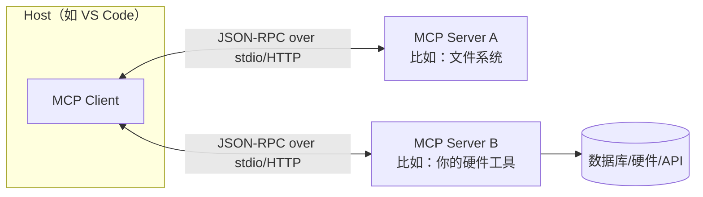

## 一、为什么会有 MCP

在 MCP 出现之前，如果你想让一个大模型应用（Claude Desktop、Cursor、VS Code Copilot……）调用外部能力（读文件、查数据库、控制硬件、调用 API），每家应用都要**自己定义一套工具接口格式**：
- OpenAI 的 function calling schema 长一个样
- Claude 的 tool_use 长另一个样
- 你自己写的 CLI（比如 garycli 的 [tools.py](vscode-file://vscode-app/d:/Users/liubo32/AppData/Local/Programs/Microsoft%20VS%20Code/e4c7e7b1d6/resources/app/out/vs/code/electron-browser/workbench/workbench.html)）又是自己的一套

结果就是经典的 **N × M 集成问题**：N 个 AI 应用 × M 个外部系统 = N×M 次重复对接工作。你在 garycli 里给 STM32 写的"烧录工具"，没法直接拿到 Claude Desktop 里用；反过来也一样。

**MCP（Model Context Protocol，Anthropic 2024 年底推出）就是为了解决这个问题**：定义一套统一的协议，让"工具/数据提供方"（MCP Server）和"AI 应用"（MCP Host/Client，比如 VS Code）之间可以即插即用。你只需要写**一次** MCP Server，VS Code、Claude Desktop、其他支持 MCP 的客户端都能直接用。
一句话类比：**MCP 之于 AI 应用，相当于 USB 之于外设** —— 统一接口，一次实现，到处插用。

## 二、MCP 是什么（核心概念）
MCP 是基于 **JSON-RPC 2.0** 的协议，三个角色：

- **Host**：宿主应用，比如 VS Code、Claude Desktop。负责托管一个或多个 Client。
- **Client**：Host 内部与某一个 Server 建立 1:1 连接的连接器。
- **Server**：你写的程序，向外暴露能力。一个 Server 可以提供三种东西：
    - **Tools（工具）**：模型可以主动调用的函数，比如 [flash_firmware(bin_path)](vscode-file://vscode-app/d:/Users/liubo32/AppData/Local/Programs/Microsoft%20VS%20Code/e4c7e7b1d6/resources/app/out/vs/code/electron-browser/workbench/workbench.html)。这是最常用的，等价于 garycli 里 [tools.py](vscode-file://vscode-app/d:/Users/liubo32/AppData/Local/Programs/Microsoft%20VS%20Code/e4c7e7b1d6/resources/app/out/vs/code/electron-browser/workbench/workbench.html) 的 [TOOL_SCHEMAS](vscode-file://vscode-app/d:/Users/liubo32/AppData/Local/Programs/Microsoft%20VS%20Code/e4c7e7b1d6/resources/app/out/vs/code/electron-browser/workbench/workbench.html)。
    - **Resources（资源）**：只读上下文数据，比如一个文件内容、一条日志，模型可以"读取"但不是"调用"。
    - **Prompts（提示词模板）**：预置的、参数化的提示词模板，用户可主动触发。

传输方式（transport）主要两种：
- **stdio**：Host 直接把 Server 当子进程启动，通过标准输入输出通信。本地场景最常用，配置最简单。
- **HTTP + SSE / Streamable HTTP**：Server 独立运行为网络服务，适合远程/多客户端共享场景。

## 三、怎么做：MCP 的工作流程
Host 启动时，读取配置，拉起（或连接）各个 MCP Server。
Client 与 Server 建立连接后先做 能力协商（initialize）：Server 告诉 Client 自己有哪些 tools/resources/prompts。
用户跟模型聊天时，模型看到这些 tool 的 name + description + JSON Schema 参数定义（和 OpenAI function calling 格式几乎一致）。
模型判断需要用某个工具时，输出一个"调用工具"的请求 → Host 通过 Client 转发给对应 Server → Server 执行真实逻辑（读文件/查数据库/控制硬件）→ 返回结果 → 模型基于结果继续生成回答。
这跟你在 garycli 里看到的 agent.py 的 tool-calling 循环是同一套思路，只是 MCP 把"工具定义 + 执行"这一层从应用里抽出来，变成了独立、可复用的进程。

## 四、在 VS Code 中构建一个 MCP Server，让 Copilot 自主调用
步骤 1：选语言和 SDK
官方 SDK 支持 Python、TypeScript/Node、Java、C# 等。给你举 Python 例子（贴近 garycli 技术栈），用最简单的 FastMCP 风格 API。
```
pip install mcp
```

步骤 2：写最小的 Server
举个例子：把 garycli 里"查询串口列表"包装成一个独立 MCP 工具。
```python
# my_mcp_server.py
from mcp.server.fastmcp import FastMCP

mcp = FastMCP("gary-hardware-tools")

@mcp.tool()
def list_serial_ports() -> str:
    """列出当前可用的串口设备"""
    import serial.tools.list_ports
    ports = serial.tools.list_ports.comports()
    return "\n".join(p.device for p in ports) or "未检测到串口设备"

@mcp.tool()
def read_register(address: str) -> str:
    """读取指定地址的寄存器值（示例）"""
    # 这里换成你真实的 pyocd/寄存器读取逻辑
    return f"寄存器 {address} = 0x00000000（示例返回）"

if __name__ == "__main__":
    mcp.run(transport="stdio")
```
一个 @mcp.tool() 装饰的函数 = 一个可被模型调用的工具，函数名、docstring、类型标注会自动转换成工具的 name/description/参数 schema，不用像 garycli 里那样手写 TOOL_SCHEMAS JSON。

步骤 3：在 VS Code 里注册这个 Server
在工作区根目录创建 .vscode/mcp.json（也可以用户级配置，或用命令面板 MCP: Add Server 引导创建）：
```json
{
  "servers": {
    "gary-hardware-tools": {
      "command": "python",
      "args": ["${workspaceFolder}/my_mcp_server.py"]
    }
  }
}
```

步骤 4：启用并测试
打开 .vscode/mcp.json，点文件里出现的 Start CodeLens（或命令面板 MCP: List Servers → 选中 → Start）。
打开 Copilot Chat，切换到 Agent 模式（不是 Ask/Edit 模式，MCP 工具只在 Agent 模式下可被自主调用）。
点工具图标（🔧）确认 list_serial_ports、read_register 已经出现在可用工具列表里。
直接用自然语言提问，比如"帮我看看现在有哪些串口设备"，Copilot 会自主判断该调用哪个工具、自动填参数、执行、把结果继续用于回答——这就是你说的"自主调用"。

步骤 5：关于"自主"程度的控制
默认情况下，Copilot 第一次调用某个工具时会弹出确认框（防止误操作有风险的动作，比如烧录固件、执行 shell 命令）。
如果确认这个工具是安全的只读操作，可以点"Always Allow"，之后就不再询问，实现真正的无人值守自主调用。
对于像"烧录固件""执行系统命令"这类有副作用的工具，建议保留确认步骤，不要一刀切放开，原理和 garycli 里 execute_command 这类工具需要谨慎对待是一样的。