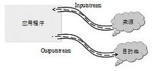

## 概念
数据流 (Stream 是对串行传输数据的一抽象表示，是对输入/输出的一抽源。数据有来源和目的地，衔接两者的就是串流对象。用比喻的方式来说或，数据就好比水，串流对象就好比水管，酒过水管的衔接，水由一端流向另一端，如下图所示：

从应用程序的角度来说，如果将数据从来源取出，可以试用输入（读）串流，把数据情存在内存缓冲区；如果将数据写入目的抱，可以使用输出（写）串流，把内存缓冲区的数据写入目的地：

当希望通过网铬传输数据，或者对文件数据进行操作时，首先需要将数据转化为数据流。其型的数据流和菜个外部数据源相关，数据源可以是文件、外部设备、内存、网络套接字等。根据数据源的不同，能 Net 提供了多个从 Stream 类派生的子类，每个类代表一种具体的数据流类型，如何磁盘文件直接相关的文件流关 FileStream, 和套接字相关的网络流关NetworkStream, 和内存相关的内存流类 MemoryStream 等。
## 流具有如下3种基本操作：

- 写入：将数据从内存缓冲区传输到外部源；
- 读取：将数据从外部源传输到内存缓冲区；
- 查找：重新设置流的当前位置，以便随机读写。但并不是所有的流类型都支持查找，如网络流类没有当前位置的概念，就不支持查找。

Stream是虚拟类，它以及它的派生类都提供了Read和Write方法，可以支持在字节级别上对数据进行读写。Read方法从当前字节流读取字节放至内存缓冲区，Write方法把内存缓冲区的字节写入当前流中。

## 封装的其他流类

但仅支持字节级别的数据处理会给开发人员带来不便。将定应用程序需要将字符数据写入到流中，则需要先将字符数据转化为字节数组之后才能调用Write方法写入流。因此，除了Stream及其派生类的读写方法之外，.Net框架同样提供了其他多种支持流读写的类：

- BinaryReader:从Streams读取编码的字符串和基元数据类型；
- BinaryWriter:向Streams写入编码的字符串和基元数据类型；
- StreamReader:通过使用Encoding将字符转换为字节，向Streams写入字符；
- StreamWriter:通过使用Encoding进行字符和字节的转换，可直接从Streams中读取字符；