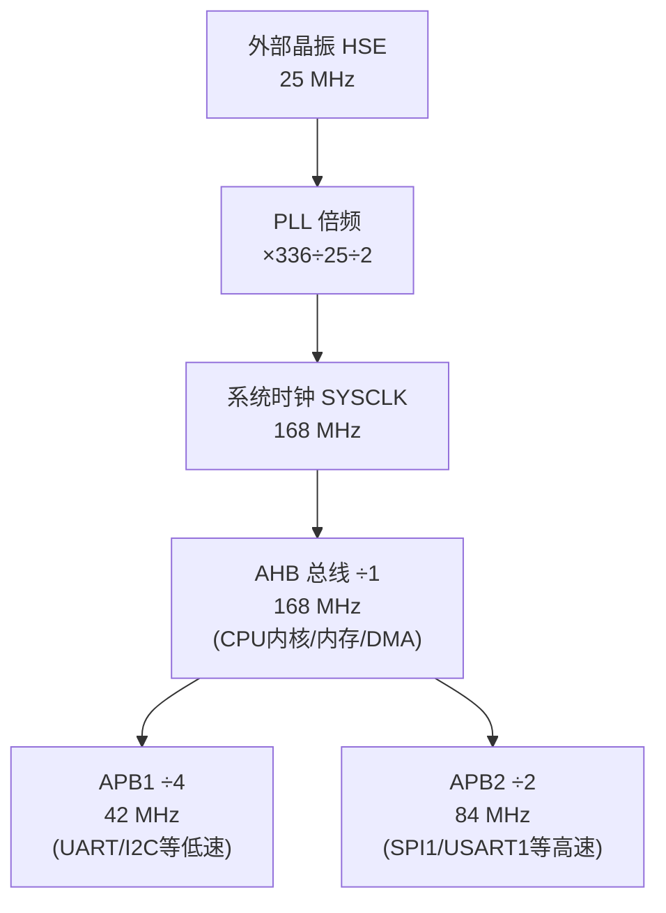

## 一、什么是嵌入式开发

**嵌入式系统（Embedded System）** 是"嵌入到设备内部、为特定功能服务的专用计算机系统"。它和你电脑上的通用软件开发有几个根本区别：

| 维度   | 通用软件（PC/手机 App）               | 嵌入式开发            |
| ---- | ----------------------------- | ---------------- |
| 运行环境 | 操作系统（Windows/Linux/Android）之上 | 直接跑在芯片上，可能没有操作系统 |
| 资源   | GB 级内存、TB 级硬盘                 | KB~MB 级内存、Flash  |
| 交互   | 屏幕、键鼠                         | 引脚电平、传感器、通信总线    |
| 实时性  | 一般不强求                         | 常要求微秒/毫秒级确定响应    |
| 出错代价 | 重启即可                          | 可能烧硬件、危及安全       |
| 调试   | 打印日志方便                        | 需要调试器、示波器、逻辑分析仪  |

**嵌入式开发的本质**：用代码精确控制硬件（引脚、外设、时序），让一块芯片完成特定任务。

  > **本项目对应**：MX Board 就是一个典型嵌入式系统——一颗 STM32F405 芯片控制电池读取、灯效显示、风扇、电源，没有桌面操作系统，只跑一个轻量的 FreeRTOS。

## 二、单片机（MCU）基础
### 2.1 什么是 MCU
**MCU（Microcontroller Unit，微控制器）** = CPU 内核 + 内存（RAM）+ 存储（Flash）+ 各种外设，全部集成在**一块芯片**里。这就是它和"微处理器 MPU"（如电脑 CPU，需要外接内存和各种芯片）的区别。

一句话：**MCU 是"单芯片电脑"**，所以中文也叫"单片机"。

### 2.2 ARM Cortex-M 内核
目前主流 MCU 大多用 **ARM Cortex-M** 系列内核（M0/M0+/M3/M4/M7…），数字越大性能越强：
- **Cortex-M0/M0+**：低端、低功耗，适合简单控制。
- **Cortex-M3**：经典通用内核。
- **Cortex-M4**：M3 + DSP 指令 + 可选浮点单元（FPU），适合信号处理。
- **Cortex-M7**：高性能，带缓存。
### 2.3 STM32 家族
**STM32** 是意法半导体（ST）基于 Cortex-M 内核做的 MCU 系列，是嵌入式入门最热门的平台：

| 系列         | 内核     | 定位                       |
| ---------- | ------ | ------------------------ |
| STM32F0    | M0     | 入门低成本                    |
| STM32F1    | M3     | 经典（"STM32F103"是无数人的第一块板） |
| STM32F4    | M4     | 高性能主流                    |
| STM32F7/H7 | M7     | 高端                       |
| STM32L     | M0+/M4 | 低功耗                      |

> **本项目对应**：用的是 **STM32F405RGT6**：
> - 内核：Cortex-M4，带 FPU，主频 **168 MHz**
> - Flash：1 MB（程序存储）
> - RAM：192 KB
> - 丰富外设：多路 UART、定时器、USB OTG、ADC 等

### 2.4 如何看芯片型号
以 `STM32F405RGT6` 为例，型号每一位都有含义：
- `STM32` 厂商系列
- `F4` 子系列（Cortex-M4）
- `05` 具体型号
- `R` 引脚数（R=64 脚）
- `G` Flash 容量（G=1MB）
- `T` 封装（T=LQFP）
- `6` 工作温度等级
## 三、数字电路与电气基础
写嵌入式代码前，先理解你在操作的"物理世界"。
### 3.1 高低电平（数字信号）
数字电路只认两个状态：
- **高电平（High / 1）**：通常是 3.3V 或 5V
- **低电平（Low / 0）**：通常是 0V（GND，地）
> STM32 是 **3.3V** 系统：高电平 ≈ 3.3V，低电平 ≈ 0V。注意：直接接 5V 信号可能烧坏引脚（除非引脚标注 5V 容忍 tolerant）。

### 3.2 上拉 / 下拉电阻
引脚悬空（不接任何东西）时，电平是不确定的（"浮空"，会乱跳）。为了给一个确定的默认状态：
- **上拉电阻（Pull-up）**：通过电阻接到电源，默认拉高（=1）。

- **下拉电阻（Pull-down）**：通过电阻接到地，默认拉低（=0）。

例如一个按键：常态用上拉保持高电平，按下后接地变低电平，程序检测到"由 1 变 0"即知道按键被按下。

### 3.3 推挽 vs 开漏输出

> GPIO 输出就是"程序通过软件控制引脚电平的高低，进而控制外部硬件"——是单片机最基础的控制手段，比如"点灯"就是它的入门第一课。

GPIO 输出有两种模式：
- **推挽（Push-Pull）**：能主动输出高电平，也能输出低电平，驱动力强。最常用。
- **开漏（Open-Drain）**：只能拉低或"放开"（高阻态），输出高电平要靠外部上拉电阻。用于 I2C 总线、电平转换、多设备共享一条线。

### 3.4 电流 / 电压 / 功率
- **电压 V**（伏特）：电势差，"推动力"。
- **电流 I**（安培）：电荷流动速率。
- **欧姆定律**：`V = I × R`（电压 = 电流 × 电阻）。
- **功率 P**（瓦特）：`P = V × I`，消耗的能量速率。

> **本项目对应**：README 提到"控制 ORIN 上电与否可节省约 40W 功耗"——这就是电源功率管理。电池协议里读的"总电压（10mV 单位）、电流（10mA 单位）"也是这些基础量。

## 四、内存与存储：Flash / RAM / 寄存器
嵌入式里有三种"存东西的地方"，新手最容易混淆：

| 类型                | 特性           | 用途              | 掉电后 |
| ----------------- | ------------ | --------------- | --- |
| **Flash（闪存）**     | 非易失、容量大、读快写慢 | 存**程序代码**、常量、固件 | 保留  |
| **RAM（内存）**       | 易失、读写都快      | 存**运行时变量**、栈、堆  | 丢失  |
| **寄存器（Register）** | CPU/外设内部、极快  | 控制硬件、临时计算       | 丢失  |

### 4.1 Flash 内存映射
STM32 把 Flash 映射到固定地址，程序从 `0x08000000` 开始。本项目把 1MB Flash 分成两段：
```
0x08000000 ┌─────────────────┐
           │   Bootloader    │  ← 引导程序（128KB）
0x08020000 ├─────────────────┤  ← APP 起始地址 STM32_APP_ADDRESS
           │   APP 主程序    │  ← 业务固件
0x08100000 └─────────────────┘
```

> **为什么分区？** Bootloader 负责升级，永不被覆盖；APP 可随时通过 DFU 重刷。即使 APP 刷坏，Bootloader 还能救回来。


> [!note]+ 2种Bootloader
> **1、ST 官方内置的「System Bootloader」（出厂就有）**
> - 每颗 STM32 出厂时，ST 在芯片内部一块**只读区域（System Memory）**里烧死了一段引导程序，叫 **System Bootloader**。
> - 它由 **ST 设计和维护**，你无法修改、也看不到源码。
> - 作用：支持通过 **UART / USB DFU / CAN / I2C** 等接口烧录固件。比如你用串口 ISP 下载、或用 DfuSe 工具通过 USB 刷固件，靠的就是它。
> - 怎么进入它：通过 **BOOT0/BOOT1 引脚**电平选择（拉高 BOOT0 上电，CPU 就从 System Memory 启动，进入 ST 的 bootloader 而不是你的程序）。
> 
> 这个确实是"ST 自己管理的"，普通开发你基本不用关心它的内部实现。
> 
> **2、你自己写的「用户 Bootloader」（本项目就是这种）**
> - 这是**开发者自己用 C 写、编译、烧到 Flash 起始地址**的一段程序，不是 ST 提供的。
> - 本项目 [Bootloader](vscode-file://vscode-app/d:/Users/liubo32/AppData/Local/Programs/Microsoft%20VS%20Code/7e7950df89/resources/app/out/vs/code/electron-browser/workbench/workbench.html) 目录里那一整套（`MB_V2.0_DFU.uvprojx`、`main.c`）就是**团队自己写的用户 Bootloader**，它：
> 	- 占用 Flash 前 128KB（`0x08000000 ~ 0x08020000`）
> 	- 自己实现了"判断要不要升级 → 跳转到 APP"的逻辑
> 	- 自己实现了一套 USB DFU 升级流程
> 
这种是项目按需求定制的，**ST 不管**，完全由开发团队负责。
  >
### 4.2 寄存器（硬件控制的本质）
所有外设（GPIO、UART、定时器）都通过**特殊功能寄存器**控制。比如"把某个引脚置高"，本质是往某个内存地址写一个 bit。HAL 库帮你把这些底层操作封装成了函数（如 `HAL_GPIO_WritePin()`），但底层就是在读写寄存器。
```c
// HAL 写法（推荐）
HAL_GPIO_WritePin(GPIOC, GPIO_PIN_1, GPIO_PIN_SET);
// 等价的寄存器写法（理解原理用）
GPIOC->BSRR = GPIO_PIN_1;
```
## 五、GPIO：最基本的输入输出
**GPIO（General Purpose Input/Output，通用输入输出）** 是 MCU 最基础的引脚功能，可配置为：
- **输入**：读取外部电平（按键、传感器开关）。
- **输出**：控制外部设备（点灯、开继电器）。
- **复用功能（Alternate Function）**：把引脚切换给某个外设用（如把某脚分给 UART 当 TX）。
- **模拟（Analog）**：给 ADC/DAC 用。
### 基本用法
先使用csharp简单的建立C的认知：

| 对比   | C#（Unity）       | C（嵌入式）                      |
| ---- | --------------- | --------------------------- |
| 运行环境 | .NET 运行时 + 操作系统 | 直接跑在芯片上，没有运行时               |
| 内存管理 | 有 GC 自动回收       | 全手动，没有垃圾回收                  |
| 面向对象 | 有 class、对象      | 没有 class，只有结构体 `struct` 和函数 |
| 调用方式 | `obj.Method()`  | 全是全局函数 `Function(参数)`       |
| 这行代码 | 类似一个静态工具方法      | 一个普通的库函数调用                  |

接下来看一下这个例子：
```c
// 输出：点亮 LED
HAL_GPIO_WritePin(G_LED_GPIO_Port, G_LED_Pin, GPIO_PIN_SET);   // 高电平
HAL_GPIO_WritePin(G_LED_GPIO_Port, G_LED_Pin, GPIO_PIN_RESET); // 低电平
HAL_GPIO_TogglePin(G_LED_GPIO_Port, G_LED_Pin);                // 翻转

// 输入：读按键
if (HAL_GPIO_ReadPin(USR_BUTTON_GPIO_Port, USR_BUTTON_Pin) == GPIO_PIN_SET) {
    // 按键被按下（取决于电路是高有效还是低有效）
```

**逐个拆解这行代码**`HAL_GPIO_WritePin(G_LED_GPIO_Port, G_LED_Pin, GPIO_PIN_SET);`
1. `HAL_GPIO_WritePin` —— 是函数名
		它是 ST 官方 HAL 库提供的函数，作用是"给某个引脚写一个电平值"。
2. 这个函数需要 **3 个参数**：`(哪一组引脚, 哪个引脚, 写什么值)`。
3. `G_LED_GPIO_Port` —— 是「引脚所属的端口组」
		STM32 的引脚是**分组管理**的，每组叫一个"端口（Port）"，命名为 GPIOA、GPIOB、GPIOC……每组里有 16 个引脚（0~15）。
		`G_LED_GPIO_Port` 实际是一个**宏定义（别名）**，它指向某个端口组，比如 `GPIOC`。
		为什么用别名？因为绿灯（G_LED）接在 PC1 这个引脚上，这里的 "C" 就是端口 C，所以 `G_LED_GPIO_Port` = `GPIOC`。
4. `G_LED_Pin` —— 是「具体引脚」
		它也是个宏定义，指向引脚号，比如 `GPIO_PIN_1`（即 PC1 里的"1"）。
		所以前两个参数合起来才完整定位一个物理引脚：**端口组 GPIOC + 引脚号 1 = PC1（绿灯）**。
5. `GPIO_PIN_SET` —— 要写的值
		这是个枚举值，只有两个可能：
		- `GPIO_PIN_SET` = 高电平（1，约 3.3V）→ 通常点亮灯
		- `GPIO_PIN_RESET` = 低电平（0，0V）→ 通常熄灭灯

**这些 `G_LED_GPIO_Port` 别名是哪来的？**

它们定义在项目的 `main.h` 头文件里，是 STM32CubeMX 工具自动生成的。你可以去 [main.h](vscode-file://vscode-app/d:/Users/liubo32/AppData/Local/Programs/Microsoft%20VS%20Code/7e7950df89/resources/app/out/vs/code/electron-browser/workbench/workbench.html) 里找到类似这样的定义：
> **好处**：代码里写 `G_LED_GPIO_Port` 比写死 `GPIOC` 更易读——一看就知道这是"绿灯"，而不是某个神秘的 C 口引脚。

## 六、时钟系统
### 6.1 为什么需要时钟
时钟就是芯片的"节拍器"，是一个不停 0→1→0→1 跳变的方波。每跳一次（一个周期），芯片就推进一步工作。

频率（Hz） = 每秒跳多少次。
25 MHz = 每秒跳 2500 万次；168 MHz = 每秒 1.68 亿次。
频率越高 → 干活越快，但功耗越大、发热越多。

### 6.2 时钟源
- **HSE（High Speed External）**：外部高速晶振，精确稳定。
- **HSI（High Speed Internal）**：芯片内部 RC 振荡器，方便但精度差。
- **LSE/LSI**：低速时钟，给 RTC（实时时钟）用。
- **PLL（锁相环）**：把低频时钟**倍频**到高频。
### 6.3 时钟树
MCU 内部有一棵"时钟树"，把时钟源经过 PLL 倍频后，再分频分配给 CPU 内核和各个外设总线（AHB/APB1/APB2）。
> **本项目对应**：
> - 外部晶振 HSE = 25 MHz
> - 经 PLL：PLLM=25, PLLN=336, PLLP=2 → **系统时钟 168 MHz**
> - APB1 总线 = 42 MHz，APB2 = 84 MHz

> [!info]+ PLL 倍频是什么
> 板子上的**晶振（HSE）只有 25 MHz**，但芯片想跑到 **168 MHz**。差了快 7 倍，怎么办？
> **为什么不直接上一个 168MHz 的晶振？** 因为高频晶振又贵、又难做、又容易受干扰、还更耗电。所以业界的做法是：**用一个便宜稳定的低频晶振，在芯片内部"放大"频率**。这个放大器就是 **PLL（锁相环）**。

> [!info]+ 分频是什么？
> 分频（Divide）就是倍频的反操作——把频率降低，除以一个整数。
> 
> 分频系数 ÷2：168MHz → 84MHz
> 分频系数 ÷4：168MHz → 42MHz
> 原理很简单：比如"每来 2 个时钟脉冲，我才输出 1 个"，频率就减半了。这是个纯数字操作，电路上很容易实现（一个计数器即可）。
> 
> 倍频靠 PLL（复杂模拟电路），分频靠计数器（简单数字电路）。

#### 为什么内核和外设总线频率不一样？
看本项目的实际分配：

|时钟域|频率|谁在用|
|---|---|---|
|系统时钟 / 内核 (AHB)|**168 MHz**|CPU 内核、内存、DMA|
|APB2 总线|**84 MHz**（÷2）|高速外设（部分定时器、SPI1、USART1/6 等）|
|APB1 总线|**42 MHz**（÷4）|低速外设（部分定时器、UART、I2C 等）|

**为什么要降速给外设？有三个原因：**
1. 外设根本不需要那么快
		CPU 做运算要尽量快（168MHz）；但一个串口波特率才几万到几十万 bps，一个 I2C 才几百 kHz——给它们 168MHz 纯属浪费，还白白增加功耗。
2. 省电、降发热
		频率越高功耗越大。把不需要高速的外设放在低频总线上，**整颗芯片更省电、更凉快**。这对你这种电池供电的设备尤其重要（省电=续航长）。
3. 硬件设计限制
		STM32F4 的 APB1 总线**物理上最高只支持 42MHz**，APB2 最高 84MHz——这是芯片设计死的规格，外设挂在哪条总线上，就只能跑那个频率范围。所以必须分频降下来，否则超频会出错。

#### 把整棵树串起来看



**一句话总结整个流程**：便宜的 25MHz 晶振 →（PLL 倍频）→ 168MHz 系统时钟给 CPU 用 →（分频）→ 84MHz/42MHz 分配给不同速度需求的外设总线。

> **新手坑**：很多外设（如 UART 波特率、定时器周期）的计算都依赖它挂在哪条总线、总线频率多少。配错时钟，串口会乱码、定时不准。

## 七、中断机制
### 7.1 什么是中断
CPU 平时在跑主程序。当某个**事件**发生（按键按下、串口收到数据、定时器溢出），硬件会"打断"CPU，让它立刻跳去执行一段专门的处理函数——**中断服务程序（ISR，Interrupt Service Routine）**，处理完再回到原来的地方。
### 7.2 轮询 vs 中断

| 方式                | 做法             | 缺点/优点         |
| ----------------- | -------------- | ------------- |
| **轮询（Polling）**   | 主循环里不停地问"有事吗？" | 简单但浪费 CPU，响应慢 |
| **中断（Interrupt）** | 事件发生时硬件主动通知    | 高效及时，但代码更复杂   |

### 7.3 中断处理原则（重要）
- **ISR 要尽量短、尽量快**：里面别做耗时操作（如长延时、复杂计算、打印）。
- 通常 ISR 里只**设置一个标志位**或把数据丢进缓冲区，真正的处理放回主循环/任务里做。
- ISR 和主程序共享的变量要加 `volatile`，防止编译器优化出错。

```c
volatile uint8_t flag_data_received = 0;  // ISR 与主程序共享，必须 volatile

// 中断里
void USARTx_IRQHandler(void) {
    // ...收数据...
    flag_data_received = 1;   // 只置标志，快速返回
}

// 主循环里
if (flag_data_received) {
    flag_data_received = 0;
    process_data();           // 真正处理放这里
}
```

  
> **本项目对应**：USB 收数据用了 `volatile uint32_t Flag_DataReceived`；Modbus 的超时检测靠定时器中断（TIM6/10/11/13）回调；急停信号也通过中断快速响应。

### 7.4 NVIC 与优先级
ARM 用 **NVIC（嵌套向量中断控制器）** 管理中断，可以给每个中断设**优先级**。高优先级中断能打断低优先级中断（嵌套）。配置不当会导致重要事件被延迟。

## 八、定时器 Timer 与 PWM
### 8.1 定时器
**定时器（Timer）** 本质是一个会自动计数的计数器，配合时钟可以：
- **定时**：每隔固定时间产生一次中断（如每 1ms 做一件事）。
- **计数**：统计外部脉冲个数。
- **测量**：测量信号的脉宽、频率（输入捕获）。
- **输出 PWM**：产生方波信号。
### 8.2 PWM（脉宽调制）
**PWM（Pulse Width Modulation）** 是用"方波的占空比"来等效模拟量的技术。
- **周期**：一个完整方波的时间。
- **占空比（Duty Cycle）**：高电平时间占周期的百分比。

占空比 50% → 等效一半电压；占空比 20% → 等效更低。常用于：
- **调光**：LED 亮度。
- **调速**：风扇/电机转速。
- **驱动**：舵机、蜂鸣器。

> **本项目对应**：
> - **风扇调速**：协议里"风扇 PWM 0~100%"就是用定时器输出 PWM 控制风扇转速（README 提到 FAN1/3/4 支持调速，FAN2 因定时器资源冲突暂不支持——这就是定时器资源分配的现实约束）。

> - **WS2812 灯**：用定时器精确产生 WS2812 协议要求的纳秒级时序（`LINE_WS1=144, LINE_WS0=72` 就是 0/1 码的高电平时长）。

## 九、常见通信协议
MCU 要和其他芯片/设备说话，需要通信协议。下面是嵌入式四大基础协议对比：

| 协议                      | 线数         | 速度  | 距离  | 主从    | 典型用途            |
| ----------------------- | ---------- | --- | --- | ----- | --------------- |
| [[UART(通用异步收发器)\|UART]] | 2（TX/RX）   | 中   | 短   | 点对点   | 串口调试、模块通信       |
| **SPI**                 | 4（多）       | 快   | 短   | 一主多从  | Flash、显示屏、高速传感器 |
| **I2C**                 | 2（SDA/SCL） | 中   | 短   | 一主多从  | 传感器、EEPROM      |
| **CAN**                 | 2（差分）      | 中   | 长   | 多主    | 汽车、工业           |
| **USB**                 | 2（差分）      | 很快  | 短   | 主机-设备 | 接电脑             |

### 9.1 UART（最常用，必须掌握）
**UART（通用异步收发器）** 是最基础的串口：
- **异步**：没有时钟线，靠双方约定好的**波特率**保持同步。
- **波特率（Baud Rate）**：每秒传多少 bit，常见 9600、115200、921600。双方必须一致，否则乱码。
- **数据格式**：常写作 `8N1` = 8 数据位、无校验、1 停止位。
- **TX**（发送）接对方 **RX**（接收），交叉连接。
> **RS485**：UART 的"加强版"，用差分信号（A/B 两线），抗干扰强、传输远，支持总线上多设备。需要一个"方向控制脚"切换收/发。

> **本项目对应**：MB 与电池板之间就是 RS485 + Modbus；`main.h` 里那些 UART 方向控制脚（`PA4/PA15/PB3`）就是干这个的。调试串口波特率用 921600。

### 9.2 SPI
四根线：SCLK（时钟）、MOSI（主→从）、MISO（从→主）、CS（片选）。同步、高速、全双工。每个从设备一根片选线。
### 9.3 I2C
只要两根线（SDA 数据、SCL 时钟）就能挂很多设备，每个设备有唯一**地址**。速度中等，省引脚。开漏输出 + 上拉电阻。
### 9.4 USB
复杂但强大。本项目用 **USB CDC（Communication Device Class）**，把 USB 模拟成一个"虚拟串口"——电脑插上后会出现一个 COM 口，软件像用普通串口一样收发数据，但速度快得多。
> **本项目对应**：MB 通过 USB CDC 虚拟串口和上位机（PC/ORIN）通信。USB 描述符里 `VID=0x17EF（联想）, PID=0xB820`，产品名 `Lira_MX_MB`。

## 十、Modbus 协议
**Modbus** 是工业领域最流行的应用层协议，构建在串口（RTU/ASCII）或网络（TCP）之上。

### 10.1 核心概念
- **主从结构**：一个**主机（Master）** 轮询多个**从机（Slave）**。从机不会主动说话，只应答。
- **从机地址**：每个从机有唯一地址（1~247）。
- **功能码**：告诉从机做什么，常用：
  - `0x03` 读保持寄存器
  - `0x04` 读输入寄存器
  - `0x06` 写单个寄存器
  - `0x10` 写多个寄存器
- **寄存器**：数据按 16 位寄存器编址，是 Modbus 的基本数据单位。
- **CRC16 校验**：每帧末尾加 CRC16（多项式 0xA001）防止传输出错。

### 10.2 一帧 RTU 的结构
```
[从机地址] [功能码] [数据...] [CRC16_低] [CRC16_高]
```
例（读 PB 从机 5 个寄存器）：
```
请求:  03 03 00 00 00 05 84 2B
       │  │  └─起始地址─┘ └─数量─┘ └CRC┘
       │  └─功能码 0x03（读）
       └─从机地址 0x03

应答:  03 03 0A [10字节数据] [CRC]
                 └─5个寄存器×2字节
```
### 10.3 字节序
Modbus 寄存器是**大端序（Big-Endian）**：高字节在前。例如电压寄存器值 `0x0E10` = 3600（单位 10mV → 36.00V）。
> **本项目对应**：
> - MB 作为 Modbus **主机**，用 4 个独立协议栈（`mbMasterStack1~4`）并行查询多个电池/PB 从板。
> - 电池 BMS 从机地址 `0x06`，PB 从机地址 `0x03`，波特率 9600，8N1。
> - 寄存器表见 `MX 电池 软件协议规格书.md`（如寄存器 100=总电压、107=电量 SOC）。
> - 协议栈用的是开源 **FreeModbus**（在 `APP/BSP/FreeModbus/`）。
  
## 十一、DMA 直接内存访问
**DMA（Direct Memory Access，直接内存访问）** 是一个"搬运工"硬件，可以**不占用 CPU**就完成"外设 ↔ 内存"或"内存 ↔ 内存"的大批量数据搬运。

**没有 DMA**：CPU 要一个字节一个字节地搬，累且慢。
**有了 DMA**：CPU 下达指令后就去干别的，DMA 自己搬完再通知 CPU（中断）。
  
典型场景：
- 串口连续收发大量数据。
- ADC 连续采样。
- 驱动 WS2812 灯（需要精确连续的数据流）。

> **本项目对应**：WS2812 灯板用 **定时器 PWM + DMA** 实现精确的灯珠时序输出；UART 收发也用 DMA 提高效率（`dma.c`）。

## 十二、看门狗 Watchdog
**看门狗（Watchdog Timer）** 是个"防死机保险"。它是一个倒计时定时器，程序必须周期性地"喂狗"（重置计数）。如果程序跑飞或卡死，没及时喂狗，看门狗超时就会**自动复位整个芯片**，让系统恢复正常。
```c
// 主循环里定期喂狗
while (1) {
    do_work();
    HAL_IWDG_Refresh(&hiwdg);  // 喂狗
}
```
- **IWDG（独立看门狗）**：用独立时钟，最可靠。
- **WWDG（窗口看门狗）**：必须在"时间窗口"内喂，太早太晚都复位。
> **本项目对应**：`iwdg.c`，main.c 里调用了 `MX_IWDG_Init()`。这对需要长期稳定运行的电源板很重要——万一固件某处卡死，看门狗能自动重启而不是一直死着。

## 十三、ADC / DAC：模拟与数字的桥梁
现实世界是模拟的（温度、电压连续变化），但 MCU 只懂数字。
- **ADC（模数转换器）**：把模拟电压转成数字值。如 12 位 ADC 把 0~3.3V 映射成 0~4095。用于读电压、温度传感器、电位器。
- **DAC（数模转换器）**：反过来，把数字值变成模拟电压输出。
**计算示例**：12 位 ADC，读到值 2048，参考电压 3.3V：
```
实际电压 = 2048 / 4095 × 3.3V ≈ 1.65V
```
## 十四、软件分层
嵌入式软件通常是分层的，从底到上：
```
┌─────────────────────────────────┐
│  应用层（你的业务逻辑）          │  app_task.c
├─────────────────────────────────┤
│  中间件（FreeRTOS / USB / Modbus）│  Middlewares/, FreeModbus/
├─────────────────────────────────┤
│  BSP 板级支持包（自写硬件模块）   │  BSP/（WS2812、补光灯）
├─────────────────────────────────┤
│  HAL 硬件抽象层（ST 官方库）     │  Drivers/STM32F4xx_HAL_Driver/
├─────────────────────────────────┤
│  寄存器 / CMSIS（最底层）        │  Drivers/CMSIS/
├─────────────────────────────────┤
│  硬件（STM32F405 芯片）          │
└─────────────────────────────────┘
```
- **CMSIS**：ARM 定义的标准接口层，统一不同厂商内核访问方式。
- **HAL（Hardware Abstraction Layer）**：ST 官方封装，让你用 `HAL_xxx()` 函数操作外设，不用直接碰寄存器。优点是好用、可移植；缺点是体积大、效率略低。
- **LL 库（Low Layer）**：比 HAL 更贴近寄存器、更高效的另一套库（可选）。
- **BSP（Board Support Package）**：针对你这块板子写的硬件功能模块。
- **中间件**：协议栈、操作系统、文件系统等通用组件。
  
> **本项目对应**：完全符合这个分层。你日常改的业务在应用层（`app_task.c`）和 BSP（灯效），底下 HAL/CMSIS 一般不动。

## 十五、裸机编程 vs RTOS
### 15.1 裸机（Bare-metal）
没有操作系统，程序就是一个大 `while(1)` 主循环 + 中断，俗称"前后台系统"：
```c
int main(void) {
    init();
    while (1) {
        task_a();   // 顺序执行
        task_b();
        task_c();
    }
}
```
- **优点**：简单、资源占用小、行为确定。
- **缺点**：任务多了难管理，一个任务卡住会拖累全部，实时性差。

### 15.2 RTOS（实时操作系统）
引入"任务调度器"，让多个任务**看起来并行运行**（实际是 CPU 快速切换）。适合复杂系统。
- **优点**：模块化、各任务独立、实时响应好、便于扩展。
- **缺点**：占用更多资源、有学习曲线、需要注意任务间同步。

> **何时上 RTOS？** 任务数量多、有不同优先级和实时要求、需要并发处理时。本项目任务较多（USB 通信、电池轮询、灯效刷新、风扇控制），所以选了 FreeRTOS。

## 十六、FreeRTOS 实时操作系统
**FreeRTOS** 是最流行的开源嵌入式 RTOS。核心概念：
### 16.1 任务（Task）
一个独立运行的函数，有自己的栈和优先级。调度器根据优先级决定谁运行。
```c
void LedTask(void *argument) {
    for (;;) {                    // 任务通常是死循环
        HAL_GPIO_TogglePin(...);
        osDelay(500);             // 延时期间让出 CPU 给别的任务
    }
}
```
> 注意：用 `osDelay()` 而不是裸机的死等延时，因为 `osDelay` 会让出 CPU 给其他任务。
### 16.2 任务调度
- **抢占式（Preemptive）**：高优先级任务就绪时，立刻打断正在跑的低优先级任务。
- **时间片轮转**：同优先级任务轮流执行。
### 16.3 任务间通信与同步
多个任务共享数据会冲突，需要同步机制：
- **队列（Queue）**：任务间安全传递数据（最常用）。
- **信号量（Semaphore）**：控制对资源的访问、任务间通知。
- **互斥锁（Mutex）**：保护共享资源，防止同时访问（解决"竞态条件"）。
- **事件标志（Event Flags）**：等待一个或多个事件。
### 16.4 CMSIS-RTOS 封装
ST 在 FreeRTOS 上又包了一层 **CMSIS-RTOS API**（函数前缀 `os`，如 `osDelay`、`osKernelStart`），让代码更标准化。
> **本项目对应**：`freertos.c` 定义任务，`main.c` 里 `osKernelInitialize()` + `osKernelStart()` 启动调度器后，程序控制权交给 RTOS。

## 十七、Bootloader 与固件升级
### 17.1 什么是 Bootloader
**Bootloader（引导程序）** 是开机后第一个运行的小程序，职责是：
1. 做最基本的初始化。
2. 判断是否需要升级固件。
3. 跳转到主应用程序（APP）。
### 17.2 IAP 与 DFU
- **IAP（In-Application Programming）**：应用程序自己改写自己的 Flash 实现升级的技术总称。
- **DFU（Device Firmware Upgrade）**：USB 标准定义的固件升级方式，电脑通过 USB 直接给设备刷固件，不需要调试器。
### 17.3 跳转原理
Bootloader 跳到 APP 的关键步骤：
1. 检查 APP 区第一个字（栈顶指针）是否合法（指向 RAM 区间）。
2. 设置主栈指针 MSP 为 APP 的栈顶。
3. 跳到 APP 的复位向量（第二个字）开始执行。
```c
// 简化逻辑
if (((*(uint32_t*)APP_ADDR) & 0x2FFE0000) == 0x20000000) {  // 栈顶合法
    JumpAddress = *(uint32_t*)(APP_ADDR + 4);                // 取复位向量
    __set_MSP(*(uint32_t*)APP_ADDR);                         // 设置栈指针
    ((void(*)(void))JumpAddress)();                          // 跳转
}
```
### 17.4 如何触发升级模式
常见手段：按住某个按键开机、或在 APP 里设置一个标志后复位。本项目用：
- **按键检测**：开机时检测 USER 按键。
- **RTC 备份寄存器标志**：APP 收到升级指令后写一个标志到 RTC 备份寄存器（掉电不丢），再复位；Bootloader 读到标志就进 DFU。
> **本项目对应**：
> - Bootloader 在 `Bootloader/Core/Src/main.c`。
> - PC 端工具 `dfuse-tool/MB_upgrade.py`：先用串口发 OTA 指令触发设备进 DFU（设备 VID/PID 从 `0x17EF/0xB820` 变成 ST 标准 DFU 的 `0x0483/0xDF11`），再通过 USB DFU 协议刷 `.dfu` 文件，完成后重启回 APP。
## 十八、开发工具链
### 18.1 编译相关
- **编译器（Compiler）**：把 C 代码翻译成汇编/机器码。ARM 常用 ARMCC（Keil）、GCC（arm-none-eabi-gcc）。
- **链接器（Linker）**：把多个目标文件 + 库合并，按**链接脚本**（.ld / .sct）分配地址，生成最终可执行文件。
- **链接脚本**：决定代码放 Flash 哪、变量放 RAM 哪——这就是为什么本项目能把 APP 定位到 `0x08020000`。
- **产物格式**：
  - `.elf` / `.axf`：带调试信息的可执行文件。
  - `.hex` / `.bin`：纯固件，用于烧录。
  - `.dfu`：DFU 升级专用格式。

### 18.2 IDE
- **Keil MDK-ARM**：老牌商业 IDE，工程文件 `.uvprojx`。本项目用它。
- **IAR EWARM**：另一款商业 IDE。
- **STM32CubeIDE**：ST 官方免费 IDE（基于 Eclipse + GCC）。

### 18.3 STM32CubeMX（重要）
ST 的**图形化配置工具**：
- 在界面上点选引脚功能、配时钟、配外设。
- 自动生成初始化 C 代码 + 工程。
- 配置保存在 `.ioc` 文件里。
> **关键规则**：CubeMX 生成的代码里有成对的 `/* USER CODE BEGIN */ ... /* USER CODE END */` 注释。**你的代码必须写在这对注释之间**，否则下次用 CubeMX 重新生成会被覆盖！

> **本项目对应**：`MX_MB_PVT.ioc` / `MX_MB_DVT.ioc` 就是 CubeMX 配置。改引脚/外设要用 CubeMX 打开它们改，别手改初始化代码。

### 18.4 烧录器/调试器

- **ST-Link**：ST 官方调试器（便宜常用）。
- **J-Link**：SEGGER 的调试器（功能强）。
- 通过 **SWD**（2 线，最常用）或 **JTAG**（多线）接口连接芯片。

## 十九、调试技术

嵌入式调试比 PC 难，因为"看不见摸不着"。常用手段：
### 19.1 打印调试（printf）
最常用。通过串口把变量、状态打印到电脑终端看。需要把 `printf` 重定向到 UART。
```c
printf("voltage = %d mV\r\n", voltage);
```
> **本项目对应**：调试串口走 MB 的 U6 → RK 的 ttyS7，波特率 921600。Bootloader 里也有 `printf("waitting for update...\r\n")`。
### 19.2 在线调试（断点）
用调试器（ST-Link/J-Link）设断点、单步执行、看变量和寄存器。最强大但需要硬件连接。
### 19.3 LED / GPIO 指示
用一个 LED 或引脚电平指示程序运行到哪、是否卡死。配示波器/逻辑分析仪看时序。
### 19.4 硬件工具
- **万用表**：测电压、通断。
- **示波器**：看模拟信号波形、时序。
- **逻辑分析仪**：抓数字信号、解析协议（UART/SPI/I2C 报文）。
### 19.5 常见"硬件错误（HardFault）"
程序跳进 HardFault 中断通常意味着严重错误：空指针、数组越界、栈溢出、非法地址访问。调试时看出错时的栈和寄存器定位问题。

## 二十、数据表示
### 20.1 进制
- **二进制（0b）**：0/1，对应电平。
- **十六进制（0x）**：嵌入式最常用，1 个十六进制位 = 4 个二进制位，方便表示字节。`0xFF = 255 = 0b11111111`。
- 协议、寄存器、地址几乎都用十六进制。

### 20.2 位操作（必须熟练）

| 操作 | 写法 | 用途 |
|------|------|------|
| 置位（某位变 1） | `x \|= (1 << n)` | 打开某个开关位 |
| 清位（某位变 0） | `x &= ~(1 << n)` | 关闭某个位 |
| 翻转 | `x ^= (1 << n)` | 切换 |
| 判断某位 | `if (x & (1 << n))` | 读状态位 |

> **本项目对应**：协议里"补光灯 bit0/bit1 分别控制两个灯""保护状态是 16+16 位的 bitfield 表示 32 种错误"——都靠位操作处理。

### 20.3 字节序（Endianness）
多字节数据在内存/传输中的排列顺序：
- **大端（Big-Endian）**：高字节在前。网络协议、Modbus 常用。
- **小端（Little-Endian）**：低字节在前。ARM/x86 内部用。
例：数值 `0x1234`
- 大端存：`12 34`
- 小端存：`34 12`
> 跨设备通信时**必须明确字节序**，否则数据解析错乱。本项目 Modbus 用大端，解析协议帧时要特别注意"高字节在前"。
### 20.4 数据类型（用定长类型）
嵌入式里 `int` 的大小可能因平台而异，所以用 `<stdint.h>` 的**定长类型**更安全：

| 类型         | 大小   | 范围       |
| ---------- | ---- | -------- |
| `uint8_t`  | 1 字节 | 0~255    |
| `int8_t`   | 1 字节 | -128~127 |
| `uint16_t` | 2 字节 | 0~65535  |
| `uint32_t` | 4 字节 | 0~约 42 亿 |

> **本项目对应**：版本号 `uint8_t sys_bin_ver[4]={1,0,7,0}`、缓冲区 `uint8_t USB_RECVBuffer[]` 全用定长类型。

## 二十一、嵌入式 C 语言要点

嵌入式以 C 为主，有些写法和 PC 编程不同：
### 21.1 volatile 关键字
告诉编译器"这个变量可能被中断/硬件随时改变，每次都重新读，别优化"。用于：
- 中断与主程序共享的变量。
- 映射到硬件寄存器的变量。
```c
volatile uint8_t flag;  // 不加 volatile 可能被优化成死循环读不到更新
```
### 21.2 const 与只读数据
`const` 数据（如查表、字模、灯效数组）会放在 Flash 而非 RAM，节省宝贵的 RAM。

> **本项目对应**：WS2812 表情数组、CRC16 查找表（`s_crc_hi_table[]`）都是 const 大数组，放 Flash。

### 21.3 static 关键字
- 修饰全局变量/函数：限制作用域在本文件（封装、避免命名冲突）。
- 修饰局部变量：让它在函数调用间保持值（存在静态区而非栈）。
### 21.4 结构体与协议解析
用结构体组织状态数据、解析协议帧很常见。注意**字节对齐**问题（用 `__packed` 或 `#pragma pack` 控制紧凑排列，避免协议解析错位）。
```c
typedef struct {
    uint8_t version;
    uint8_t emergencyStop;
    uint8_t relayEnabled;
    uint8_t fanPwm;
} ControlProtocolState;   // 本项目里的控制状态结构
```
### 21.5 指针与内存
嵌入式里指针常用于：直接访问硬件地址、操作缓冲区、回调函数。要特别小心空指针、越界（没有操作系统兜底，越界可能直接 HardFault 或改坏别的数据）。

### 21.6 避免动态内存
嵌入式里慎用 `malloc/free`：RAM 小、易碎片化、易泄漏。优先用静态数组、固定大小缓冲区。

## 二十二、常见问题与排查思路

| 现象 | 可能原因 | 排查方向 |
|------|----------|----------|
| 串口乱码 | 波特率/时钟配错、字节序 | 核对波特率、时钟树配置 |
| 程序跑飞/重启 | 看门狗复位、HardFault、栈溢出 | 看复位源、查数组越界/空指针 |
| 引脚不输出 | 时钟没开、复用配置错 | 检查外设时钟使能、引脚模式 |
| 中断不触发 | NVIC 没使能、优先级问题 | 检查中断使能、优先级配置 |
| 变量值"莫名其妙" | 缺 volatile、多任务竞态 | 加 volatile、加锁保护 |
| 通信偶尔丢包 | 缓冲区溢出、中断太长 | 用 DMA、缩短 ISR、加缓冲 |
| 升级失败 | DFU 没进入、固件地址错 | 检查触发流程、链接地址 |
| 偶发死机 | 栈太小、资源冲突 | 增大栈、检查共享资源 |

**通用排查思路**：
1. **缩小范围**：用 LED/打印定位代码卡在哪一步。
2. **看时序**：用示波器/逻辑分析仪看信号是否符合预期。
3. **查配置**：80% 的"奇怪问题"是时钟、引脚、中断配置错误。
4. **最小复现**：写最简单的测试代码验证某个外设单独是否正常。


## 二十三、术语速查表

| 术语 | 全称 | 中文 / 含义 |
|------|------|------------|

| MCU | Microcontroller Unit | 单片机 |
| MPU | Microprocessor Unit | 微处理器 |
| HAL | Hardware Abstraction Layer | 硬件抽象层 |
| BSP | Board Support Package | 板级支持包 |
| GPIO | General Purpose I/O | 通用输入输出 |
| UART | Universal Async Receiver/Transmitter | 异步串口 |
| SPI | Serial Peripheral Interface | 串行外设接口 |
| I2C | Inter-Integrated Circuit | 两线串行总线 |
| CAN | Controller Area Network | 控制器局域网 |
| ADC | Analog-to-Digital Converter | 模数转换器 |
| DAC | Digital-to-Analog Converter | 数模转换器 |
| PWM | Pulse Width Modulation | 脉宽调制 |
| DMA | Direct Memory Access | 直接内存访问 |
| ISR | Interrupt Service Routine | 中断服务程序 |
| NVIC | Nested Vectored Interrupt Controller | 嵌套向量中断控制器 |
| RTOS | Real-Time Operating System | 实时操作系统 |
| IWDG | Independent Watchdog | 独立看门狗 |
| RTC | Real-Time Clock | 实时时钟 |
| PLL | Phase-Locked Loop | 锁相环（倍频） |
| HSE/HSI | High Speed External/Internal | 外部/内部高速时钟 |
| SWD | Serial Wire Debug | 串行调试接口 |
| IAP | In-Application Programming | 应用内编程升级 |
| DFU | Device Firmware Upgrade | 设备固件升级 |
| OTA | Over-The-Air | 远程升级 |
| CDC | Communication Device Class | USB 通信设备类（虚拟串口） |
| VID/PID | Vendor/Product ID | 厂商/产品标识 |
| BMS | Battery Management System | 电池管理系统 |
| CRC | Cyclic Redundancy Check | 循环冗余校验 |
| FPU | Floating Point Unit | 浮点运算单元 |
| Endianness | - | 字节序（大端/小端） |
