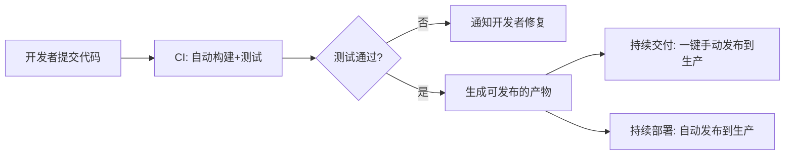
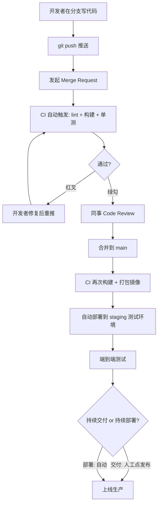

## 一、为什么需要 CI/CD（Why）
### 1.1 没有 CI/CD 时的痛点
想象一个 5 人团队开发同一个项目，每个人在自己电脑上写代码：

| 问题                         | 具体表现                                |
| -------------------------- | ----------------------------------- |
| **集成地狱（Integration Hell）** | 大家各写各的，两周后合并代码，发现互相冲突、互相破坏，光合并就要花几天 |
| **「在我电脑上能跑」**              | 代码在开发者机器上正常，部署到服务器却挂了（环境不一致）        |
| **手动部署易出错**                | 上线靠人手敲命令、传文件，漏一步就出事故，且无法复现          |
| **问题发现太晚**                 | Bug 在上线后才暴露，修复成本指数级上升               |
| **不敢频繁发布**                 | 每次发布都像「拆炸弹」，于是攒一大堆改动一次性上线，风险更大      |

### 1.2 核心思想：把「痛苦的事」自动化、频繁化
CI/CD 的哲学是 **「If it hurts, do it more often, and automate it」**（如果某件事很痛苦，就更频繁地做它，并把它自动化）。
- 合并代码很痛苦 → **每天甚至每次提交都合并**（持续集成）
- 部署很痛苦 → **让机器自动部署**（持续交付/部署）
频繁做 + 自动化 → 每次改动都很小 → 出问题容易定位 → 风险被分摊。

### 1.3 收益
- ✅ **更快反馈**：提交后几分钟就知道有没有问题
- ✅ **更高质量**：自动化测试守门，问题挡在上线前
- ✅ **可重复、可追溯**：每次构建/部署都有记录，可回滚
- ✅ **释放人力**：工程师不再做机械的构建、测试、部署劳动
- ✅ **敢于频繁发布**：小步快跑，降低单次发布风险

## 二、核心概念（What）
### 2.1 三个 CD 容易混淆，先分清
```
CI  = Continuous Integration   持续集成
CD  = Continuous Delivery       持续交付
CD  = Continuous Deployment      持续部署
```



  
| 概念                             | 做什么                     | 上生产是否需要人点按钮     |
| ------------------------------ | ----------------------- | --------------- |
| **持续集成 CI**                    | 自动合并、构建、测试代码            | 不涉及发布           |
| **持续交付 Continuous Delivery**   | CI 之上，自动把产物准备到「随时可发布」状态 | **需要**人工点一下「发布」 |
| **持续部署 Continuous Deployment** | 更进一步，测试通过后**自动**发布到生产   | **不需要**，全自动     |

  
> 记忆法：持续交付＝「随时能发，但由人决定发不发」；持续部署＝「测过就自动发」。

### 2.2 持续集成（CI）的关键实践
1. **维护单一代码仓库**（用 Git）
2. **自动化构建**：一条命令能把源码编译/打包成产物
3. **自动化测试**：构建后自动跑测试（单元测试为主）
4. **每人每天至少提交一次**到主干
5. **每次提交都触发构建**：在专门的 CI 服务器上跑，而不是某个人的电脑
6. **快速构建**：尽量让流水线在 10 分钟内出结果
7. **构建结果对所有人可见**：红了（失败）大家都看得到，并优先修复

### 2.3 流水线（Pipeline）—— CI/CD 的载体
流水线就是把「一系列自动化步骤」串起来。一条典型流水线：


核心术语（不同工具叫法略有差异）：
- **Pipeline（流水线）**：一次完整的自动化流程
- **Stage（阶段）**：流水线的大段落，如「构建」「测试」「部署」
- **Job（任务）**：阶段里的具体工作单元，可并行
- **Step / Task（步骤）**：Job 里的一条条命令
- **Runner / Agent（执行器）**：真正干活的机器/容器
- **Trigger（触发器）**：什么事件启动流水线（push、PR、定时、手动）
- **Artifact（产物）**：构建出来的可交付物（二进制、镜像、包）

### 2.4 常见工具一览

| 工具 | 类型 | 特点 |
|------|------|------|
| **GitHub Actions** | 云端，集成在 GitHub | 上手最快，YAML 配置，生态丰富 |
| **GitLab CI/CD** | 集成在 GitLab | `.gitlab-ci.yml`，自托管友好 |
| **Jenkins** | 自托管老牌 | 插件极多，灵活但维护成本高 |
| **CircleCI / Travis CI** | 云端 | 配置简单，适合开源项目 |
| **Azure DevOps Pipelines** | 微软生态 | 企业级 |

### 2.5 容器与 CI/CD 的关系
CI/CD 经常和 **Docker** 一起出现，因为它正好解决「环境不一致」问题：
- 把应用 + 运行环境一起打包成**镜像（Image）**
- 流水线里构建镜像 → 推送到镜像仓库 → 部署时拉取运行
- 「在我电脑上能跑」彻底变成「在哪都能跑」

## 三、怎么做（How）—— 动手搭第一条流水线
### 3.1 用 GitLab CI/CD 跑通最小示例
GitLab CI/CD 的约定：在仓库根目录创建一个名为 `.gitlab-ci.yml` 的文件，GitLab 会自动识别并执行。
```yaml
# 定义流水线的阶段，按顺序执行：先 build，再 test，最后 deploy
stages:
  - build
  - test
  - deploy

# 全局默认镜像：每个 Job 默认在这个容器里跑
default:
  image: node:20

# ---------- build 阶段 ----------

build-job:
  stage: build                # 归属 build 阶段
  script:                     # 要执行的命令
    - npm install
    - npm run build
  artifacts:                  # 把构建产物传给后续阶段
    paths:
      - dist/

# ---------- test 阶段 ----------

lint-job:
  stage: test
  script:
    - npm run lint

test-job:
  stage: test                 # 与 lint-job 同阶段 → 并行执行
  script:
    - npm test

```

提交（push）后，进入 GitLab 项目左侧菜单的 **Build → Pipelines**，就能看到流水线运行、绿勾（成功）或红叉（失败）。
### 3.2 逐行理解这份配置

| 关键字 | 含义 |
|------|------|
| `stages` | 定义**阶段**及其执行顺序（前一阶段全部成功才进入下一阶段） |
| Job 名（如 `build-job`） | 一个**任务**，是流水线的基本执行单元 |
| `stage` | 声明该 Job 属于哪个阶段；**同阶段的 Job 并行运行** |
| `image` | 该 Job 运行所用的 Docker **镜像**（执行环境） |
| `script` | Job 里依次执行的 **Shell 命令** |
| `artifacts` | 声明要**保留并传递给后续阶段**的产物 |
| `default` | 所有 Job 的默认配置（如统一镜像） |

> GitLab CI/CD 的 Job 由 **Runner** 执行：可以用 GitLab.com 提供的共享 Runner，也可以自己部署 Runner（自托管场景常见）。

### 3.3 加上部署（演进到 CD）

再添加一个属于 `deploy` 阶段的 Job，用 `rules` 限定只有 `main` 分支才部署：
```yaml
# ---------- deploy 阶段 ----------
deploy-job:
  stage: deploy
  image: docker:latest        # 用带 docker 的镜像来构建镜像
  services:
    - docker:dind             # docker-in-docker，让 Job 内能跑 docker 命令
  script:
    # 用提交短哈希给镜像打标签，保证产物可追溯、可回滚
    - docker build -t myapp:$CI_COMMIT_SHORT_SHA .
    - ./deploy.sh             # 你自己的部署脚本
  rules:
    # 只有当本次流水线运行在 main 分支时才执行部署
    - if: '$CI_COMMIT_BRANCH == "main"'
  environment:
    name: production          # 在 GitLab 中记录这是一次「生产环境」部署
```

  
> - `$CI_COMMIT_SHORT_SHA`、`$CI_COMMIT_BRANCH` 是 GitLab 内置的 **预定义变量**，流水线运行时自动注入。
> - 把 `rules` 换成 `when: manual`，就从「持续部署（自动上线）」变成「持续交付（人工点按钮上线）」。
> - 密码/Token 等敏感信息不要写进 YAML，用 **Settings → CI/CD → Variables** 配置后以变量形式引用。

### 3.4 流水线设计的实用原则
1. **快**：把慢的、非必须的步骤拆到后面或并行，让开发者尽快得到反馈
2. **早失败（Fail Fast）**：先跑便宜快速的检查（lint、单测），再跑昂贵的（端到端测试）
3. **每个环境隔离**：dev → staging → production 逐级推进
4. **产物只构建一次**：同一个 artifact 一路用到底，不要每个环境重新构建（避免不一致）
5. **密钥用 Secrets 管理**：绝不把密码/Token 写进代码或 YAML，用平台的 Secret 功能
6. **可回滚**：保留历史产物，出问题能快速退回上一个版本
7. **流水线即代码**：配置文件进 Git 仓库，和代码一起版本管理、评审

### 3.5 测试金字塔（CI 里测试怎么排布）

```
        /\
       /  \      少量  端到端测试 E2E（慢、贵、脆）
      /----\
     /      \    适量  集成测试 Integration
    /--------\
   /          \  大量  单元测试 Unit（快、稳、便宜）
  /------------\
```
- **单元测试**：占大头，每次提交都跑
- **集成测试**：测模块间协作
- **端到端测试**：模拟真实用户，数量少、放后面跑

## 四、典型完整工作流（把概念串起来）


