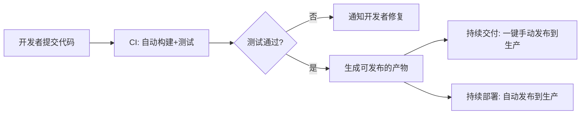
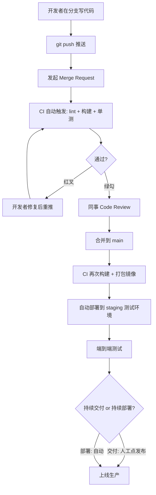

## 一、为什么需要 CI/CD（Why）
### 1.1 没有 CI/CD 时的痛点
想象一个 5 人团队开发同一个项目，每个人在自己电脑上写代码：

| 问题                         | 具体表现                                |
| -------------------------- | ----------------------------------- |
| **集成地狱（Integration Hell）** | 大家各写各的，两周后合并代码，发现互相冲突、互相破坏，光合并就要花几天 |
| **「在我电脑上能跑」**              | 代码在开发者机器上正常，部署到服务器却挂了（环境不一致）        |
| **手动部署易出错**                | 上线靠人手敲命令、传文件，漏一步就出事故，且无法复现          |
| **问题发现太晚**                 | Bug 在上线后才暴露，修复成本指数级上升               |
| **不敢频繁发布**                 | 每次发布都像「拆炸弹」，于是攒一大堆改动一次性上线，风险更大      |

### 1.2 核心思想：把「痛苦的事」自动化、频繁化
CI/CD 的哲学是 **「If it hurts, do it more often, and automate it」**（如果某件事很痛苦，就更频繁地做它，并把它自动化）。
- 合并代码很痛苦 → **每天甚至每次提交都合并**（持续集成）
- 部署很痛苦 → **让机器自动部署**（持续交付/部署）
频繁做 + 自动化 → 每次改动都很小 → 出问题容易定位 → 风险被分摊。

### 1.3 收益
- ✅ **更快反馈**：提交后几分钟就知道有没有问题
- ✅ **更高质量**：自动化测试守门，问题挡在上线前
- ✅ **可重复、可追溯**：每次构建/部署都有记录，可回滚
- ✅ **释放人力**：工程师不再做机械的构建、测试、部署劳动
- ✅ **敢于频繁发布**：小步快跑，降低单次发布风险

## 二、核心概念（What）
### 2.1 三个 CD 容易混淆，先分清
```
CI  = Continuous Integration   持续集成
CD  = Continuous Delivery       持续交付
CD  = Continuous Deployment      持续部署
```



```mermaid

flowchart LR

    A[开发者提交代码] --> B[CI: 自动构建+测试]

    B --> C{测试通过?}

    C -->|否| D[通知开发者修复]

    C -->|是| E[生成可发布的产物]

    E --> F[持续交付: 一键手动发布到生产]

    E --> G[持续部署: 自动发布到生产]

```
  
| 概念                             | 做什么                     | 上生产是否需要人点按钮     |
| ------------------------------ | ----------------------- | --------------- |
| **持续集成 CI**                    | 自动合并、构建、测试代码            | 不涉及发布           |
| **持续交付 Continuous Delivery**   | CI 之上，自动把产物准备到「随时可发布」状态 | **需要**人工点一下「发布」 |
| **持续部署 Continuous Deployment** | 更进一步，测试通过后**自动**发布到生产   | **不需要**，全自动     |

  
> 记忆法：持续交付＝「随时能发，但由人决定发不发」；持续部署＝「测过就自动发」。

### 2.2 持续集成（CI）的关键实践
1. **维护单一代码仓库**（用 Git）
2. **自动化构建**：一条命令能把源码编译/打包成产物
3. **自动化测试**：构建后自动跑测试（单元测试为主）
4. **每人每天至少提交一次**到主干
5. **每次提交都触发构建**：在专门的 CI 服务器上跑，而不是某个人的电脑
6. **快速构建**：尽量让流水线在 10 分钟内出结果
7. **构建结果对所有人可见**：红了（失败）大家都看得到，并优先修复

### 2.3 流水线（Pipeline）—— CI/CD 的载体
流水线就是把「一系列自动化步骤」串起来。一条典型流水线：


```mermaid

flowchart LR

    S1[拉取代码] --> S2[安装依赖]

    S2 --> S3[代码检查 Lint]

    S3 --> S4[编译/构建]

    S4 --> S5[单元测试]

    S5 --> S6[打包/构建镜像]

    S6 --> S7[部署到测试环境]

    S7 --> S8[集成/端到端测试]

    S8 --> S9[部署到生产]

```

核心术语（不同工具叫法略有差异）：
- **Pipeline（流水线）**：一次完整的自动化流程
- **Stage（阶段）**：流水线的大段落，如「构建」「测试」「部署」
- **Job（任务）**：阶段里的具体工作单元，可并行
- **Step / Task（步骤）**：Job 里的一条条命令
- **Runner / Agent（执行器）**：真正干活的机器/容器
- **Trigger（触发器）**：什么事件启动流水线（push、PR、定时、手动）
- **Artifact（产物）**：构建出来的可交付物（二进制、镜像、包）

### 2.4 常见工具一览

| 工具 | 类型 | 特点 |
|------|------|------|
| **GitHub Actions** | 云端，集成在 GitHub | 上手最快，YAML 配置，生态丰富 |
| **GitLab CI/CD** | 集成在 GitLab | `.gitlab-ci.yml`，自托管友好 |
| **Jenkins** | 自托管老牌 | 插件极多，灵活但维护成本高 |
| **CircleCI / Travis CI** | 云端 | 配置简单，适合开源项目 |
| **Azure DevOps Pipelines** | 微软生态 | 企业级 |

### 2.5 容器与 CI/CD 的关系
CI/CD 经常和 **Docker** 一起出现，因为它正好解决「环境不一致」问题：
- 把应用 + 运行环境一起打包成**镜像（Image）**
- 流水线里构建镜像 → 推送到镜像仓库 → 部署时拉取运行
- 「在我电脑上能跑」彻底变成「在哪都能跑」

同样的思路也延伸到了**开发阶段**（而不只是构建/部署阶段）：[[Dev Containers 入门|Dev Containers]] 就是把「开发环境」本身也用镜像/容器锁定，团队每个人打开项目都在一致的容器里编码、编译、调试，从源头上减少「在我电脑上能跑」的问题。

## 三、怎么做（How）—— 动手搭第一条流水线
### 3.1 用 GitLab CI/CD 跑通最小示例
GitLab CI/CD 的约定：在仓库根目录创建一个名为 `.gitlab-ci.yml` 的文件，GitLab 会自动识别并执行。
```yaml
# 定义流水线的阶段，按顺序执行：先 build，再 test，最后 deploy
stages:
  - build
  - test
  - deploy

# 全局默认镜像：每个 Job 默认在这个容器里跑
default:
  image: node:20

# ---------- build 阶段 ----------

build-job:
  stage: build                # 归属 build 阶段
  script:                     # 要执行的命令
    - npm install
    - npm run build
  artifacts:                  # 把构建产物传给后续阶段
    paths:
      - dist/

# ---------- test 阶段 ----------

lint-job:
  stage: test
  script:
    - npm run lint

test-job:
  stage: test                 # 与 lint-job 同阶段 → 并行执行
  script:
    - npm test

```

提交（push）后，进入 GitLab 项目左侧菜单的 **Build → Pipelines**，就能看到流水线运行、绿勾（成功）或红叉（失败）。
### 3.2 逐行理解这份配置

| 关键字 | 含义 |
|------|------|
| `stages` | 定义**阶段**及其执行顺序（前一阶段全部成功才进入下一阶段） |
| Job 名（如 `build-job`） | 一个**任务**，是流水线的基本执行单元 |
| `stage` | 声明该 Job 属于哪个阶段；**同阶段的 Job 并行运行** |
| `image` | 该 Job 运行所用的 Docker **镜像**（执行环境） |
| `script` | Job 里依次执行的 **Shell 命令** |
| `artifacts` | 声明要**保留并传递给后续阶段**的产物 |
| `default` | 所有 Job 的默认配置（如统一镜像） |

> GitLab CI/CD 的 Job 由 **Runner** 执行：可以用 GitLab.com 提供的共享 Runner，也可以自己部署 Runner（自托管场景常见）。

### 3.3 加上部署（演进到 CD）

再添加一个属于 `deploy` 阶段的 Job，用 `rules` 限定只有 `main` 分支才部署：
```yaml
# ---------- deploy 阶段 ----------
deploy-job:
  stage: deploy
  image: docker:latest        # 用带 docker 的镜像来构建镜像
  services:
    - docker:dind             # docker-in-docker，让 Job 内能跑 docker 命令
  script:
    # 用提交短哈希给镜像打标签，保证产物可追溯、可回滚
    - docker build -t myapp:$CI_COMMIT_SHORT_SHA .
    - ./deploy.sh             # 你自己的部署脚本
  rules:
    # 只有当本次流水线运行在 main 分支时才执行部署
    - if: '$CI_COMMIT_BRANCH == "main"'
  environment:
    name: production          # 在 GitLab 中记录这是一次「生产环境」部署
```

  
> - `$CI_COMMIT_SHORT_SHA`、`$CI_COMMIT_BRANCH` 是 GitLab 内置的 **预定义变量**，流水线运行时自动注入。
> - 把 `rules` 换成 `when: manual`，就从「持续部署（自动上线）」变成「持续交付（人工点按钮上线）」。
> - 密码/Token 等敏感信息不要写进 YAML，用 **Settings → CI/CD → Variables** 配置后以变量形式引用。

### 3.4 流水线设计的实用原则
1. **快**：把慢的、非必须的步骤拆到后面或并行，让开发者尽快得到反馈
2. **早失败（Fail Fast）**：先跑便宜快速的检查（lint、单测），再跑昂贵的（端到端测试）
3. **每个环境隔离**：dev → staging → production 逐级推进
4. **产物只构建一次**：同一个 artifact 一路用到底，不要每个环境重新构建（避免不一致）
5. **密钥用 Secrets 管理**：绝不把密码/Token 写进代码或 YAML，用平台的 Secret 功能
6. **可回滚**：保留历史产物，出问题能快速退回上一个版本
7. **流水线即代码**：配置文件进 Git 仓库，和代码一起版本管理、评审

### 3.5 测试金字塔（CI 里测试怎么排布）

```
        /\
       /  \      少量  端到端测试 E2E（慢、贵、脆）
      /----\
     /      \    适量  集成测试 Integration
    /--------\
   /          \  大量  单元测试 Unit（快、稳、便宜）
  /------------\
```
- **单元测试**：占大头，每次提交都跑
- **集成测试**：测模块间协作
- **端到端测试**：模拟真实用户，数量少、放后面跑

## 四、典型完整工作流（把概念串起来）


```mermaid

flowchart TD

    A[开发者在分支写代码] --> B[git push 推送]

    B --> C[发起 Merge Request]

    C --> D[CI 自动触发: lint + 构建 + 单测]

    D --> E{通过?}

    E -->|红叉| F[开发者修复后重推]

    F --> D

    E -->|绿勾| G[同事 Code Review]

    G --> H[合并到 main]

    H --> I[CI 再次构建 + 打包镜像]

    I --> J[自动部署到 staging 测试环境]

    J --> K[端到端测试]

    K --> L{持续交付 or 持续部署?}

    L -->|交付: 人工点发布| M[上线生产]

    L -->|部署: 自动| M

```
## 五、进阶实战：解析一份真实项目的 `.gitlab-ci.yml`

下面结合项目里实际用到的一份 GitLab CI 配置（多阶段镜像发布 + 文档部署 + MCP Server stub 部署），补充第二、三节里没展开的知识点。

### 5.1 YAML 锚点（Anchor）与别名（Alias）—— 配置复用

```yaml
.image_changes: &image_changes
  - ".gitlab-ci.yml"
  - "CHANGELOG.rst"
  - "CI.bash"
  - "VERSION"
  - "*.repos"
  - "docker/**"

release_image:
  rules:
    - if: '$CI_COMMIT_BRANCH == "main"'
      changes: *image_changes
      when: manual
```

- `&锚点名` 给一段 YAML 内容打标记，`*锚点名` 在别处原样引用，避免同一份 `changes` 列表在 `release_image` / `arm_release_image` 里复制粘贴两遍。
- Job 名以 **`.` 开头**（如 `.image_changes`、`.build_before_script`）会被 GitLab 当作**隐藏 Job**，不会被调度执行，专门用来当"配置模板"存放锚点内容。
- 除了锚点，GitLab 还提供关键字 **`extends`** 实现类似的"继承/复用"效果（`extends: .some_template`），二者可以按需选用：锚点更贴近原生 YAML、复用整段任意结构；`extends` 是 GitLab 专属关键字、支持多层继承和深度合并。

### 5.2 `rules` 触发规则：`if` / `changes` / `when` 组合

```yaml
rules:
  - if: '$CI_COMMIT_BRANCH == "main"'
    changes: *image_changes
    when: manual
  - when: never
```

| 关键字 | 作用 |
|---|---|
| `if` | 条件表达式，为真才继续判断该规则（常用预定义变量如 `$CI_COMMIT_BRANCH`） |
| `changes` | 只有命中的文件路径发生变更时才触发（配合 `if` 使用，避免无关改动也跑一遍构建） |
| `when: manual` | 条件满足时该 Job 出现在流水线里，但需要**人工点击**才会真正运行（对应第二节里"持续交付"的人工发布按钮） |
| `when: never` | 明确不运行（常放在规则列表最后一条，作为"其余情况都不跑"的兜底） |
| `when: on_success`（默认值） | 不写 `when` 时的默认行为：前置阶段成功就自动运行 |

`rules` 是新一代写法，功能上完全覆盖并取代了旧的 **`only` / `except`**（本配置里 `build_docs` 用的是 `only: refs / changes`，是旧写法，两者可以在同一个 `.gitlab-ci.yml` 里混用，但官方建议新配置统一使用 `rules`）。

### 5.3 `needs`：打破 Stage 顺序限制，组成 DAG 流水线

```yaml
build_docs:
  stage: docs
  needs: []
```

- 默认情况下，Stage 是**严格顺序执行**的：`release` 阶段所有 Job 都成功了，`docs` 阶段才会开始。
- `needs: []` 显式声明"我不依赖任何前置 Job"，GitLab 会把该 Job 提前到依赖满足时就立即调度，从顺序流水线变成 **DAG（有向无环图）流水线**，缩短总耗时。
- 本配置里 `build_docs` 和 `deploy_mcp_stub` 都用 `needs: []`，是因为它们（文档、MCP stub）与 `release` 阶段的 ROS2 镜像构建**互不依赖**，没必要等镜像发布完才开始。

### 5.4 `variables`：全局变量、Job 级覆盖、预定义变量

```yaml
variables:
  RELEASE_TYPE: "alpha"
  GIT_STRATEGY: fetch          # 全局默认拉代码策略

dev_release_image:
  variables:
    SDK_REPOS_FILE: "sdk_server.dev.repos"   # Job 级变量，覆盖/补充全局变量
```

- 顶层 `variables` 对所有 Job 生效；Job 内的 `variables` 只在该 Job 生效，同名时覆盖全局值。
- `GIT_STRATEGY: fetch` 控制 Runner 每次跑 Job 前**用 `git fetch` 增量更新工作区**，而不是 `clone` 全新克隆，配合下面的 `cache` 能显著加速大仓库/带子模块项目的流水线。
- **预定义变量**（GitLab 自动注入，无需声明）在本配置里用到的有 `$CI_COMMIT_BRANCH`（当前分支名）、`$CI_COMMIT_REF_NAME`（分支/Tag 名，用作 cache key）；此前第三节示例里用到的 `$CI_COMMIT_SHORT_SHA` 同理。

### 5.5 `cache`：跨流水线复用依赖，加速构建

```yaml
cache:
  key: "$CI_COMMIT_REF_NAME"
  paths:
    - sdk_server/
    - third_party/
    - ros2/
```

- `cache` 和 `artifacts` 容易混淆：**`artifacts` 是本次流水线产物、传给下游 Stage 用**（如 `build_docs` 里的 HTML 文档）；**`cache` 是跨次流水线复用、给同一分支下次跑加速用**（如 `third_party/` 编译产物不用每次重新拉取/编译）。
- `key` 决定缓存的"槽位"，这里用分支名做 key，保证不同分支的缓存互不覆盖、互不干扰。

### 5.6 `artifacts.expire_in`：产物保留期限

```yaml
artifacts:
  paths:
    - sdk_server/daystar_api/docs/sphinx/_build/html
  expire_in: 1 year
```

对应第三节"产物只构建一次、可回滚"的原则：产物默认会一直占用 GitLab 存储空间，`expire_in` 显式声明过期时间，避免历史产物无限堆积。

### 5.7 `tags`：指定由哪些 Runner 执行

```yaml
tags:
  - Bot_SDK
```

当一个 GitLab 实例注册了多个 Runner（例如不同架构、不同网络环境的机器）时，`tags` 用来精确指定"这个 Job 必须调度到打了 `Bot_SDK` 标签的 Runner 上"，避免被随机分配到不满足条件（如缺少 Docker、连不到内网 registry）的 Runner。

### 5.8 Job 级 `image`：为单个 Job 指定专属执行环境

```yaml
release_image:
  image: docker:stable
```

和第三节"镜像与 CI/CD 的关系"呼应：这里的 `image` 不是被构建的产物镜像，而是 **Job 自身运行所在的容器**（相当于"在哪个环境里执行 script"）；因为该 Job 要执行 `docker build`，所以选用自带 Docker CLI 的 `docker:stable` 镜像。

### 5.9 `before_script` / `script` / `after_script` 的职责划分

- `before_script`：环境准备，如 `chmod +x`、配置 SSH、清理旧进程——失败会让整个 Job 直接失败。
- `script`：真正的业务逻辑（构建、部署）。
- `after_script`：**无论 `script` 成功与否都会执行**的收尾步骤，常用来打印诊断信息（本例中列出构建产物目录），不应放关键业务逻辑。

### 5.10 CI 里的密钥管理与 SSH 免交互登录模式

```bash
eval $(ssh-agent -s)
echo "$SSH_PRIVATE_KEY" | tr -d '\r' | ssh-add -
ssh-keyscan -p $REMOTE_PORT $REMOTE_HOST >> ~/.ssh/known_hosts
```

对应第三节"密钥用 Secrets 管理"原则的具体落地：
- `SSH_PRIVATE_KEY` 私钥本身**不出现在 YAML 里**，而是提前配置在 GitLab 的 **Settings → CI/CD → Variables**（并勾选 Masked/Protected），流水线运行时以环境变量形式注入，日志里也不会明文打印。
- `ssh-agent` + `ssh-add` 把私钥加载进内存代理，后续 `scp`/`ssh` 命令无需再交互输入密码。
- `ssh-keyscan` 提前把目标机公钥写入 `known_hosts`，避免 `ssh`/`scp` 首次连接时卡在"是否信任该主机"的交互确认上（CI 环境没有终端可以手动输入 yes）。

### 5.11 一个仓库拆出多个互不依赖的部署目标

这份配置把 `release`（ROS2 完整镜像）、`docs`（Sphinx 文档站）、`deploy_mcp`（stub 版 MCP Server）三类完全不同的产物放在同一条流水线里，但通过 `needs: []` + 各自独立的 `rules`/`changes` 让它们互不阻塞、按需触发——这是"流水线设计的实用原则"里"每个环境隔离"思想的延伸：**不仅环境要隔离，同一仓库里方向不同的多个交付物，也应该在流水线层面解耦**，避免为了发文档而被迫等一次不相关的镜像构建跑完。

### 5.12 脚本健壮性：`set -euo pipefail`

```bash
set -euo pipefail
```

在 CI 的 `script` 多行 Shell 块里加上这行，是常见的防御性写法：
- `-e`：任意命令失败立即退出，不会"错误被忽略、继续往下跑出更难排查的二次错误"。
- `-u`：引用未定义变量时报错退出，而不是当空字符串处理。
- `-o pipefail`：管道中任意一环失败，整个管道判定为失败（默认 Shell 只看管道最后一条命令的返回码）。

这能让 CI 脚本"该失败时就快速失败"，避免第三节提到的"Fail Fast"原则在 Shell 脚本层面被破坏。