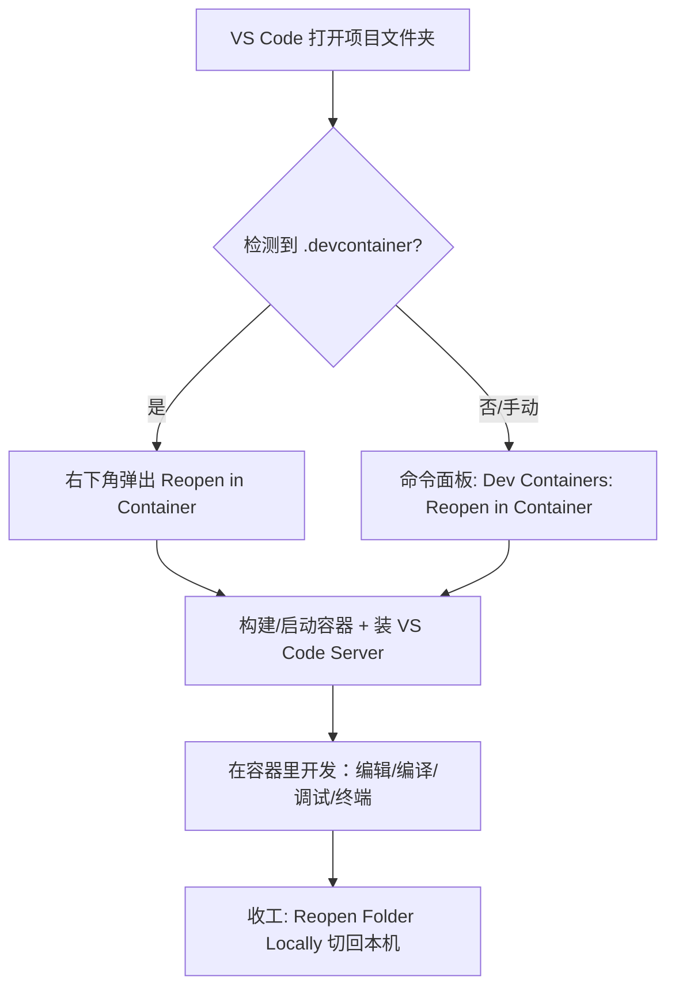

## 1. 它解决什么问题（为什么要用）
如果你刚从别的方向转过来，可能遇到过这些痛点：
- **“在我电脑上能跑，在你电脑上跑不了。”** 编译器版本、依赖库、环境变量不一致。
- **新人配环境要一两天。** 装 ROS2、装一堆依赖、设环境变量，步骤多还容易出错。
- **不敢升级。** 本机环境一改就怕影响其他项目。
- **多项目互相污染。** 项目 A 要 Python 3.8，项目 B 要 3.11，全装本机会打架。


**Dev Container 的核心思想**：把“开发环境”本身也变成代码（写进配置文件，跟着仓库走）。每个人打开项目时，VS Code 自动起一个**完全一致的 Docker 容器**，所有编译、运行、调试都发生在容器里。

带来的好处：

| 痛点    | Dev Container 的解决方式           |
| ----- | ----------------------------- |
| 环境不一致 | 所有人用同一个镜像，版本完全锁定              |
| 配环境慢  | 一键 “Reopen in Container”，自动装好 |
| 怕污染本机 | 环境隔离在容器内，本机干净                 |
| 多项目冲突 | 每个项目一个容器，互不影响                 |

> 对本项目尤其有用：本项目依赖 ROS2 `humble` + 自定义 underlay/overlay workspace，本机直接配非常麻烦，用容器最省心。

## 2. 核心原理：VS Code 的“客户端 + 服务端”架构

理解这一点，后面所有“为什么目录变了 / 为什么扩展要重装”的问题都迎刃而解。
VS Code 不是一个“整体”程序，而是分成两半：


- 你**看到的窗口**（菜单、编辑器、按钮）= **客户端（UI）**，跑在你本机。
- 真正**读文件、跑编译、开终端、调试**的部分 = **VS Code Server**，被自动装进**容器内部**运行。

所以当你 “Reopen in Container” 时，发生的事是：
1. VS Code 读取 `.devcontainer/devcontainer.json`。
2. 按配置**构建或启动一个 Docker 容器**。
3. 往容器里**自动安装一份 VS Code Server**。
4. 本机 UI 通过隧道连接到容器里的 Server。
5. 之后你的一切操作，实际都作用在**容器内部**。

> 一句话：**界面在本机，干活在容器。**

## 3. 关键概念与名词

| 名词                      | 含义                                                  |
| ----------------------- | --------------------------------------------------- |
| **镜像 Image**            | 环境的“模板/快照”，比如本项目的 `sdk_server` 镜像。只读。               |
| **容器 Container**        | 镜像跑起来的“实例”，你在里面开发。可读写。                              |
| **Dockerfile**          | 描述“如何构建镜像”的脚本。                                      |
| **`.devcontainer`**     | VS Code 约定的配置目录，告诉它“用哪个容器开发”。                       |
| **`devcontainer.json`** | 核心配置文件：用什么镜像、装什么扩展、挂载什么、跑什么命令。                      |
| **workspaceFolder**     | 进容器后 VS Code 打开的**容器内**路径（你看到的“根目录”）。               |
| **Features**            | 官方/社区提供的“即插即用”组件（如一键装 Git、Python、Docker-in-Docker）。 |
| **Volume / Mount（挂载）**  | 把本机目录映射进容器，实现文件共享与持久化。                              |

## 4. 前置条件（环境准备）
1. **安装 Docker**
   - Linux：安装 Docker Engine（本项目环境就是 Linux）。
   - Windows/macOS：安装 Docker Desktop。
   - 验证：`docker run hello-world` 能跑通。
2. **安装 VS Code**。
3. **安装扩展：Dev Containers**（扩展 ID：`ms-vscode-remote.remote-containers`）。
   - 装完左下角会出现一个绿色/蓝色的 **“><”** 角标。
4. （本项目）确保能**登录私有镜像仓库** `im.daystar.cloud:10443`，否则拉不到基础镜像：
   ```bash
   docker login im.daystar.cloud:10443
   ```

## 5. `.devcontainer` 目录结构
放在项目根目录下，常见几种形态：
```text
.devcontainer/
├── devcontainer.json        # 必需：核心配置
├── Dockerfile               # 可选：自定义镜像构建
└── docker-compose.yml       # 可选：多容器编排时使用
```
最简单时甚至只要一个文件：`.devcontainer/devcontainer.json`。

## 6. `devcontainer.json` 字段详解
下面是最常用字段（带注释，方便对照）：
```jsonc
{
  // 容器/配置的显示名称
  "name": "SDK Server Dev",
  // 三选一：指定环境来源
  "image": "im.daystar.cloud:10443/daystar_bot/sdk_server:latest", // ① 直接用现成镜像
  // "build": { "dockerfile": "Dockerfile" },                       // ② 用 Dockerfile 构建
  // "dockerComposeFile": "docker-compose.yml",                     // ③ 用 compose 编排
  
  // 进容器后 VS Code 打开的路径（容器内）
  "workspaceFolder": "/root/ws/overlay_ws/src/sdk_server",
  // 把本机项目目录挂到容器里（实现代码同步）
  "workspaceMount": "source=${localWorkspaceFolder},target=/root/ws/overlay_ws/src/sdk_server,type=bind",
  // 传给 docker run 的额外参数（如挂载、网络、设备）
  "runArgs": ["--network=host"],
  // 在容器里自动安装的 VS Code 扩展和设置
  "customizations": {
    "vscode": {
      "extensions": [
        "ms-vscode.cpptools",
        "ms-python.python",
        "ms-iotools.vscode-ros"
      ],
      "settings": {
        "terminal.integrated.defaultProfile.linux": "bash"
      }
    }
  },

  // 额外挂载（缓存、配置等）
  "mounts": [
    "source=${localWorkspaceFolder}/../,target=/root/ws/overlay_ws/src/sdk_server_parent,type=bind"
  ],

  // 端口转发：容器内端口映射到本机
  "forwardPorts": [9090],

  // 生命周期命令
  "onCreateCommand": "echo '容器首次创建时执行一次'",
  "postCreateCommand": "rosdep update || true",     // 容器创建后执行（常用于装依赖）
  "postStartCommand": "echo '每次启动容器都执行'",

  // 以哪个用户身份进入容器
  "remoteUser": "root",
  
  // 容器内的环境变量
  "remoteEnv": {
    "ROS_DOMAIN_ID": "0"
  }
}
```
  
**生命周期命令的区别（重要）：**

| 字段 | 执行时机 |
| --- | --- |
| `onCreateCommand` | 容器**首次创建**时（构建阶段后） |
| `postCreateCommand` | 容器创建完成后、连接前（**最常用**，装依赖放这里） |
| `postStartCommand` | **每次启动**容器都会执行 |
| `postAttachCommand` | 每次 VS Code 连接上时执行 |
  
## 7. 三种配置方式

### 方式 A：直接用现成镜像（最快）
适合“已经有镜像”的场景——本项目就有现成的 `sdk_server` 镜像。
```jsonc
{
  "name": "SDK Server",
  "image": "im.daystar.cloud:10443/daystar_bot/sdk_server:latest"
}
```
### 方式 B：用 Dockerfile 构建（最灵活）
适合需要在基础镜像上再装东西。
```jsonc
{
  "name": "SDK Server",
  "build": { "dockerfile": "Dockerfile" }
}
```
### 方式 C：用 docker-compose（多容器）
适合需要同时起多个服务（如 app + 数据库 + 消息队列）。
```jsonc
{
  "name": "SDK Stack",
  "dockerComposeFile": "docker-compose.yml",
  "service": "dev",
  "workspaceFolder": "/workspace"
}
```

## 8. 实战：为本项目（ROS2）写一份配置
本项目特点：ROS2 `humble`、私有镜像、underlay/overlay 双 workspace、`colcon` 构建。下面给一份可直接参考的最小配置。
> 在项目根目录新建 `.devcontainer/devcontainer.json`：
```jsonc
{
  "name": "SDK Server (ROS2 humble)",
  // 用项目现成的镜像（如需自定义，改成 build + Dockerfile）
  "image": "im.daystar.cloud:10443/daystar_bot/sdk_server:latest",

  // 把本机仓库挂到 overlay 工作区的 src 下
  "workspaceFolder": "/root/ws/overlay_ws/src/sdk_server",
  "workspaceMount": "source=${localWorkspaceFolder},target=/root/ws/overlay_ws/src/sdk_server,type=bind",

  // ROS2 通信常用 host 网络；按需开启
  "runArgs": ["--network=host"],
  "remoteUser": "root",

  "remoteEnv": {
    "ROS_DISTRO": "humble"
  },

  "customizations": {
    "vscode": {
      "extensions": [
        "ms-vscode.cpptools-extension-pack",
        "ms-python.python",
        "ms-iotools.vscode-ros",
        "redhat.vscode-yaml",
        "twxs.cmake"
      ],

      "settings": {
        "terminal.integrated.defaultProfile.linux": "bash",
        "C_Cpp.default.compilerPath": "/usr/bin/g++"
      }
    }
  },

  // 容器创建后初始化（按需调整）
  "postCreateCommand": "bash -lc 'source /opt/ros/humble/setup.bash && rosdep update || true'"
}
```
进容器后，编译就和平时一样：
```bash
cd /root/ws/overlay_ws
colcon build --packages-up-to daystar_api
source install/setup.bash
```

> 提示：如果本项目已有 GPU、串口、`/dev` 设备等需求，可在 `runArgs` 里加 `--gpus all`、`--device=/dev/ttyUSB0` 等。

## 9. 日常使用流程
  


  

常用命令（`Ctrl+Shift+P` 打开命令面板）：
- `Dev Containers: Reopen in Container` —— 进容器。
- `Dev Containers: Rebuild Container` —— 改了配置后重建。
- `Dev Containers: Reopen Folder Locally` —— 切回本机视角。
- `Dev Containers: Show Container Log` —— 看构建/启动日志（排错用）。

判断当前在不在容器：看**左下角绿色角标**，会显示 `Dev Container: xxx`。

## 10. 常见疑问解答（FAQ）

**Q1：为什么进容器后目录结构完全变了，看不到 `.devcontainer` 了？**

因为你现在看到的是**容器内部的文件系统**，不再是本机磁盘。VS Code 的“根目录”被切到了 `workspaceFolder` 指定的容器内路径（如 `/root/ws/overlay_ws/src/sdk_server`）。你本机的 `.devcontainer` 文件**没有消失**，只是当前视角看不到。点左下角角标 → `Reopen Folder Locally` 即可切回本机视角再看到它。

**Q2：我在容器里改的代码会丢吗？**

只要是挂载（mount/bind）进来的目录，改动直接写回**本机磁盘**，不会丢。但如果你在容器里**挂载范围之外**的路径（比如直接 `apt install` 装的系统包）做的改动，容器删除后会丢——这类应写进 Dockerfile 或 `postCreateCommand` 固化。

  
**Q3：为什么扩展要在容器里重新装一次？**
因为扩展运行在 **VS Code Server（容器内）** 上，不是本机。把要用的扩展写进 `customizations.vscode.extensions`，下次进容器自动装。

**Q4：`image`、`build`、`dockerComposeFile` 怎么选？**
- 有现成镜像 → `image`（最快，本项目推荐）。
- 要在镜像上加料 → `build` + `Dockerfile`。
- 要起多个服务 → `dockerComposeFile`。

**Q5：改了 `devcontainer.json` 不生效？**
需要执行 `Dev Containers: Rebuild Container` 让改动生效。

## 11. 常见坑与排错

| 现象 | 原因 | 解决 |
| --- | --- | --- |
| 拉镜像失败 `unauthorized` | 没登录私有仓库 | `docker login im.daystar.cloud:10443` |
| 构建很慢/卡住 | 网络或镜像层大 | 看 `Show Container Log`，必要时配代理/镜像加速 |
| 改了配置没反应 | 没重建 | `Rebuild Container` |
| 容器里看不到代码 | `workspaceMount` 路径写错 | 核对 source/target 路径 |
| ROS2 节点互相发现不到 | 网络隔离 | `runArgs` 加 `--network=host`，对齐 `ROS_DOMAIN_ID` |
| 串口/设备访问不了 | 没映射设备 | `runArgs` 加 `--device=/dev/ttyUSB0` |
| 扩展没装上 | 没写进 extensions | 加到 `customizations.vscode.extensions` 后重建 |
| 容器内 `g++`/头文件找不到 | C++ 配置缺失 | 设 `C_Cpp.default.compilerPath`，装 `cpptools` |
