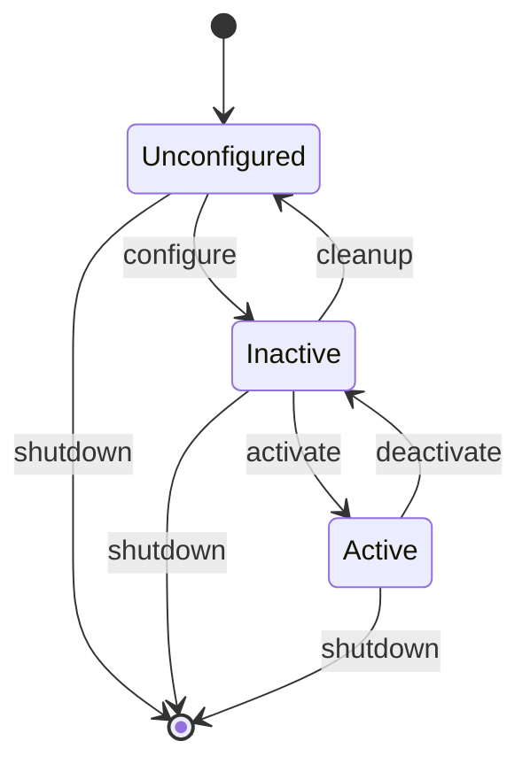

### DDS 是什么
[[DDS介绍|DDS]] 是工业界成熟的发布/订阅中间件标准（不是 ROS2 发明的），ROS2 通过 **RMW（ROS MiddlewareInterface）** 这层抽象接入不同厂商的 DDS 实现：
```
你的代码（rclcpp / rclpy）
        │
        ▼
   rcl（C 语言核心库，各语言客户端库共用）
        │
        ▼
   rmw（ROS Middleware 接口，抽象层）
        │
        ▼
  具体 DDS 实现：Fast DDS / Cyclone DDS / Connext / Zenoh …
        │
        ▼
      操作系统网络栈（UDP/共享内存等）
```
rclcpp 和 rclpy 是 ROS2 官方提供的客户端库（client library），是你写节点代码时真正调用的 API 层：
- rclcpp：C++ 客户端库（"ROS Client Library for C++"）
- rclpy：Python 客户端库（"ROS Client Library for Python"）
这意味着：**换一个 DDS 厂商实现，上层代码不用改**（这也是为什么会有 QoS 兼容性这种"DDS 带来的新概念"——ROS1 时代没有这个问题，因为它没有 DDS）。
## 2. 节点（Node）：是什么、怎么创建、怎么工作
### 2.1 节点是什么
**节点是 ROS2 世界里的一个"通信身份 + 资源容器"**，不是操作系统的进程，也不是线程。

一个节点可以：
- 有名字、命名空间、参数；
- 创建发布者（publisher）、订阅者（subscription）；
- 创建服务端（service）、客户端（client）；
- 创建动作服务端/客户端（action server/client）；
- 创建定时器（timer）；
- 声明回调组（callback group）来控制自己的回调怎么被调度。

一个进程里可以有 0 个、1 个或多个节点；一个节点也可以被 1 条或多条线程处理（取决于 Executor，见[[ROS2 核心概念#3. 执行模型：Executor 与线程|第 3 节]]]）。

### 2.2 最小节点代码
**C++：**
```cpp
#include "rclcpp/rclcpp.hpp"
class SimpleNode : public rclcpp::Node
{
public:
  SimpleNode() : Node("simple_node") {}
};

int main(int argc, char * argv[])
{
  rclcpp::init(argc, argv);
  auto node = std::make_shared<SimpleNode>();
  rclcpp::spin(node);      // 启动执行循环，见第 3 节
  rclcpp::shutdown();
  return 0;
}
```
**Python：**
```python
import rclpy
from rclpy.node import Node
class SimpleNode(Node):
    def __init__(self):
        super().__init__('simple_node')

def main():
    rclpy.init()
    node = SimpleNode()
    rclpy.spin(node)
    rclpy.shutdown()
```

`rclcpp::spin(node)` 实际上是下面这几行的语法糖：
```cpp
rclcpp::executors::SingleThreadedExecutor executor;
executor.add_node(node);
executor.spin();
```
### 2.3 节点怎么"工作"起来
单独 `new` 出一个节点对象，它只是"配置好了自己有哪些通信资源"，**不会自动处理任何消息**。必须被一个 **Executor** 接管、调用 `spin()`，节点上的订阅、服务、定时器等回调才会真正被执行。
```text
创建节点对象  →  节点上创建 publisher/subscription/service/timer
     │
     ▼
把节点 add_node() 给一个 Executor
     │
     ▼
调用 executor.spin()  →  开始不断从 DDS 层取事件、调用对应回调
```
细节详见[[ROS2 核心概念#3. 执行模型：Executor 与线程|第 3 节]]。
### 2.4 节点的命名与命名空间
节点名 + 命名空间构成"全限定名"，例如命名空间 `/robot1`、节点名 `navigation` 的全限定名是`/robot1/navigation`。这在多机器人系统里非常关键——同一份代码可以通过命名空间隔离部署多份实例。

## 3. 执行模型：Executor 与线程
### 3.1 核心心智模型
```text
节点 Node   = ROS 世界里的通信身份和资源容器（谁拥有哪些 topic/service/timer）
Executor    = 调度者（决定"什么时候""哪个线程"去执行哪个回调）
线程 Thread = 真正执行代码的操作系统执行单元
```
节点本身不执行任何代码；**Executor 才是驱动一切运转的引擎**。
### 3.2 Executor 的基本原理
Executor 内部维护一个 **wait set**：告诉底层 rcl/中间件"我关心这些订阅、定时器、服务的事件"。

`spin()` 就是一个死循环：
```text
while (rclcpp::ok()):
    等待 wait set 里任意一个实体就绪（有新消息/请求/定时器到期）
    找到就绪的实体属于哪个回调
    在（某条）线程里执行该回调
```

> 一个重要区别（相对 ROS1）：收到的消息**不会**被缓存到客户端库层的队列里，而是留在中间件里，直到 Executor 真正"取走"它交给回调处理。这样可以让 QoS 的历史/深度设置真正生效。

### 3.3 三种 Executor 类型
| 类型                          | 特点                                 | 适用场景                            |
| --------------------------- | ---------------------------------- | ------------------------------- |
| `SingleThreadedExecutor`    | 单线程串行处理所有回调                        | 简单节点，`rclcpp::spin(node)` 默认用这个 |
| `MultiThreadedExecutor`     | 内部维护线程池，尽量并行处理回调                   | 一个节点有多个互不相关、可并行的回调              |
| `EventsCBGExecutor`（较新版本引入） | 事件驱动，CPU 占用比前两者低 10%~15%，支持单/多线程模式 | 追求极致性能、多个节点分组调度                 |

多个节点可以共用同一个 Executor：
```cpp
rclcpp::executors::SingleThreadedExecutor executor;
executor.add_node(node1);
executor.add_node(node2);
executor.add_node(node3);
executor.spin();   // 一条线程串行服务三个节点
```

也可以给不同节点分配独立的 Executor（各自跑在自己的线程里，互不阻塞）——这正是本仓库`daystar_api` 里 `Navigation` 单例"自己造一个 `MultiThreadedExecutor` + 独立线程"的原因，详见[[ROS2 核心概念#13. 与本仓库 daystar_api 的对照|第 13 节]]。

### 3.4 一条线程可以服务多个节点，一个节点也可以被多条线程处理
```text
SingleThreadedExecutor + 3 个节点  →  1 条线程轮流执行 3 个节点的全部回调

MultiThreadedExecutor + 1 个节点   →  多条线程并行执行这 1 个节点的不同回调（具体并行度受回调组约束）
```

所以：**节点 ≠ 线程，也 ≠ 进程**。节点只是通信身份；到底被谁、怎么执行，完全取决于 Executor 和回调组的配置。

## 4. 回调组（Callback Group）与死锁规避
“回调组”和"回调函数"是两个不同层次的概念：**回调函数是"要执行的代码"，回调组是"给这些代码分类打标签，决定它们能不能同时执行"**。

### 4.1 先明确什么是"回调函数"
节点里凡是"事件发生时会被调用的函数"都叫回调，包括：
```cpp
create_subscription(topic, qos, 订阅回调)   // 收到消息时调用
create_service(name, 服务回调)              // 收到请求时调用
create_wall_timer(period, 定时器回调)       // 定时触发
create_client(...)                          // 异步调用的"完成回调"
```
在你贴的代码里，`navigation.cpp` 里至少有这几个回调函数：定时器回调、service 回调等。

### 4.2 回调组是什么
**每一个回调（订阅/服务/定时器/客户端）在创建时，都会被"分配"到某一个回调组里**，哪怕你不手动指定，它也会被自动放进节点的**默认回调组**。
```text
节点
 ├─ 回调组 A（比如你没指定，用默认组）
 │    ├─ 订阅回调 1
 │    ├─ 定时器回调 2
 │    └─ 服务回调 3
 └─ 回调组 B（你手动创建的）
      └─ 服务回调 4
```
### 4.3为什么需要回调组
`MultiThreadedExecutor` 有好几条线程可用，但**线程池空闲不代表回调就能并行跑**——能不能并行，是由回调组的类型决定的：

| 回调组类型                      | 语义                            |
| -------------------------- | ----------------------------- |
| **Mutually Exclusive**（互斥） | 组内回调**任意时刻只能有一个在执行**（哪怕线程池空闲） |
| **Reentrant**（可重入）         | 组内回调可以并行执行，甚至同一个回调的不同调用也能并行   |

不指定回调组时，所有实体都落在节点的 **默认回调组**（是一个 Mutually Exclusive 组）。这意味着：**哪怕你用了 `MultiThreadedExecutor`，如果所有东西都在默认组里，效果等同于单线程**。不同回调组之间**永远可以并行**，无论类型。

### 4.4 死锁的经典场景
**在一个回调里发起同步 service/action 调用，而这个调用需要等待的"响应处理回调"和当前回调属于同一个 Mutually Exclusive 组** —— 这会导致永久死锁：

```text
Timer 回调（Mutually Exclusive 组 A）
  └─ 发起同步 service 调用，阻塞等待
       └─ 响应也需要在组 A 里执行的 done-callback 处理
            └─ 但组 A 正被 Timer 回调占着 → 永远等不到 → 死锁
```

```
t0: Executor 的 wait set 发现 timer 到期
    → 把 timer_callback 派给 线程1 执行
    → 组 A 被标记"占用中"（因为互斥组任意时刻只能有 1 个回调在跑）

t1: 线程1 正在执行 timer_callback
    → 调用 client_->async_send_request(request)
    → 请求通过 DDS 发出去，注册了一个"等响应来了要执行的处理逻辑"
      （这个处理逻辑本质上也是一个回调，它属于 client_ 所在的回调组，
       也就是组 A —— 因为创建 client_ 时没有单独指定组）
    → 代码执行到 future.wait()，线程1 开始阻塞，但注意：
      线程1 虽然阻塞了，但 timer_callback 这个函数**还没返回**，
      所以从 Executor 的视角看，"组 A 有一个回调正在执行中"这个状态一直没解除

t2: 服务端处理完，响应通过 DDS 到达
    → Executor 的 wait set 发现"client_ 有响应数据可以取了"
    → 想把"处理响应、完成 future"这个回调派给 线程2 执行
    → 但这个回调也属于组 A
    → Executor 检查：组 A 现在是不是已经有回调在跑？
      → 是的（timer_callback 还没返回，虽然它自己卡在 wait() 上）
    → 互斥规则：组 A 同一时刻只能有 1 个回调在执行
    → Executor 拒绝把"响应处理回调"派发给线程2，让它排队等着

t3: 线程1 卡在 future.wait()，永远等着 future 被填充
    线程2 空闲，但被组 A 的互斥规则挡住，不能去执行本该"填充 future"的那个回调
    → 谁都没法往前推进 → 死锁
```
**规避方法**（任选其一）：
1. 把定时器和 client 放进**不同**的回调组（哪怕都是 Mutually Exclusive）；
2. 把它们放进同一个 **Reentrant** 组；
3. 改用**异步调用**（`async_send_request` + 回调，而不是阻塞等待 future）。

```cpp

// C++：把 timer 和 client 分到不同回调组，避免死锁
client_cb_group_ = this->create_callback_group(rclcpp::CallbackGroupType::MutuallyExclusive);
timer_cb_group_  = this->create_callback_group(rclcpp::CallbackGroupType::MutuallyExclusive);

  
rclcpp::SubscriptionOptions options;
options.callback_group = client_cb_group_;
client_ptr_ = this->create_client<Empty>("test_service", ..., client_cb_group_);
timer_ptr_  = this->create_wall_timer(1s, callback, timer_cb_group_);
```

> 本仓库 `daystar_api` 的 `navigation.cpp` 里有一段专门的 `thread_local + RAII` 死锁防御代码（检测"在导航回调里又发起阻塞式导航调用"），本质上就是在给这条规则做运行时兜底，见 [第 13 节](#13-与本仓库-daystar_api-的对照)。

## 5. 节点间通信：Topic / Service / Action / Parameter
ROS2 提供三种主要通信范式，外加基于服务实现的参数系统。
### 5.1 对比总览

| 通信方式          | 模式             | 特点                                 | 典型用途             |
| ------------- | -------------- | ---------------------------------- | ---------------- |
| **Topic**     | 发布/订阅，多对多，匿名   | 持续数据流；发布者不知道谁在订阅                   | 传感器数据、机器人状态、持续话题 |
| **Service**   | 请求/响应，一对一，同步语义 | 短时的远程过程调用                          | 查询一次性数据、触发一次性动作  |
| **Action**    | 长时任务，带反馈和取消    | 有 goal / feedback / result 三段式，可取消 | 导航到某点、执行一段耗时轨迹   |
| **Parameter** | 底层基于 Service   | 节点的可配置项，支持运行时查询/修改                 | 运行时调参、配置管理       |

### 5.2 Topic：发布/订阅
三个关键特性（来自官方文档原文归纳）：
1. **发布/订阅（总线式）**：发布者和订阅者通过 topic 名字互相发现，同一 topic 上可以有 0 个或多个发布者、0 个或多个订阅者；
2. **匿名**：订阅者不关心消息是谁发的（除非主动查询），发布者/订阅者可以随时增删而不影响其他人；
3. **强类型**：消息的每个字段都有明确类型和语义（`.msg` 文件定义）。
```cpp
// 发布者
rclcpp::QoS qos(rclcpp::KeepLast{10});
pub_ = this->create_publisher<std_msgs::msg::String>("chatter", qos);
pub_->publish(msg);

// 订阅者
sub_ = this->create_subscription<std_msgs::msg::String>(
    "chatter", qos, [this](std_msgs::msg::String::SharedPtr msg) {
        RCLCPP_INFO(this->get_logger(), "heard: %s", msg->data.c_str());
    });
```
调试利器：`ros2 bag record` 本质上就是"新建一个订阅者，把收到的消息落盘"，不会干扰系统里其他订阅者。

**QoS 配置**就是给一个 topic 的通信实体声明“消息应该怎样存、怎样送”的一组策略，例如：
```cpp
rclcpp::QoS qos(rclcpp::KeepLast(10));
qos.reliable();
qos.durability_volatile();
```

```text
KeepLast(10)        最多保留最近 10 条消息
Reliable            尽力确保消息送达，必要时重传
Volatile            新订阅者只接收它订阅之后发布的新消息
```
“只保留最近 10 条未处理消息”可以这样理解：假设发布速度快于订阅回调处理速度：
```
发布：m1, m2, m3, ... m10, m11
订阅回调暂时来不及处理

中间件队列最多存 10 条：
m2, m3, ..., m11

最旧的 m1 被挤掉。
```
这里的“未处理”指：消息已经到达订阅端，但 Executor 还没有取出它、执行订阅回调。队列满时，`KeepLast(N)` 保留最新的 NN 条，旧消息被丢弃。

它不是跨进程共享的单一队列。发布者与每个订阅者各自都可能有缓冲区，具体资源和丢弃行为还受 DDS 实现、可靠性策略、网络状态等影响。对实时传感器数据来说，“宁可丢旧帧也要拿最新帧”通常正是想要的行为。

### 5.3 Service：请求/响应
```
# 一个 .srv 文件的结构
<Request 字段>
---
<Response 字段>
```

```cpp
// 服务端
auto service = node->create_service<AddTwoInts>(
    "add_two_ints",
    [](const std::shared_ptr<AddTwoInts::Request> req,
       std::shared_ptr<AddTwoInts::Response> res) {
        res->sum = req->a + req->b;
    });

// 客户端（异步，推荐）
auto client = node->create_client<AddTwoInts>("add_two_ints");
auto future = client->async_send_request(request,
    [](rclcpp::Client<AddTwoInts>::SharedFuture future) {
        auto result = future.get();
    });
```
> Service 应对短时调用；长时任务不要用 Service（会一直占着连接），应该用 Action。

### 5.4 Action：长时任务 + 反馈 + 可取消
```
# 一个 .action 文件的结构
<Goal 请求字段>
---
<Result 最终结果字段>
---
<Feedback 过程反馈字段>
```
Action 由 **action server**（接收目标、执行、发反馈、响应取消）和 **action client**（发起目标、接收反馈/结果、可以取消）组成。一个 action 名字下只应该有**一个** server，但可以有任意多个 client。

典型例子：导航到某个航点——过程中持续反馈"走到哪了"，高层状态机可以随时取消或抢占。

### 5.5 Parameter：节点的可配置项
参数底层就是走 Service（`declare_parameter`/`get_parameter`/`set_parameter` 等），所以它天生具有和 Service 一样的 QoS 语义（默认走更大队列深度，防止参数客户端偶尔连不上导致请求丢失）。
```cpp
this->declare_parameter<int>("rate", 10);
int rate = this->get_parameter("rate").as_int();
```

```console
$ ros2 param list
$ ros2 param get /my_node rate
$ ros2 param set /my_node rate 20
$ ros2 param dump /my_node > my_node.yaml
```
## 6. QoS（服务质量）
QoS 是 ROS2 相对 ROS1 最大的新增能力，来自底层 DDS。它让"要不要保证送达""要不要保留历史数据"这些网络行为变成可配置项。
### 6.1 核心策略
| 策略                   | 取值                          | 含义                                         |
| -------------------- | --------------------------- | ------------------------------------------ |
| **History**（历史）      | Keep Last(N) / Keep All     | 只保留最近 N 条，还是保留全部（受资源上限约束）                  |
| **Depth**（深度）        | 整数                          | 仅在 History=Keep Last 时生效，队列大小              |
| **Reliability**（可靠性） | Best Effort / Reliable      | 尽力而为（可能丢包）vs 保证送达（会重传）                     |
| **Durability**（持久性）  | Volatile / Transient Local  | 是否给"迟到"的订阅者补发历史数据（类似 ROS1 的 latched topic） |
| **Deadline**         | 时长                          | 期望的消息发布最大间隔                                |
| **Lifespan**         | 时长                          | 消息从发布到被视为"过期"的最长时间                         |
| **Liveliness**       | Automatic / Manual by topic | 判断发布者是否还"活着"的机制                            |

### 6.2 预置 Profile（不用逐项配置）
| Profile            | 适用场景             | 关键设置                            |
| ------------------ | ---------------- | ------------------------------- |
| **Default**        | 通用场景，向 ROS1 行为看齐 | Keep Last(10)、Reliable、Volatile |
| **Sensor Data**    | 高频传感器数据，宁可丢也要新鲜  | Best Effort、较小队列深度              |
| **Services**       | 服务调用             | Reliable、Volatile（避免重启后收到过期请求）  |
| **Parameters**     | 参数系统             | 类似 Services，但队列深度更大             |
| **System Default** | 完全交给底层 DDS 实现决定  | 各实现可能不同                         |

### 6.3 兼容性规则（发布者"提供"、订阅者"请求"）
发布者的 QoS 是它能提供的"上限"，订阅者的 QoS 是它能接受的"下限"，只有当发布者提供的质量**不低于**订阅者请求的质量时，才能建立连接：
```text
Reliability: Best Effort 发布 → Reliable 订阅  ❌ 不兼容
Reliability: Reliable    发布 → Best Effort 订阅 ✅ 兼容（够格）
Durability:  Volatile    发布 → Transient Local 订阅 ❌ 不兼容
Durability:  Transient Local 发布 → Volatile 订阅 ✅ 兼容（只是拿不到历史数据）
```

不兼容时**静默失败**：不会报错，只是双方永远收不到彼此的消息——这是新手最容易踩的坑，排查命令：

```console
$ ros2 topic info /some_topic --verbose   # 看两端实际 QoS 是否匹配
$ ros2 service info /some_service --verbose
```
### 6.4 常用设置代码
```cpp
// C++：History+Depth 用 rclcpp::QoS，其余用链式调用
rclcpp::QoS qos(rclcpp::KeepLast(10));
qos.reliable();              // 或 .best_effort()
qos.durability_volatile();   // 或 .transient_local()
pub_ = create_publisher<MsgT>("topic", qos);
```

```python
# Python
from rclpy.qos import QoSProfile, ReliabilityPolicy, DurabilityPolicy
qos = QoSProfile(depth=10,
                  reliability=ReliabilityPolicy.RELIABLE,
                  durability=DurabilityPolicy.VOLATILE)
self.create_publisher(MsgT, 'topic', qos)
```

## 7. 生命周期节点（Managed Node）

普通节点一创建就立即"上线"（发布者、服务全部就绪）。但对于要控制硬件的节点（相机、雷达、电机驱动），往往需要**分阶段初始化**，避免"节点存在但硬件还没准备好"导致的异常。

### 7.1 状态机


| 状态               | 含义                                   |
| ---------------- | ------------------------------------ |
| **Unconfigured** | 刚创建，资源未分配                            |
| **Inactive**     | 已配置（分配了资源、创建了通信实体），但发布者未激活、不对外提供正常服务 |
| **Active**       | 正常运行状态                               |
| **Finalized**    | 已销毁，不可逆                              |

节点需要重写 `on_configure()` / `on_activate()` / `on_deactivate()` / `on_cleanup()` /`on_shutdown()` 等回调来响应状态转换，在合适的阶段初始化/释放资源。

```cpp
class MyLifecycleNode : public rclcpp_lifecycle::LifecycleNode
{
public:
  MyLifecycleNode() : LifecycleNode("my_lifecycle_node") {}

  CallbackReturn on_configure(const rclcpp_lifecycle::State &) override
  {
    pub_ = this->create_publisher<std_msgs::msg::String>("out", 10);
    return CallbackReturn::SUCCESS;
  }
  
  CallbackReturn on_activate(const rclcpp_lifecycle::State & state) override
  {
    LifecycleNode::on_activate(state);   // 默认实现会自动激活 LifecyclePublisher
    return CallbackReturn::SUCCESS;
  }
private:
  rclcpp_lifecycle::LifecyclePublisher<std_msgs::msg::String>::SharedPtr pub_;
};
```

> 较新版本的 `LifecycleNode` 已提供 `on_activate`/`on_deactivate` 的**默认实现**，会自动帮你激活/反激活节点持有的所有 `LifecyclePublisher`，不用手动逐个调用。

### 7.2 为什么用它
- 保证"硬件资源只在真正需要时才初始化"，出错/关闭时按可控顺序释放；
- 可以被外部统一编排（比如启动流程要求"所有节点先 configure 完，再统一 activate"）；
- 未激活状态下，`LifecyclePublisher::publish()` 会被静默丢弃，不会污染系统。

本仓库 `daystar_api` 里 `DaystarServiceNode` 正是 `LifecycleNode`，其 `onConfigure()` 阶段一次性初始化了 `Navigation`/`PTZ`/`Motion` 等所有能力域单例，详见 [第 13 节](#13-与本仓库-daystar_api-的对照)。

## 8. 开发流程：workspace、package、colcon
### 8.1 workspace（工作区）与 overlay
一个 ROS2 workspace 通常是这样的目录结构：
```
my_ws/
├── src/         # 你的源代码（每个子目录是一个 package）
├── build/       # colcon 中间产物
├── install/     # 构建产物的安装目录（含 setup.bash）
└── log/         # 构建日志
```
可以把 ROS2 当成安装在机器人上的“通信运行时 + 开发工具”，你的程序则是注册到这个运行时中的节点。完整链路是：
```text
1. 机器人安装 ROS2 发行版
   /opt/ros/humble/
   └─ 提供 rclcpp、rclpy、DDS、消息类型、ros2 CLI、colcon 等基础设施

2. 你在自己的 workspace 编写 ROS2 package
   my_ws/src/my_package/
   ├─ package.xml       声明依赖：rclcpp、std_msgs 等
   ├─ CMakeLists.txt    描述怎么编译 C++
   └─ src/my_node.cpp   你的节点代码

3. 编译你的 package
   cd my_ws
   source /opt/ros/humble/setup.bash
   colcon build --packages-select my_package

4. 编译产物进入 my_ws/install/
   source my_ws/install/setup.bash
   ros2 run my_package my_node

5. 程序运行，节点创建 publisher
   create_publisher<MsgT>("/robot/status", qos)
   publish(message)

6. DDS 自动发现网络上的订阅者
   其他模块只要：
   - 在同一个 ROS_DOMAIN_ID
   - topic 名称相同：/robot/status
   - 消息类型相同：MsgT
   - QoS 兼容
   - 网络可达

   就会收到你的消息。
```
`overlay` 就是“**在已有 ROS2 安装之上，叠加你自己构建的一层包**”。
```text
底层 underlay：/opt/ros/humble
    └─ 官方预装包：rclcpp、nav2、std_msgs 等

上层 overlay：~/my_ws/install
    └─ 你自己编译的包：my_package、my_msgs 等
```
每次 `source` 一个 `setup.bash`，它会把对应 workspace 的包路径、库路径、Python 路径等加入环境变量。这正是本工作区 `underlay_ws` → `ros2_ws` → `overlay_ws`三层结构的用意：每一层都是对上一层的叠加。后 source 的层级优先级更高：
```bash
source /opt/ros/humble/setup.bash      # 系统底层安装
source ~/underlay_ws/install/setup.bash # 第一层 overlay
source ~/overlay_ws/install/setup.bash  # 第二层 overlay（会覆盖前面同名包）
```

### 8.2 package 的两种构建类型
| 类型                     | 必需文件                                                           | 适用           |
| ---------------------- | -------------------------------------------------------------- | ------------ |
| `ament_cmake`（C++）     | `CMakeLists.txt`、`package.xml`、`include/<pkg>/`、`src/`         | C++ 节点、混合语言包 |
| `ament_python`（Python） | `package.xml`、`setup.py`、`setup.cfg`、`resource/<pkg>`、`<pkg>/` | 纯 Python 节点  |

一个 workspace 里可以混合两种类型的包，但**一个包内部**不能既是纯 C++ 又是纯 Python（除非用 `ament_cmake_python` 做特殊桥接）。
```console
# 创建一个 C++ 包，带一个可执行节点模板
$ ros2 pkg create --build-type ament_cmake --license Apache-2.0 \
    --node-name my_node my_package --dependencies rclcpp std_msgs
# 创建一个 Python 包
$ ros2 pkg create --build-type ament_python --license Apache-2.0 \
    --node-name my_node my_package --dependencies rclpy std_msgs
```
`package.xml` 的核心作用是让 colcon 知道**依赖关系和构建顺序**，`CMakeLists.txt`/`setup.py`才是真正描述"怎么编译/安装"的文件。

### 8.3 CMakeLists.txt 最简骨架
```cmake
cmake_minimum_required(VERSION 3.20)
project(my_package)

find_package(ament_cmake REQUIRED)
find_package(rclcpp REQUIRED)
find_package(std_msgs REQUIRED)

add_executable(my_node src/my_node.cpp)
ament_target_dependencies(my_node rclcpp std_msgs)

install(TARGETS my_node DESTINATION lib/${PROJECT_NAME})

ament_package()   # 必须是最后一行，且每个包只能调用一次
```

### 8.4 自定义接口（.msg/.srv/.action）
自定义消息通常**单独放一个包**（例如 `xxx_msgs`），避免和逻辑代码耦合导致的循环依赖问题：
```cmake
find_package(rosidl_default_generators REQUIRED)
rosidl_generate_interfaces(${PROJECT_NAME}
  "msg/Num.msg"
  "srv/AddThreeInts.srv"
)
```
> `rosidl_generate_interfaces` 和 `ament_python_install_package` **不能**在同一个 CMake项目里混用，这是官方文档明确写出的限制，也是"接口定义单独建包"的直接原因。

### 8.5 构建与运行
```console
$ colcon build                              # 构建 workspace 内所有包
$ colcon build --packages-select my_package # 只构建指定包（增量、更快）
$ colcon build --symlink-install            # Python/资源文件用符号链接，改完不用重新 build
$ source install/setup.bash                 # 让当前 shell 能找到这些包
$ ros2 run my_package my_node               # 运行
```
推荐参数：
- `--packages-up-to <pkg>`：只构建该包及其依赖，不构建无关包；
- `--symlink-install`：迭代 Python 脚本/launch 文件/资源文件时不用每次重新 build。

## 9. 从零写一个节点（实操）
### 9.1 一个发布者节点（C++）
```cpp
#include <chrono>
#include "rclcpp/rclcpp.hpp"
#include "std_msgs/msg/string.hpp"
using namespace std::chrono_literals;
class MinimalPublisher : public rclcpp::Node
{
public:
  MinimalPublisher() : Node("minimal_publisher"), count_(0)
  {
    publisher_ = this->create_publisher<std_msgs::msg::String>("topic", 10);
    timer_ = this->create_wall_timer(
        500ms, std::bind(&MinimalPublisher::timer_callback, this));
  }

private:
  void timer_callback()
  {
    auto message = std_msgs::msg::String();
    message.data = "Hello, world! " + std::to_string(count_++);
    RCLCPP_INFO(this->get_logger(), "Publishing: '%s'", message.data.c_str());
    publisher_->publish(message);
  }
  rclcpp::TimerBase::SharedPtr timer_;
  rclcpp::Publisher<std_msgs::msg::String>::SharedPtr publisher_;
  size_t count_;
};

int main(int argc, char * argv[])
{
  rclcpp::init(argc, argv);
  rclcpp::spin(std::make_shared<MinimalPublisher>());
  rclcpp::shutdown();
  return 0;
}
```

### 9.2 对应的订阅者节点
```cpp
class MinimalSubscriber : public rclcpp::Node
{
public:
  MinimalSubscriber() : Node("minimal_subscriber")
  {
    subscription_ = this->create_subscription<std_msgs::msg::String>(
        "topic", 10,
        [this](std_msgs::msg::String::SharedPtr msg) {
          RCLCPP_INFO(this->get_logger(), "I heard: '%s'", msg->data.c_str());
        });
  }

private:
  rclcpp::Subscription<std_msgs::msg::String>::SharedPtr subscription_;
};
```

### 9.3 验证运行时的通信关系
```console
$ ros2 node list                 # 看当前有哪些节点
$ ros2 node info /minimal_publisher
$ ros2 topic list                # 看当前有哪些 topic
$ ros2 topic echo /topic         # 实时打印某个 topic 的数据
$ ros2 topic info /topic --verbose   # 看发布者/订阅者的 QoS 是否匹配
```

## 10. Launch 系统：管理一堆节点
真实系统往往是几十个节点一起跑，手动逐个 `ros2 run` 很繁琐。Launch 系统用一份 Python文件描述"启动哪些节点、传什么参数、怎么响应节点退出"等：
```python
from launch import LaunchDescription
from launch_ros.actions import Node

def generate_launch_description():
    return LaunchDescription([
        Node(
            package='my_package',
            executable='my_node',
            name='my_node_renamed',
            parameters=[{'rate': 10}],
            remappings=[('/topic', '/renamed_topic')],
        ),
    ])
```

```console
$ ros2 launch my_package my_launch.py
```

Launch 系统还支持事件处理（`OnProcessExit`、`OnProcessStart` 等），可以做到"某节点退出后触发另一个动作/整体关闭"，本仓库中 `rms_bringup` 包即承担这一角色。

## 11. 常用工具链（CLI）

| 命令 | 用途 |
|---|---|
| `ros2 node list` / `ros2 node info <node>` | 查看节点及其发布/订阅/服务/参数 |
| `ros2 topic list` / `echo` / `info` / `hz` / `pub` | 查看、监听、发布、测速某个话题 |
| `ros2 service list` / `call` / `type` | 查看、调用、查类型 |
| `ros2 action list` / `send_goal` / `info` | 动作相关操作 |
| `ros2 param list` / `get` / `set` / `dump` | 参数系统操作 |
| `ros2 bag record` / `play` / `info` | 数据录制与回放（调试利器） |
| `ros2 doctor` | 检查当前 ROS2 环境是否正常 |
| `rqt_graph` | 图形化查看节点通信拓扑 |
| `ros2 pkg create` | 脚手架生成新包 |

排查"QoS 不兼容导致收不到消息"的标准动作：
```console
$ ros2 topic info /xxx --verbose
$ ros2 service info /xxx --verbose
```

## 12. 行业最佳实践清单
综合官方文档与社区共识，整理出的常见最佳实践：
1. **不要阻塞回调**：所有耗时操作应该异步化或放到独立线程/独立回调组，回调本身应尽快返回。
2. **同步调用要小心回调组**：在回调里发起同步 service/action 调用前，先确认调用方和响应处理不在同一个 Mutually Exclusive 组，否则死锁（见第 4 节）。
3. **默认回调组 = 单线程效果**：用了 `MultiThreadedExecutor` 却什么都不分组，等于白费性能。
4. **QoS 要和场景匹配**：传感器数据用 Best Effort + 小队列，服务/参数用 Reliable +Volatile，需要"迟到者补发历史"的用 Transient Local。
5. **自定义接口单独建包**：避免逻辑代码和消息定义耦合，也规避 `rosidl_generate_interfaces`与 `ament_python_install_package` 不能共存的限制。
6. **硬件相关节点用 Lifecycle Node**：把资源初始化和"节点存在"解耦，故障恢复更可控。
7. **善用 overlay 工作区**：不要把所有代码堆进一个 workspace，按依赖层次拆分（underlay/overlay），减小单次构建范围。
8. **构建时用 `--packages-select`/`--packages-up-to`**：避免每次全量重建。
9. **发布 Response/字段变更时注意兼容性**：ROS2 消息类型是强类型的，字段增删会影响下游，  涉及多语言绑定（如本仓库的 pybind 层）时要格外小心版本 skew（新增字段要用 `getattr(..., default)` 之类的方式做容错）。
10. **诊断优先用官方工具**：`ros2 topic info --verbose`、`ros2 doctor`、`rqt_graph`，比一上来看代码更快定位"图层面"的问题（节点没起来、QoS 不匹配、命名空间没对齐等）。

## 13. 与本仓库 daystar_api 的对照
把上面的抽象概念对照到你已经在读的代码，能更快巩固理解。

| 抽象概念 | 本仓库对应 | 参考文档 |
|---|---|---|
| **普通节点 vs Lifecycle Node** | `DaystarServiceNode` 继承 `LifecycleNode`，`onConfigure()`→`onActivate()` 两阶段启动 | [四层架构详解.md](四层架构详解.md)、本文第 7 节 |
| **一个进程里的"单例 + 自持 Executor"** | `Navigation::GetInstance()` 内部自建 `MultiThreadedExecutor` + 独立线程，`automatically_add_to_executor_with_node=false` 阻止被外层 executor 接管 | [框架分层实现拆解-delete_map垂直切片.md § 4.1](框架分层实现拆解-delete_map垂直切片.md) |
| **回调组三选一** | `service_callback_group_`（慢服务）/ `fast_service_callback_group_`（快查询）/ `feedback_callback_group_`（周期发布） | 同上 § 4.2 |
| **死锁防御** | `navigation.cpp` 里 `thread_local g_in_nav_callback` + RAII guard，检测"导航回调里又发起阻塞式导航调用" | 同上 § 4.5，对应本文第 4.2 节 |
| **Service（对外接口）** | `api_msgs/srv/DeleteMap.srv` + `create_service("/sdk/nav/delete_map", ...)` | 同上 § L0/L4 |
| **同一份代码在两个进程里各自持有一份单例** | 服务节点进程绑定 `shared_from_this()`；任务脚本子进程绑定自建的 `api_<task_id>_node` | 同上"模型二" |
| **强类型消息的多语言绑定** | pybind11 把 C++ `DeleteMapResponse` 结构体绑定成 Python 类，需要手写 `__repr__`、`py::init<>()` | 同上 § L2 |
| **参数系统** | `declareROSParameters()` 在 `onConfigure()` 之前统一声明 | 同上 § 4.6 |
| **QoS 在批量删除接口里的体现** | `DeleteMaps.srv` 里 `block`+`timeout` 的约定，本质是"自定义的应用层超时/阻塞协议"，与 DDS QoS 是两个不同层面但类似的"质量取舍"思想 | 同上 § L0 关键点 3、§ 4.3 |
