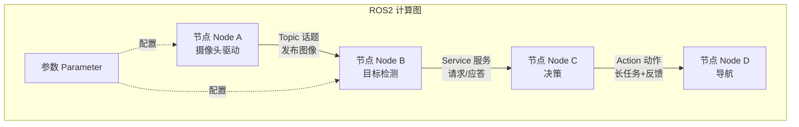
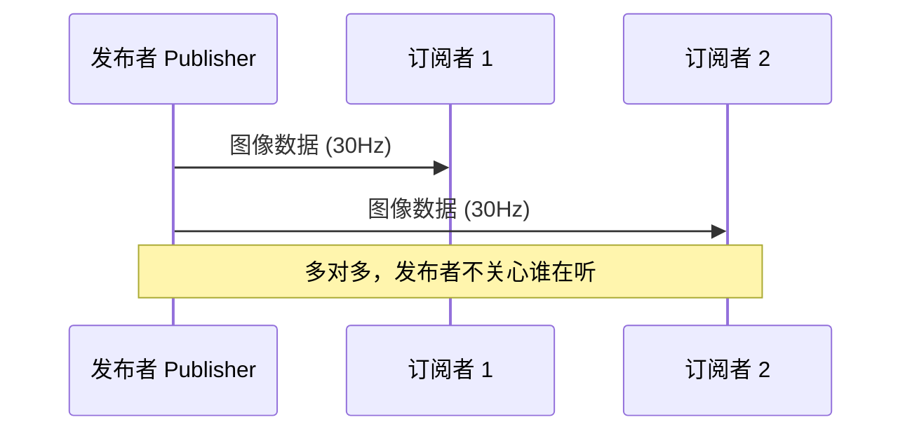
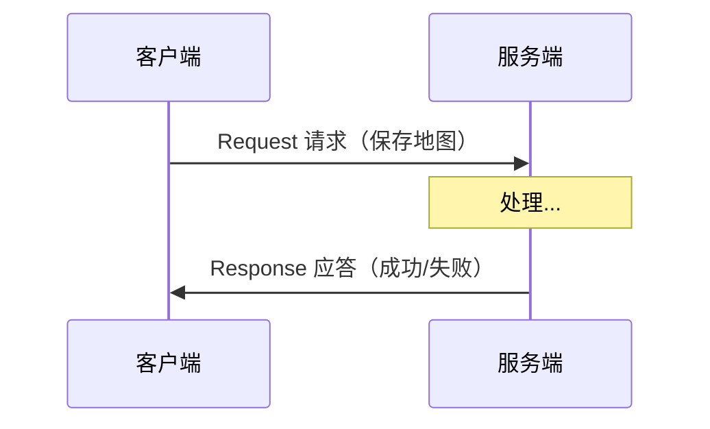
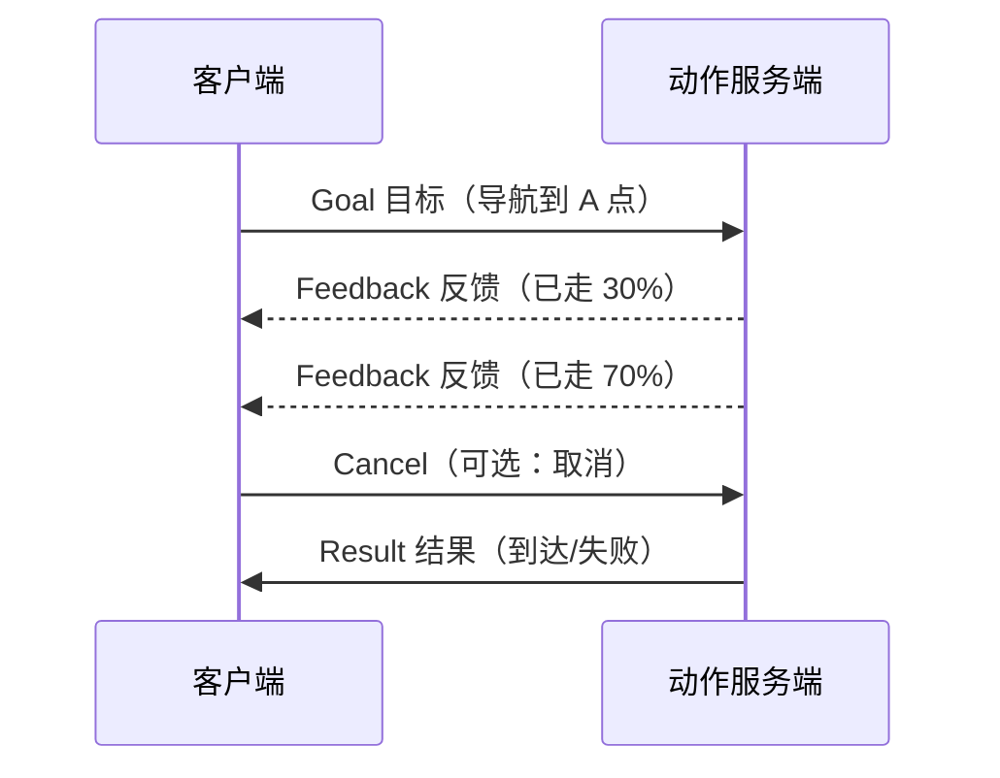

## 1. 为什么需要 ROS2（Why）
### 1.1 机器人开发的真实痛点
写一个机器人程序，你需要同时处理：
- **多个传感器**：摄像头、激光雷达、IMU、编码器……各自有不同的数据格式和频率
- **多个执行器**：电机、机械臂、云台……需要实时控制
- **多个算法模块**：定位、建图、导航、感知、决策……彼此依赖
- **分布式硬件**：算法可能跑在工控机，控制可能跑在嵌入式板，还要联网
如果用「一个大 main 函数」把这些都塞在一起，会变成无法维护的灾难：模块强耦合、无法复用、一个崩溃全盘崩溃。
### 1.2 ROS 的核心思想
**把一个复杂系统拆成许多小程序（节点），让它们通过标准化的「消息」互相通信。**
这样带来的好处：

| 痛点    | ROS 的解决方案               |
| ----- | ----------------------- |
| 模块耦合  | 节点之间只靠消息通信，互不依赖代码       |
| 难以复用  | 标准消息格式 + 包管理，社区生态可直接拿来用 |
| 单点崩溃  | 进程隔离，一个节点挂掉不影响其他节点      |
| 跨语言协作 | C++ 节点和 Python 节点可以无缝通信 |
| 分布式部署 | 节点可跨多台机器，通信透明           |

### 1.3 为什么是 ROS2 而不是 ROS1
ROS1（2007 年起）很成功，但有先天缺陷。ROS2 是**彻底重写**的版本：

| 维度    | ROS1                  | ROS2                          |
| ----- | --------------------- | ----------------------------- |
| 通信中间件 | 自研 TCPROS，依赖中心 Master | 基于工业标准 **DDS**，去中心化           |
| 单点故障  | roscore 挂了全网瘫痪        | 无中心节点，节点自动发现                  |
| 实时性   | 差                     | 支持实时（RTOS、QoS 策略）             |
| 多机器人  | 困难                    | 原生支持                          |
| 操作系统  | 主要 Linux              | Linux / Windows / macOS / 嵌入式 |
| 安全性   | 几乎没有                  | 支持加密、认证（SROS2）                |
| 生产可用  | 偏研究                   | 面向产品级量产                       |

## 2. ROS2 是什么（What）
ROS2 **不是操作系统**，而是一套运行在 Linux/Windows 之上的**机器人开发框架（中间件 + 工具 + 生态）**，包含三层：
```
┌─────────────────────────────────────────────┐
│  生态 (Ecosystem)                            │
│  导航 Nav2 / 操作 MoveIt2 / 仿真 Gazebo ...   │
├─────────────────────────────────────────────┤
│  工具 (Tools)                                │
│  构建 colcon / 命令行 ros2 / 可视化 rviz2 ...  │
├─────────────────────────────────────────────┤
│  客户端库 (Client Libraries)                  │
│  C++: rclcpp    Python: rclpy                │
├─────────────────────────────────────────────┤
│  中间件抽象 (RMW)  →  DDS 实现                 │
│  Fast DDS / Cyclone DDS ...                  │
└─────────────────────────────────────────────┘
```
- **rclcpp / rclpy**：你写代码时直接调用的 API。
- **RMW (ROS Middleware)**：屏蔽底层 DDS 差异的抽象层，可换不同 DDS 厂商。
- **DDS**：真正负责数据传输的工业级通信标准（数据分发服务）。

### 版本（Distribution）
ROS2 按字母顺序命名发行版，常见的有：
- **Humble**（2022，LTS 长期支持到 2027）← 目前最主流，新手首选
- **Iron**（2023）
- **Jazzy**（2024，LTS）
- **Foxy**（2020，已 EOL）
> 选择原则：优先选 LTS 版本，配套的 Ubuntu 版本要对应（如 Humble 配 Ubuntu 22.04）。

## 3. 核心概念：知识地图
这是整个 ROS2 最重要的一张图，理解了这些概念就掌握了 70%。


| 概念     | 英文        | 一句话理解                | 类比            |
| ------ | --------- | -------------------- | ------------- |
| **节点** | Node      | 一个干具体活的小程序           | 一个工人          |
| **话题** | Topic     | 单向广播的数据流             | 电台广播 / 订阅公众号  |
| **消息** | Message   | 话题里传输的数据结构           | 信件的格式         |
| **服务** | Service   | 一问一答的同步调用            | 打电话问问题        |
| **动作** | Action    | 长耗时任务，带进度反馈和可取消      | 点外卖（下单→进度→送达） |
| **参数** | Parameter | 节点的可配置项              | 程序的设置项        |
| **接口** | Interface | msg/srv/action 的定义文件 | 通信契约          |

### 关键心智模型
- **节点是进程，通过消息解耦**：你永远不直接调用别人的函数，而是「发消息」或「订阅消息」。
- **三种通信范式各有适用场景**（下一节详解）。
- **发现机制是自动的**：节点启动后通过 DDS 自动找到彼此，不需要配置 IP（同一网络/同一 `ROS_DOMAIN_ID` 下）。

## 4. 通信机制详解
ROS2 有三种通信方式，**选对方式是设计良好系统的关键**。
### 4.1 Topic（话题）—— 发布/订阅，单向数据流
**适用**：持续的、单向的数据流。例如传感器数据、机器人状态、速度指令。

特点：
- **异步**、多对多、发布者不等待订阅者。
- 一个话题可以有多个发布者和多个订阅者。
- 例：`/cmd_vel`（速度指令）、`/scan`（激光数据）、`/image_raw`（图像）。

### 4.2 Service（服务）—— 请求/应答，同步调用
**适用**：偶尔触发、需要立即得到结果的请求。例如「查询当前电量」「切换模式」「保存地图」。

特点：
- **一问一答**，客户端发请求后等待结果。
- 不适合长耗时任务（会一直阻塞）。

### 4.3 Action（动作）—— 长任务，带反馈可取消
**适用**：耗时长、需要进度反馈、可能要中途取消的任务。例如「导航到某点」「机械臂抓取」。

特点：本质是 Service + Topic 的组合（目标、反馈、结果）。

### 4.4 三者对比与选择
|      | Topic | Service | Action  |
| ---- | ----- | ------- | ------- |
| 方向   | 单向    | 双向      | 双向      |
| 同步性  | 异步    | 同步      | 异步（带反馈） |
| 耗时任务 | ❌     | ❌       | ✅       |
| 进度反馈 | ❌     | ❌       | ✅       |
| 可取消  | ❌     | ❌       | ✅       |
| 典型场景 | 传感器流  | 查询/配置   | 导航/抓取   |

**选择口诀**：持续数据用 **Topic**，即时问答用 **Service**，长任务用 **Action**。

### 4.5 QoS（服务质量）
ROS2 基于 DDS，引入了 **QoS 策略**来控制通信可靠性，这是 ROS1 没有的重要特性：
- **Reliability（可靠性）**：
  - `RELIABLE`：保证送达（重传），适合指令。
  - `BEST_EFFORT`：尽力而为，可丢包，适合高频传感器（如图像）。
- **Durability（持久性）**：
  - `TRANSIENT_LOCAL`：晚加入的订阅者也能收到最后一条消息（适合静态地图）。
  - `VOLATILE`：只收订阅后的消息。
- **History（历史）**：缓存多少条消息。

> **新手坑点**：发布者和订阅者的 QoS 必须「兼容」才能通信，否则连不上却没明显报错。传感器数据建议用 `SensorDataQoS`。

## 5. 环境搭建（How - 准备）
### 5.1 推荐组合
- **操作系统**：Ubuntu 22.04 LTS
- **ROS2 版本**：Humble（LTS）
### 5.2 安装步骤（Ubuntu 22.04 + Humble）
```bash
# 1. 设置 locale
sudo apt update && sudo apt install locales
sudo locale-gen en_US en_US.UTF-8
sudo update-locale LC_ALL=en_US.UTF-8 LANG=en_US.UTF-8

# 2. 添加 ROS2 软件源
sudo apt install software-properties-common curl -y
sudo add-apt-repository universe
sudo curl -sSL https://raw.githubusercontent.com/ros/rosdistro/master/ros.key \
  -o /usr/share/keyrings/ros-archive-keyring.gpg
echo "deb [arch=$(dpkg --print-architecture) signed-by=/usr/share/keyrings/ros-archive-keyring.gpg] \
  http://packages.ros.org/ros2/ubuntu $(. /etc/os-release && echo $UBUNTU_CODENAME) main" | \
  sudo tee /etc/apt/sources.list.d/ros2.list > /dev/null

# 3. 安装 ROS2 Humble 桌面完整版（含 rviz、demo 等）
sudo apt update
sudo apt install ros-humble-desktop -y

# 4. 安装构建工具
sudo apt install ros-dev-tools python3-colcon-common-extensions -y
```
### 5.3 配置环境变量
每开一个新终端都要 `source` 一次，可以写进 `~/.bashrc` 一劳永逸：
```bash
echo "source /opt/ros/humble/setup.bash" >> ~/.bashrc
source ~/.bashrc
```
### 5.4 验证安装：经典「说话/听话」例子
开两个终端：
```bash
# 终端 1：发布者（说话的乌龟）
ros2 run demo_nodes_cpp talker

# 终端 2：订阅者（听话的乌龟）
ros2 run demo_nodes_py listener
```

如果终端 2 不断打印收到的消息，说明环境 OK。🎉
> 也可以跑 `ros2 run turtlesim turtlesim_node` 看可视化小乌龟。

## 6. 动手实践（How - 编码）

下面用最小例子展示如何写一个发布者和订阅者。先用 Python（`rclpy`），更易上手。
### 6.1 发布者（Python）

```python
import rclpy
from rclpy.node import Node
from std_msgs.msg import String

class MinimalPublisher(Node):
    def __init__(self):
        super().__init__('minimal_publisher')      # 节点名
        # 创建发布者：消息类型, 话题名, 队列长度
        self.publisher_ = self.create_publisher(String, 'chatter', 10)
        # 每 0.5 秒触发一次回调
        self.timer = self.create_timer(0.5, self.timer_callback)
        self.count = 0

    def timer_callback(self):
        msg = String()
        msg.data = f'Hello ROS2: {self.count}'
        self.publisher_.publish(msg)                # 发布消息
        self.get_logger().info(f'Publishing: {msg.data}')
        self.count += 1

def main():
    rclpy.init()                                    # 初始化
    node = MinimalPublisher()
    rclpy.spin(node)                                # 持续运行，处理回调
    node.destroy_node()
    rclpy.shutdown()

if __name__ == '__main__':
    main()
```

### 6.2 订阅者（Python）
```python
import rclpy
from rclpy.node import Node
from std_msgs.msg import String

class MinimalSubscriber(Node):
    def __init__(self):
        super().__init__('minimal_subscriber')
        # 创建订阅者：消息类型, 话题名, 回调函数, 队列长度
        self.subscription = self.create_subscription(
            String, 'chatter', self.listener_callback, 10)
  
    def listener_callback(self, msg):
        self.get_logger().info(f'I heard: {msg.data}')

def main():
    rclpy.init()
    node = MinimalSubscriber()
    rclpy.spin(node)
    node.destroy_node()
    rclpy.shutdown()

if __name__ == '__main__':
    main()
```

### 6.3 节点编写套路（记住这个模板）
任何 ROS2 节点都是这个结构：
```
1. 继承 Node 基类
2. 在 __init__ 里创建通信对象（publisher / subscriber / service / timer ...）
3. 写回调函数处理事件
4. main 里：init → 创建节点 → spin（进入事件循环）→ shutdown
```
> `spin()` 是关键：它让节点「转起来」，不断检查有没有消息/定时器/服务请求要处理。
## 7. 常用命令行工具速查
`ros2` 命令是日常调试的瑞士军刀，**强烈建议背熟**。
```bash
# ---- 节点 ----
ros2 node list                      # 列出所有运行中的节点
ros2 node info /节点名               # 查看节点的话题、服务等

# ---- 话题 ----
ros2 topic list                     # 列出所有话题
ros2 topic echo /话题名              # 实时打印话题数据（最常用！）
ros2 topic info /话题名              # 查看话题类型、发布者/订阅者数
ros2 topic hz /话题名                # 查看话题发布频率
ros2 topic pub /话题名 类型 '数据'    # 手动发布一条消息（调试用）

# ---- 服务 ----
ros2 service list                   # 列出所有服务
ros2 service call /服务名 类型 '请求' # 手动调用服务

# ---- 动作 ----
ros2 action list
ros2 action send_goal /动作名 类型 '目标'

# ---- 接口（消息/服务定义）----
ros2 interface show std_msgs/msg/String   # 查看某个消息的结构

# ---- 参数 ----
ros2 param list
ros2 param get /节点名 参数名
ros2 param set /节点名 参数名 值

# ---- 运行与启动 ----
ros2 run 包名 可执行文件             # 运行单个节点
ros2 launch 包名 启动文件.launch.py   # 一次启动多个节点

# ---- 录制与回放（调试神器）----
ros2 bag record /话题名              # 录制数据
ros2 bag play 文件名                 # 回放数据
```

### 可视化工具
- **rviz2**：3D 可视化机器人模型、传感器数据、路径等。`rviz2`
- **rqt_graph**：图形化查看节点和话题的连接关系。`rqt_graph`
- **rqt**：一堆调试插件的集合。
## 8. 工程化：包、构建与启动
### 8.1 工作空间（Workspace）结构
ROS2 代码组织在「工作空间」里：
```
ros2_ws/                    # 工作空间根目录
├── src/                    # 源码（你写的包都放这）
│   ├── my_package/
│   │   ├── package.xml     # 包的元信息和依赖声明
│   │   ├── setup.py        # (Python 包) 构建配置
│   │   │   或 CMakeLists.txt (C++ 包)
│   │   └── my_package/     # 实际代码
│   └── ...
├── build/                  # 构建中间产物（自动生成）
├── install/                # 安装产物，source 它来使用（自动生成）
└── log/                    # 构建日志（自动生成）
```
### 8.2 创建包
```bash
cd ~/ros2_ws/src
# 创建 Python 包
ros2 pkg create --build-type ament_python my_py_pkg --dependencies rclpy std_msgs
# 创建 C++ 包
ros2 pkg create --build-type ament_cmake my_cpp_pkg --dependencies rclcpp std_msgs
```
### 8.3 构建：colcon
ROS2 用 **colcon** 构建（取代 ROS1 的 catkin）：
```bash
cd ~/ros2_ws
colcon build                        # 构建所有包
colcon build --packages-select my_pkg   # 只构建指定包
source install/setup.bash           # 关键！构建后必须 source 才能用
```
> **必记流程**：改代码 → `colcon build` → `source install/setup.bash` → 运行。

### 8.4 Launch 文件：一键启动多个节点
实际机器人有几十个节点，不可能一个个手动开。用 launch 文件批量启动：
```python
# my_pkg/launch/demo.launch.py
from launch import LaunchDescription
from launch_ros.actions import Node

def generate_launch_description():
    return LaunchDescription([
        Node(package='my_py_pkg', executable='talker', name='talker'),
        Node(package='my_py_pkg', executable='listener', name='listener'),
    ])
```
运行：`ros2 launch my_py_pkg demo.launch.py`
### 8.5 自定义接口（msg/srv/action）
当标准消息不够用时，定义自己的消息：
```
# my_interfaces/msg/Temperature.msg
float64 celsius
string  sensor_id
```
构建后即可在代码中 `import` 使用。定义服务（`.srv`）用 `---` 分隔请求和应答：
```
# AddTwoInts.srv
int64 a
int64 b
---
int64 sum
```


## 9. 进阶主题
学完上面，你已能写出可用的 ROS2 程序。以下是进一步深入的方向：

| 主题                    | 说明                                 |
| --------------------- | ---------------------------------- |
| **TF2 坐标变换**          | 管理机器人各部件、传感器之间的坐标系关系（必学，几乎所有机器人都用） |
| **生命周期节点**            | 受管理的节点（配置→激活→停用），用于可靠系统            |
| **组件 (Components)**   | 多节点在同一进程内零拷贝通信，提升性能                |
| **Nav2**              | 导航框架（建图、定位、路径规划、避障的完整方案）           |
| **MoveIt2**           | 机械臂运动规划框架                          |
| **Gazebo / Ignition** | 物理仿真，没有真机也能开发                      |
| **ros2_control**      | 硬件抽象与控制框架                          |
| **DDS 调优 & QoS**      | 大规模/实时系统的通信优化                      |
| **micro-ROS**         | 在 MCU（单片机）上跑 ROS2                  |

### TF2 简介（很重要，单独说）
机器人有很多坐标系：世界、底盘、激光雷达、相机、机械臂末端……TF2 帮你回答：
> 「相机看到的物体，相对于机器人底盘在哪里？」

它维护一棵随时间变化的坐标变换树，让你能在任意两个坐标系之间转换数据。导航、感知、操作都离不开它。