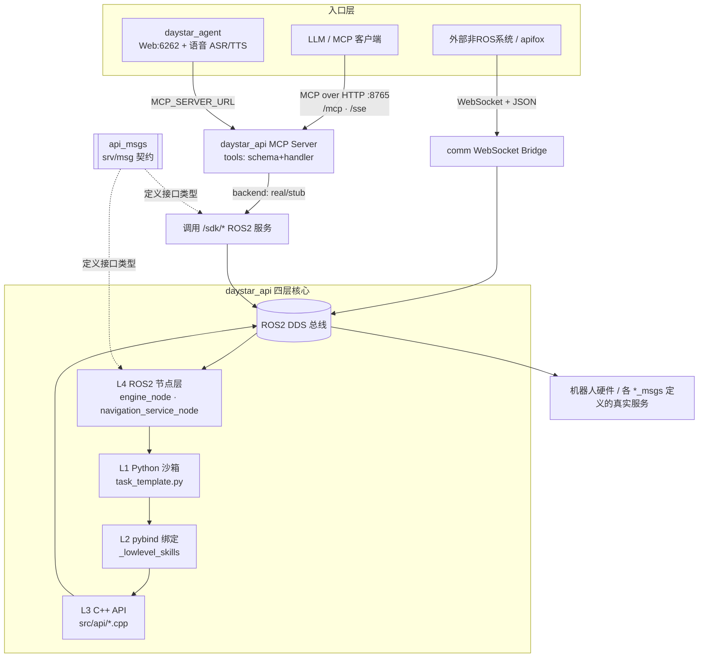
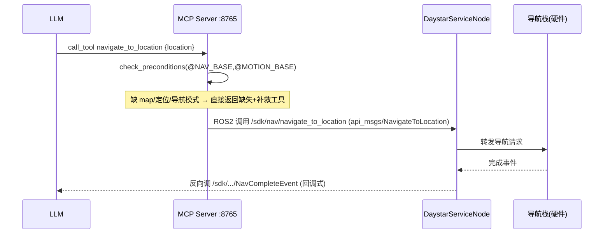

---
ti[[WebSocket]]YSB_SDK_Server]]"
type: Permanent
status: ing
Creation Date: 2026-06-11 15:37
tags:
---
## 0. 总览

- `sdk_server` 不是单一仓库，而是一个 **multi-repo 的 colcon 工作空间**：16 个各自带 `.git` 的 ROS2 包被并排放在 `overlay_ws/src/sdk_server/` 下，由 `colcon`（命令 `overlay_build_release`）统一编译。

- **核心是 `daystar_api`**：用「C++ API → pybind11 → Python 沙箱 → ROS2 节点」四层，把机器人能力封装出来；之上再叠 **MCP Server（:8765）** 给 LLM 用、**daystar_agent（:6262）** 做智能体与语音交互。

- **`api_msgs` 是接口契约层**：定义 `daystar_api` 对外暴露的所有 ROS2 `srv`/`msg`（48 个 srv + 9 个 msg）。它是 `daystar_api` 的"语言"，改任何对外接口都要先动它。

- `comm` 子模块单独负责 **ROS2 ↔ [[WebSocket]]** 的跨网段/跨系统桥接（与 api_msgs/daystar_api 解耦）。

## 1. 工作空间与构建
### 1.1 三层工作空间（underlay → ros2 → overlay）
```
/root/ws/
├── underlay_ws/      # 最底层依赖
├── ros2_ws/          # ROS2 本体（rclcpp、ament 等，源码编译）
└── overlay_ws/       # 业务层 ← 你工作的地方
    └── src/sdk_server/   # multi-repo 聚合目录
```
overlay 依赖 ros2/underlay 的环境（`source install/setup.bash` 叠加）。
### 1.2 构建命令
```bash
# 定义在 ~/.bashrc：cd $OVERLAY_WS && colcon build --mixin ccache lld clang rel-with-deb-info ninja --event-handlers=console_cohesion+ "$@"
overlay_build_release                                  # 全量构建
overlay_build_release --packages-select api_msgs       # 只编接口包
overlay_build_release --packages-select daystar_api    # 只编核心包
overlay_build_release --packages-select api_msgs daystar_api  # 两个一起
```
- **必须在 `/root/ws/overlay_ws` 目录下执行**（colcon 工作区根），不要进子目录单独编。
- 工具链：`clang` + `ninja` + `ccache`（缓存）+ `lld`（快链接），构建类型 `RelWithDebInfo`（优化 + 调试符号）。
- **改了 `api_msgs` 必须重编 `daystar_api`**（接口变了，依赖方要重新生成绑定）。

### 1.3 子仓库一览（16 个独立 git）
| 类别               | 包                                                                                                                                  |
| ---------------- | ---------------------------------------------------------------------------------------------------------------------------------- |
| **核心**           | `daystar_api`（四层框架 + MCP + 引擎）、`daystar_agent`（LangGraph 智能体）                                                                      |
| **接口契约（*_msgs）** | `api_msgs`★、`cam_msgs`、`saturn_msgs`、`umi_msgs`、`vision_msgs`、`rms_msgs`、`navigation_msgs`、`ysc_robot_msgs`、`bot_sense_interfaces` |
| **通信**           | `comm`（ROS2↔WebSocket 桥接）                                                                                                          |
| **能力/资源**        | `speech`、`system`、`path_planner_api`、`daystar_resource`                                                                            |
| **其它**           | `chenxing_agent_ros`（含 `COLCON_IGNORE`，默认不编）                                                                                       |

> 带 `COLCON_IGNORE` 文件的目录会被 colcon 跳过。

## 2. 总体架构图




## 3. `api_msgs` 详解（你维护的模块 ①）
### 3.1 定位
`api_msgs` = **daystar_api 对外 ROS2 接口的"类型契约层"**。它只含接口定义（`.srv`/`.msg`），不含任何业务逻辑。所有 `/sdk/*` 服务的请求/响应结构都在这里声明，由 `rosidl` 在编译期生成 C++/Python 类型。

规模：**48 个 srv + 9 个 msg**（无 action，导航走 srv + 事件回调模式）。

### 3.2 目录与构建
```
api_msgs/
├── CMakeLists.txt          # rosidl_generate_interfaces 生成类型
├── package.xml
├── complie_ros_interface.cmake  # 自定义宏，自动收集 msg/srv/action 文件
├── msg/    (9)
└── srv/    (48)
```

关键 [[CMake]] 机制（[api_msgs/CMakeLists.txt](overlay_ws/src/sdk_server/api_msgs/CMakeLists.txt)）：
- `get_ros_interface_file(${PROJECT_NAME} "msg"|"srv"|"action")` 自动把目录下所有接口文件加入列表 —— **新增 `.srv`/`.msg` 文件无需手动改 CMake，放进对应目录即可**。

- `rosidl_generate_interfaces(...)` 的 `DEPENDENCIES` 列出跨包依赖：`builtin_interfaces`、`sensor_msgs`、`geometry_msgs`、`action_msgs`、`daystar_navigation_msgs`。**用到外部消息类型时，记得把它的包加进这里**，否则生成失败。

### 3.3 接口分组（按功能域）
| 域            | 代表 srv/msg                                                                                                                                                                                                | 说明                                  |
| ------------ | --------------------------------------------------------------------------------------------------------------------------------------------------------------------------------------------------------- | ----------------------------------- |
| **任务引擎**     | `CreateTask`、`ExecuteTask`、`PauseTask`、`ResumeTask`、`StopTask`、`DeleteTask(s)`、`GetAllTasks`、`GetTask`、`TaskStatus`(srv+msg)、`TaskEvent`、`ScriptOutput`                                                   | 任务生命周期 + 状态/输出流                     |
| **导航**       | `NavigateToLocation`、`NavigateToPosition`、`NavigationViaLocations`、`NavigationViaPoses`、`CancelNavigation`、`NavCompleteEvent`、`NavFailedEvent`、`NavigationFeedback`                                       | 注意：完成/失败是**回调式 srv**（SDK 作为客户端反向调用） |
| **定位/地图**    | `GetCurrentPose`、`GetLocalizationState`、`SetLocalization`、`StartMapping`、`StopMapping`、`LoadMap`、`GetCurrentMap`、`GetAvailableMaps`、`DeleteMap(s)`、`MapFileInfo`、`UpdateGraph`、`PathPlan`、`VisualizePath` |                                     |
| **点位**       | `AddLocation`、`DeleteLocation(s)`、`GetAvailableLocations`                                                                                                                                                 | 点位存 YAML（见 §4.6）                    |
| **相机/云台**    | `CaptureImage`、`CaptureEncodeImage`、`GetAvailableImages`、`DeleteImage(s)`、`GetAvailableVideos`、`GetPtzfPosition`                                                                                          |                                     |
| **状态查询**     | `GetRobotStatus`+`RobotStatus`(msg)、`GetHarawareStatus`、`GetLidarState`                                                                                                                                   | `RobotStatus` 是聚合快照                 |
| **语音**       | `GenerateAudio`+`GenerateAudioFeedback`(msg)                                                                                                                                                              |                                     |
| **告警/Agent** | `RaiseWarn`、`RaiseError`、`SwitchLlmGroup`、`AgentRuntimeState`(msg)、`FileInfo`                                                                                                                             |                                     |

### 3.4 ⚠️ 维护要点（高频踩坑）
1. **枚举镜像必须与 C++ 同步**：`msg/RobotStatus.msg` 顶部一大段枚举常量（`RobotState`/`ControlMode`/`GaitType`/`DockState`/`DriverEnableState`/`LidarState`/`LocalizationMode`）是 C++ `include/api/common.hpp` 对应 enum 的**镜像**。改一边必须同步另一边，否则两端数值漂移会导致状态误判。文件头已写明这条约束。
2. **srv 结构 = 请求 `---` 响应**：如 `CreateTask`（`task_id`+`script_content` → `success`+`message`）。
3. **改接口的完整链路**（改一个 srv 字段要动这些地方）：
   - ① 改 `api_msgs/srv/Xxx.srv`
   - ② C++ 节点 handler（`daystar_api/src/node/daystar_service_node.cpp` 或 `src/engine/engine_node.cpp`）
   - ③ 如果该接口也走 MCP，要改对应 backend（`mcp_server/backends/real/`）+ tool schema/handler
   - ④ 重编 `api_msgs` 再重编 `daystar_api`
4. **回调式事件接口**（`NavCompleteEvent`/`NavFailedEvent`）：SDK 节点是**客户端**，外部系统需实现这两个服务端来接收导航完成/失败通知。新增类似事件要遵循同模式。

## 4. `daystar_api` 详解（你维护的模块 ②）
### 4.1 四层架构（核心心智模型）
```
用户 Python 脚本 / MCP 工具调用
        ↓
L1  task_template.py（受限沙箱：白名单导入 + 黑名单内置 + AST 步骤化 + 暂停/恢复）
        ↓
L2  _lowlevel_skills（pybind11 C++↔Python 绑定，src/api_py/）
        ↓
L3  C++ API 层（src/api/：navigation/ptz/motion/speech/agent/manipulation/task）
        ↓
L4  ROS2 节点（src/engine/ 引擎 + src/node/ 服务），对外暴露 /sdk/* 服务/话题
        ↓
     ROS2 DDS → 机器人硬件
```
`State.code == 0` 表示成功，非零为失败/错误（贯穿全栈的统一响应约定）。
### 4.2 目录结构
```
daystar_api/
├── package.xml / CMakeLists.txt / compile_and_install.cmake
├── include/                # C++ 头
│   ├── api/                # 各能力域：navigation/ptz/motion/speech/agent/manipulation/task/common.hpp
│   ├── data/               # yaml 读写 + 数据类型(point/common)
│   ├── engine/             # 任务引擎(engine_node/task_manager/linux_executor/python_*)
│   └── node/               # daystar_service_node
├── src/                    # C++ 实现（与 include 对称）
│   ├── api/                # L3 C++ API 实现
│   ├── api_py/             # L2 pybind 绑定（main.cpp 注册；ros_*.cpp 绑消息类型）
│   ├── data/               # YAML 持久化（点位/图）
│   ├── engine/             # L4 任务引擎节点
│   └── node/               # L4 对外服务节点
├── daystar_api/            # 纯 Python 包
│   ├── task_template.py    # ★ L1 沙箱核心
│   ├── lowlevel_skills/    # 编译产物 _lowlevel_skills 的 re-export + .pyi
│   ├── highlevel_skills/   # 纯 Python 高层技能（组合 lowlevel）
│   ├── config.py / errors.py / logger.py / path_planning_api.py
│   └── tcp_client/tcp_server/udp_socket.py
├── mcp_server/             # MCP Server（给 LLM 的工具层，见 §4.5）
├── _lowlevel_skills.pyi    # IDE 类型存根（130KB，stubgen 生成）
├── skills/                 # highlevel skill 的 SKILL.md 文档
├── docs/                   # Sphinx + 多语言接口文档
├── launch/daystar_api.launch.py
└── tests/
```
### 4.3 L1 任务沙箱 `task_template.py`（最关键文件）
- **受限沙箱**：白名单模块（`time/json/math` 等）；黑名单内置（`eval/exec/open` 等）。
- **步骤化执行**：AST 把顶层函数调用拆成独立"步骤"，支持单步暂停/跳过。
- **暂停/恢复**：通过 `$DAYSTAR_CONTROL_DIR`（默认 `/tmp/daystar_tasks`）下的文件信号（`pause`/`resume`/`stop`），由 `PauseManager` 用**行级 AST tracer** 监听 —— 不依赖系统信号。
- **长时操作钩子**：`_monkey_patch_lowlevel` 给导航/建图等长时函数注入暂停检查点。
- **输出重定向**：用户 stdout 加 `[DAYSTAR_USER]` 前缀，stderr 加 `[DAYSTAR_USER_ERROR]`。
- 关键环境变量：`DAYSTAR_CONTROL_DIR`、`DAYSTAR_TASK_ID`、`DAYSTAR_PARAMETERS`、`DAYSTAR_DATA_ROOT`（默认 `/root/data/daystar_api`）。
> 修改沙箱/步骤提取逻辑时，务必测：带函数调用的赋值（`x = func()`）、对象创建、暂停/恢复。
### 4.4 L2/L3 C++ API 与绑定
- **L3 `src/api/`**：每个能力域一对 `.cpp/.hpp`——`navigation`、`ptz`、`motion`、`speech`、`agent`、`manipulation`、`task`、`user_logging`。真正调 ROS2 服务/动作。`common.hpp` 定义所有响应结构体 + 枚举（与 api_msgs 镜像同步）。
- **L2 `src/api_py/`**：pybind11，编译成 `_lowlevel_skills`。
  - `main.cpp`——模块入口，`PYBIND11_MODULE` 注册所有子绑定。
  - `<域>_py.cpp`——各域函数绑定（如 `navigation_py.cpp` 含回调支持）。
  - `ros_*.cpp`——绑定 ROS 消息类型（std/geometry/sensor/builtin + 自定义 `ros_custom_interfaces.cpp`）。
  - `apy.hpp`——所有绑定函数前向声明；`common.cpp`——响应结构体绑定。
- **新增一个 C++ API 函数的完整链路**（9 步，详见 [daystar_api/CLAUDE.md](overlay_ws/src/sdk_server/daystar_api/CLAUDE.md) "新增能力"节）：实现 cpp/hpp → 定义响应结构 → pybind 绑定 → 声明 → 绑响应 → 绑 ROS 类型并注册 → main.cpp 注册 → 重编。
- **pybind docstring 是强制契约**：`m.def(...)` 的 `R"pbdoc(...)"` 会经 `pybind11-stubgen → .pyi → generate_task_guide.py → task_script_guide.md → 喂给 LLM`。缺 docstring = 该能力对模型不可见（算功能缺陷）。必须含 `Args/Returns/Examples/Note`。
### 4.5 L4 ROS2 节点层
两个生命周期节点（LifecycleNode），由 [launch/daystar_api.launch.py](overlay_ws/src/sdk_server/daystar_api/launch/daystar_api.launch.py) 拉起并自动 configure→activate（带 `respawn`）：
**① 引擎节点 `TaskEngineNode`**（`src/engine/`，[engine_node.hpp](overlay_ws/src/sdk_server/daystar_api/include/engine/engine_node.hpp)）
- 服务：`/sdk/create_task`、`/sdk/execute_task`、`/sdk/pause_task`、`/sdk/resume_task`、`/sdk/stop_task`、`/sdk/delete_task(s)`、`/sdk/get_all_tasks`、`/sdk/get_task`。
- 发布：`/sdk/script_output`（stdout 流）、`/sdk/task_status`（状态转换）。
- 子系统：`TaskManager`（调度）、`LinuxExecutor`（**子进程**执行用户脚本，隔离崩溃）、`PythonScriptValidator`（执行前校验）。
**② 服务节点 `DaystarServiceNode`**（`src/node/`，[daystar_service_node.hpp](overlay_ws/src/sdk_server/daystar_api/include/node/daystar_service_node.hpp)）
- 把 C++ API 暴露成 ROS2 服务：`/sdk/nav/*`、`/sdk/cam/*`、`/sdk/raise_warn`、`/sdk/raise_error` 等。
- 周期发布聚合状态（`RobotStatus`、当前位姿、定位状态、雷达状态等，速率可配参数）。
- 用**可重入回调组** + 多线程 executor 支持并发服务调用。
### 4.6 数据持久化（YAML）
- 点位：`$DAYSTAR_DATA_ROOT/points/`
- 导航图：`$DAYSTAR_DATA_ROOT/graph/`
- 用户日志：`$DAYSTAR_DATA_ROOT/user_logs/`
- 任务控制信号：`$DAYSTAR_CONTROL_DIR/<task_id>/`（`pause`/`resume`/`stop`）
- 读写实现：`src/data/yaml/`。
### 4.7 MCP Server（`mcp_server/`，给 LLM 用的工具层）
- 入口 [mcp_server/server.py](overlay_ws/src/sdk_server/daystar_api/mcp_server/server.py)：Starlette + uvicorn，**默认 `0.0.0.0:8765`**，暴露 `/mcp`（Streamable HTTP，新协议）+ `/sse`（旧协议兼容）。
- **backends**（`mcp_server/backends/`）：`real/`（连真实 ROS）与 `stub/`（无 ROS，纯本地 mock，用 `MCP_ROS_BACKEND=stub` 启动可离线验证工具/契约）。
- **工具注册分层**（`mcp_server/tools/`，schema 与 handler 物理解耦，按 name 1:1 绑定）：
  - `schemas/<域>.py`：`register_schema(name, description, input_schema, preconditions=..., action_phrase=..., ...)` —— 只声明 schema + 注解。
  - `handlers/<域>.py`：`@handler("name") async def ...` —— 实现。
  - `link()` 在 import 末尾做双向校验：**孤儿 schema / 孤儿 handler 启动即 fail-fast**。name 不一致直接报错。
  - 域：`task/posture/motion/location/navigation/mapping/localization/camera/query/manipulation/system`。
- **声明式前置条件**（`_preconditions.py`）：如导航要 `map_loaded`+`robot_localized`+`nav_mode`。server dispatch 前统一守门（fail-closed），缺失则一次性返回全部缺失 + 补救工具。**`set_control_mode` 等 remedy 工具永远不能加前置**（否则成环死锁）。
- **契约测试**：`tests/golden/tool_catalog.json` 冻结全部工具面，任何漂移逐字节暴露；有意改工具时需显式更新 golden。
### 4.8 高层技能（highlevel_skills）
- 纯 Python，位于 `daystar_api/highlevel_skills/`，组合调用 `lowlevel_skills`。
- **每新增一个 highlevel 函数必须同步建 `skills/<skill-name>/SKILL.md`**（函数名下划线转连字符），含 `description`（供 LLM 语义检索）+ `action_phrase`（给用户听的中文短语）。
## 5. 关键数据流（端到端示例）
### 5.1 LLM 让机器人导航到某点位

### 5.2 用户脚本任务执行
```
ExecuteTask(script) → TaskEngineNode.handleExecuteTask
  → LinuxExecutor 起子进程跑 task_template.py
  → 沙箱里 import lowlevel_skills → pybind → C++ API → /sdk 服务 → 硬件
  → stdout 经 [DAYSTAR_USER] 前缀 → 发布 /sdk/script_output
  → 状态变化发布 /sdk/task_status
  → 暂停/恢复：写 $DAYSTAR_CONTROL_DIR/<task_id>/{pause,resume,stop}
```
## 6. 常用运行命令速查
```bash
# 启动 daystar_api 的 ROS2 节点（引擎 + 服务节点）
ros2 launch daystar_api daystar_api.launch.py
# 启动 MCP Server（连真实 ROS）
python -m mcp_server.server --host 0.0.0.0 --port 8765
# 离线/无 ROS 验证工具列表与契约
MCP_ROS_BACKEND=stub python -m mcp_server.server
# 启动智能体 Web（语音+文字，:6262）
ros2 run daystar_agent daystar_web --port 6262 --asr-topic /speech/asr_result
ros2 run daystar_agent daystar_web --no-ros --port 6262   # 纯 Web 调试
# 手动调一个 ROS2 服务（调试 api_msgs 接口）
ros2 service call /sdk/get_robot_status api_msgs/srv/GetRobotStatus
# 测试
colcon test --packages-select daystar_api
python -m pytest tests/test_api.py -v
```

## 7. 维护这两个模块的"铁律"清单

1. **改 `api_msgs` 接口 → 必重编 `daystar_api`**；改 srv 字段要同步 ② C++ handler、③ MCP backend、④ tool schema/handler。
2. **`RobotStatus.msg` 枚举 ↔ C++ `common.hpp` enum 必须同步**，禁止单边改。
3. **新增 srv/msg 文件**：直接放进 `api_msgs/msg|srv/` 目录即可（CMake 自动收集），用到外部消息类型记得加进 `rosidl_generate_interfaces` 的 `DEPENDENCIES`。
4. **新增 C++ API 能力**：走完 9 步链路，pybind docstring 必须完整（否则 LLM 看不到）。
5. **新增 MCP tool**：`schemas/<域>` 和 `handlers/<域>` 的 name 必须一致，否则 `link()` 启动报错；状态前置用 `preconditions=` 声明，别给 remedy 工具加会成环的前置。
6. **日志一律英文**（便于 grep/采集），禁 emoji；代码注释/文档/提交用中文；用户面响应文案保持中文。
7. **构建固定在 `/root/ws/overlay_ws`**，用 `overlay_build_release`。
8. 调试机器人栈问题时**先怀疑 C++ 层（pybind/ROS2 C++），再查 Python 层**。

## 8. 延伸阅读（仓库内）

- [daystar_api/CLAUDE.md](overlay_ws/src/sdk_server/daystar_api/CLAUDE.md) — 最权威的开发约定（新增能力链路、pybind docstring 规范、MCP 注册、preconditions、表情/灯光多处同步规则等）。
- [daystar_api/README.md](overlay_ws/src/sdk_server/daystar_api/README.md) — 四层架构 + 快速任务定位表 + 数据结构。
- [daystar_agent/CLAUDE.md](overlay_ws/src/sdk_server/daystar_agent/CLAUDE.md) — LangGraph 工作流、daystar_web 统一入口、语音门控。
- [comm/README.md](overlay_ws/src/sdk_server/comm/README.md) — ROS2↔WebSocket 桥接设计。

- `daystar_api/docs/` — 多语言接口文档 + Sphinx API。