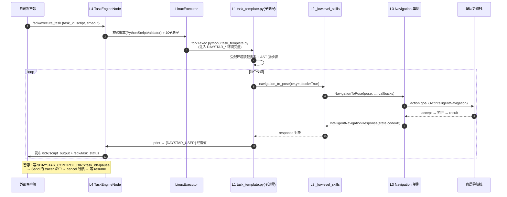
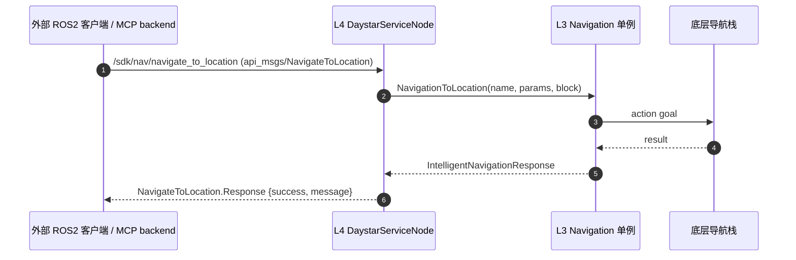

## 0. 一张图看懂四层
<div style="font-family:sans-serif;background:#fff;border-radius:12px;padding:8px 0;overflow:auto">
<svg width="100%" viewBox="0 0 760 958" xmlns="http://www.w3.org/2000/svg">
<style>
  text{font-family:sans-serif}
  .edge-label{paint-order:stroke;stroke:#fff;stroke-width:3px;stroke-linejoin:round}
</style>
<defs>
  <marker id="arr" viewBox="0 0 10 10" refX="8" refY="5" markerWidth="6" markerHeight="6" orient="auto-start-reverse">
    <path d="M2 1L8 5L2 9" fill="none" stroke="#888" stroke-width="1.5" stroke-linecap="round" stroke-linejoin="round"/>
  </marker>
  <marker id="arr-blue" viewBox="0 0 10 10" refX="8" refY="5" markerWidth="6" markerHeight="6" orient="auto-start-reverse">
    <path d="M2 1L8 5L2 9" fill="none" stroke="#185FA5" stroke-width="1.5" stroke-linecap="round" stroke-linejoin="round"/>
  </marker>
  <marker id="arr-teal" viewBox="0 0 10 10" refX="8" refY="5" markerWidth="6" markerHeight="6" orient="auto-start-reverse">
    <path d="M2 1L8 5L2 9" fill="none" stroke="#0F6E56" stroke-width="1.5" stroke-linecap="round" stroke-linejoin="round"/>
  </marker>
  <marker id="arr-amber" viewBox="0 0 10 10" refX="8" refY="5" markerWidth="6" markerHeight="6" orient="auto-start-reverse">
    <path d="M2 1L8 5L2 9" fill="none" stroke="#854F0B" stroke-width="1.5" stroke-linecap="round" stroke-linejoin="round"/>
  </marker>
  <marker id="arr-purple" viewBox="0 0 10 10" refX="8" refY="5" markerWidth="6" markerHeight="6" orient="auto-start-reverse">
    <path d="M2 1L8 5L2 9" fill="none" stroke="#534AB7" stroke-width="1.5" stroke-linecap="round" stroke-linejoin="round"/>
  </marker>
</defs>

<!-- ═══════════════ 调用来源（仅经 /sdk/* 进入 L4） ═══════════════ -->
<rect x="30" y="14" width="700" height="74" rx="12" fill="none" stroke="#aaa" stroke-width="1" stroke-dasharray="5 3"/>
<text x="46" y="30" font-size="11" fill="#888">调用来源（网络调用方）</text>

<rect x="150" y="36" width="200" height="44" rx="8" fill="#F1EFE8" stroke="#888780" stroke-width="0.8"/>
<text x="250" y="63" text-anchor="middle" font-size="13" font-weight="600" fill="#2C2C2A">MCP 工具 / LLM</text>

<rect x="410" y="36" width="200" height="44" rx="8" fill="#F1EFE8" stroke="#888780" stroke-width="0.8"/>
<text x="510" y="63" text-anchor="middle" font-size="13" font-weight="600" fill="#2C2C2A">外部 ROS2 客户端</text>

<!-- callers → L4 -->
<line x1="250" y1="88" x2="250" y2="118" stroke="#888" stroke-width="1.2" marker-end="url(#arr)"/>
<line x1="510" y1="88" x2="510" y2="118" stroke="#888" stroke-width="1.2" marker-end="url(#arr)"/>
<text class="edge-label" x="380" y="106" text-anchor="middle" font-size="11" fill="#777">ROS2 服务调用 /sdk/*（经 DDS 总线）</text>

<!-- ═══════════════ L4 · ROS2 节点层（SDK 自身服务端 = 唯一入口） ═══════════════ -->
<rect x="40" y="118" width="680" height="176" rx="12" fill="#EEEDFE" stroke="#534AB7" stroke-width="1.2" stroke-dasharray="6 3"/>
<text x="56" y="137" font-size="11" font-weight="600" fill="#534AB7">L4 · ROS2 节点层 · src/engine/ + src/node/</text>
<text x="56" y="151" font-size="10" fill="#6A62C4">SDK 自身服务端：/sdk/* 暴露在 DDS 上，是进入系统的唯一入口</text>

<!-- 路径A 节点：TaskEngineNode + LinuxExecutor -->
<rect x="60" y="162" width="300" height="52" rx="8" fill="#CECBF6" stroke="#534AB7" stroke-width="0.8"/>
<text x="210" y="182" text-anchor="middle" font-size="12" font-weight="600" fill="#26215C">TaskEngineNode（任务引擎）</text>
<text x="210" y="201" text-anchor="middle" font-size="9.5" fill="#3C3489">/sdk/execute_task …（请求体携带用户 Python 脚本）</text>

<rect x="60" y="224" width="300" height="46" rx="8" fill="#CECBF6" stroke="#534AB7" stroke-width="0.8"/>
<text x="210" y="251" text-anchor="middle" font-size="11" font-weight="600" fill="#26215C">LinuxExecutor：fork + exec 子进程（隔离）</text>

<!-- 路径B 节点：DaystarServiceNode -->
<rect x="392" y="162" width="300" height="108" rx="8" fill="#CECBF6" stroke="#534AB7" stroke-width="0.8"/>
<text x="542" y="188" text-anchor="middle" font-size="12" font-weight="600" fill="#26215C">DaystarServiceNode（直连服务）</text>
<text x="542" y="210" text-anchor="middle" font-size="9.5" fill="#3C3489">/sdk/nav/* · /sdk/cam/* · /sdk/raise_* …</text>
<text x="542" y="230" text-anchor="middle" font-size="9.5" fill="#3C3489">本进程内直接调用 L3 C++ API</text>

<!-- 路径A：fork → L1 -->
<line x1="210" y1="270" x2="210" y2="332" stroke="#534AB7" stroke-width="1.6" marker-end="url(#arr-purple)"/>
<text class="edge-label" x="218" y="306" font-size="11" fill="#534AB7">① 路径A：fork 子进程</text>

<!-- 路径B：DaystarServiceNode → L3（跳过 L1/L2） -->
<path d="M542 270 L542 624" stroke="#534AB7" stroke-width="1.6" stroke-dasharray="6 4" marker-end="url(#arr-purple)" fill="none"/>
<text class="edge-label" x="552" y="430" font-size="11" fill="#534AB7">② 路径B：直连 L3</text>
<text class="edge-label" x="552" y="446" font-size="11" fill="#534AB7">（跳过 L1 / L2）</text>

<!-- ═══════════════ L1 · Python 沙箱层（仅路径A，运行于子进程） ═══════════════ -->
<rect x="40" y="332" width="400" height="120" rx="12" fill="#EBF3FC" stroke="#185FA5" stroke-width="1.2" stroke-dasharray="6 3"/>
<text x="56" y="350" font-size="11" font-weight="600" fill="#185FA5">L1 · Python 沙箱层 · task_template.py（运行于子进程）</text>

<rect x="54" y="358" width="116" height="84" rx="8" fill="#B5D4F4" stroke="#185FA5" stroke-width="0.8"/>
<text x="112" y="396" text-anchor="middle" font-size="12" font-weight="600" fill="#042C53">受限执行环境</text>
<text x="112" y="416" text-anchor="middle" font-size="11" fill="#185FA5">白名单/黑名单</text>

<rect x="182" y="358" width="116" height="84" rx="8" fill="#B5D4F4" stroke="#185FA5" stroke-width="0.8"/>
<text x="240" y="396" text-anchor="middle" font-size="12" font-weight="600" fill="#042C53">AST 步骤化</text>
<text x="240" y="416" text-anchor="middle" font-size="11" fill="#185FA5">行级 tracer</text>

<rect x="310" y="358" width="116" height="84" rx="8" fill="#B5D4F4" stroke="#185FA5" stroke-width="0.8"/>
<text x="368" y="396" text-anchor="middle" font-size="12" font-weight="600" fill="#042C53">PauseManager</text>
<text x="368" y="416" text-anchor="middle" font-size="11" fill="#185FA5">暂停/恢复/停止</text>

<!-- L1 → L2 -->
<line x1="240" y1="452" x2="240" y2="478" stroke="#185FA5" stroke-width="1.4" marker-end="url(#arr-blue)"/>
<text class="edge-label" x="248" y="471" font-size="11" fill="#185FA5">import lowlevel_skills</text>

<!-- ═══════════════ L2 · pybind11 绑定层（仅路径A） ═══════════════ -->
<rect x="40" y="478" width="400" height="120" rx="12" fill="#E5F5EF" stroke="#0F6E56" stroke-width="1.2" stroke-dasharray="6 3"/>
<text x="56" y="496" font-size="11" font-weight="600" fill="#0F6E56">L2 · pybind11 绑定层 · src/api_py/</text>

<rect x="54" y="504" width="116" height="84" rx="8" fill="#9FE1CB" stroke="#0F6E56" stroke-width="0.8"/>
<text x="112" y="542" text-anchor="middle" font-size="12" font-weight="600" fill="#04342C">_lowlevel_skills</text>
<text x="112" y="562" text-anchor="middle" font-size="11" fill="#0F6E56">模块绑定</text>

<rect x="182" y="504" width="116" height="84" rx="8" fill="#9FE1CB" stroke="#0F6E56" stroke-width="0.8"/>
<text x="240" y="542" text-anchor="middle" font-size="12" font-weight="600" fill="#04342C">args/kwargs</text>
<text x="240" y="562" text-anchor="middle" font-size="11" fill="#0F6E56">GIL 管理</text>

<rect x="310" y="504" width="116" height="84" rx="8" fill="#9FE1CB" stroke="#0F6E56" stroke-width="0.8"/>
<text x="368" y="538" text-anchor="middle" font-size="12" font-weight="600" fill="#04342C">ROS 消息类型</text>
<text x="368" y="558" text-anchor="middle" font-size="11" fill="#0F6E56">↔ Python 对象</text>

<!-- L2 → L3 -->
<line x1="240" y1="598" x2="240" y2="624" stroke="#0F6E56" stroke-width="1.4" marker-end="url(#arr-teal)"/>
<text class="edge-label" x="248" y="617" font-size="11" fill="#0F6E56">调用 C++ 单例方法</text>

<!-- ═══════════════ L3 · C++ API 层（两路在此汇合） ═══════════════ -->
<rect x="40" y="624" width="680" height="120" rx="12" fill="#FEF3E0" stroke="#854F0B" stroke-width="1.2" stroke-dasharray="6 3"/>
<text x="56" y="643" font-size="11" font-weight="600" fill="#854F0B">L3 · C++ API 层 · src/api/ — 单例（每进程一个），路径 A / B 在此汇合</text>

<rect x="56" y="652" width="200" height="80" rx="8" fill="#FAC775" stroke="#854F0B" stroke-width="0.8"/>
<text x="156" y="688" text-anchor="middle" font-size="12" font-weight="600" fill="#412402">Navigation / PTZ / Motion</text>
<text x="156" y="708" text-anchor="middle" font-size="11" fill="#854F0B">单例 + 自持 executor</text>

<rect x="280" y="652" width="200" height="80" rx="8" fill="#FAC775" stroke="#854F0B" stroke-width="0.8"/>
<text x="380" y="688" text-anchor="middle" font-size="12" font-weight="600" fill="#412402">ROS2 client / action</text>
<text x="380" y="708" text-anchor="middle" font-size="11" fill="#854F0B">创建与请求</text>

<rect x="504" y="652" width="200" height="80" rx="8" fill="#FAC775" stroke="#854F0B" stroke-width="0.8"/>
<text x="604" y="688" text-anchor="middle" font-size="12" font-weight="600" fill="#412402">State + Response</text>
<text x="604" y="708" text-anchor="middle" font-size="11" fill="#854F0B">统一响应（code==0 成功）</text>

<!-- L3 → BUS -->
<line x1="380" y1="744" x2="380" y2="786" stroke="#854F0B" stroke-width="1.4" marker-end="url(#arr-amber)"/>
<text class="edge-label" x="388" y="768" font-size="11" fill="#854F0B">create_client / action → 底层节点</text>

<!-- ═══════════════ ROS2 DDS 总线 ═══════════════ -->
<rect x="80" y="786" width="600" height="48" rx="12" fill="#F0997B" stroke="#993C1D" stroke-width="1"/>
<text x="380" y="809" text-anchor="middle" font-size="14" font-weight="700" fill="#4A1B0C">ROS2 DDS 总线</text>
<text x="380" y="826" text-anchor="middle" font-size="9.5" fill="#6B2D18">同一条 DDS：上方 callers 访问 /sdk/*，此处 L3 访问底层 /nav、/cam 等</text>

<!-- BUS → HW -->
<line x1="380" y1="834" x2="380" y2="872" stroke="#888" stroke-width="1.4" marker-end="url(#arr)"/>

<!-- ═══════════════ 硬件层 ═══════════════ -->
<rect x="80" y="872" width="600" height="48" rx="12" fill="#D3D1C7" stroke="#888780" stroke-width="0.8"/>
<text x="380" y="901" text-anchor="middle" font-size="13" font-weight="600" fill="#2C2C2A">底层导航 / 相机 / 运动等真实节点 + 硬件</text>

<!-- ═══════════════ 图例 ═══════════════ -->
<line x1="84" y1="942" x2="114" y2="942" stroke="#888" stroke-width="1.2" marker-end="url(#arr)"/>
<text x="120" y="946" font-size="11" fill="#888">调用 / 数据流</text>
<line x1="250" y1="942" x2="280" y2="942" stroke="#534AB7" stroke-width="1.6" marker-end="url(#arr-purple)"/>
<text x="286" y="946" font-size="11" fill="#534AB7">① 任务脚本路径(A)</text>
<line x1="430" y1="942" x2="460" y2="942" stroke="#534AB7" stroke-width="1.6" stroke-dasharray="6 4" marker-end="url(#arr-purple)"/>
<text x="466" y="946" font-size="11" fill="#534AB7">② 直连服务路径(B)·跳过 L1/L2</text>
</svg>
</div>

**关键认知**：四层不是单向"瀑布"。存在两条独立入口：
- **任务脚本路径**：`L4 引擎` → fork 子进程 → `L1 沙箱` → `L2 绑定` → `L3 C++ API` → ROS2 总线。
- **直连服务路径**：外部客户端 → `L4 服务节点` → 直接调 `L3 C++ API` → ROS2 总线。
同一套 `L3 C++ API` 既被 `L2` 调用，也被 `L4 服务节点` 调用。

## 1. 贯穿全栈的"统一语言"：State + Response
理解数据流前，先认识在四层之间传递的统一数据结构。定义于 [include/api/common.hpp](include/api/common.hpp)。
### 1.1 StateCode（状态码枚举）
```cpp
enum StateCode {
    success = 0,            // 成功
    fail = 1,              // 失败
    error_base = 1000,
    uninitialized = 1001,
    timeout = 1002,
    module_status_error = 1003,
    action_request_timeout = 1010,   // 动作请求超时
    action_request_rejected = 1011,  // 动作被拒
    action_request_async_sent = 1013,// 异步已发送(block=false)
    action_result_timeout = 1014,
    action_canceled = 1015,          // 被取消
    service_appear_timeout = 1016,   // 服务未上线
    service_request_timeout = 1018,
};
```
### 1.2 State / Response 结构
```cpp
struct State {
    State() { code = StateCode::success; describe = StateDescribe[success]; }
    StateCode   code;        // 0=成功，非零=失败/错误
    std::string describe;    // 人类可读描述
};

struct IntelligentNavigationResponse {
    State                            state;       // 统一状态
    ActIntelligentNavigation::Result response;    // ROS 动作原始结果
    NavigationFuturePtr              future;      // 仅 block=false 时填充
    bool has_future() const { return future != nullptr; }
};
```

**全栈约定**：`state.code == 0` 表示成功，非零是失败。这个结构经 L2 pybind 绑定后，在 Python 里变成 `response.state.code` / `response.state.describe`，用户脚本据此判断。

> 这些枚举常量在 [api_msgs/msg/RobotStatus.msg](../api_msgs/msg/RobotStatus.msg) 里有一份**镜像**，改 C++ 必须同步 msg（你维护这两个模块时的高频坑）。

## 2. L1 · Python 沙箱层（task_template.py）
文件：[daystar_api/task_template.py](daystar_api/task_template.py)。这是**用户脚本的运行容器**，也是整套框架最关键的文件。
### 2.1 职责
| 职责           | 实现机制                              |
| ------------ | --------------------------------- |
| **安全隔离**     | 白名单模块 + 黑名单内置/属性，阻止用户脚本逃逸         |
| **步骤化执行**    | AST 把顶层调用拆成独立"步骤"，支持单步暂停          |
| **暂停/恢复/停止** | 控制文件信号 + 行级 tracer + PauseManager |
| **长时操作中断**   | 对导航等函数 monkey-patch，注入取消/重启钩子     |
| **输出标记**     | 用户 stdout/stderr 加专用前缀，便于上层分流     |

### 2.2 安全沙箱（白名单 / 黑名单）
```python
ALLOWED_MODULES = frozenset({
    "time","json","math","random","datetime","collections","itertools",
    "functools","re","uuid","decimal","fractions","statistics","copy","enum",
    "daystar_api",          # ← 机器人能力入口
})

DANGEROUS_BUILTINS = frozenset({
    "eval","exec","compile","open","__import__","globals","locals","vars",
    "getattr","setattr","delattr","type","input","breakpoint", ...
})

DANGEROUS_OS_ATTRS  = frozenset({"system","popen","fork","kill","remove",
    "unlink","rename","chmod","putenv","environ","chdir", ...})
DANGEROUS_SYS_ATTRS = frozenset({"exit","modules","_getframe","settrace", ...})
```

含义：用户脚本只能 import 这 16 个白名单模块；`eval/exec/open/__import__` 等被禁；`os.system`、`sys.modules` 等危险属性被拦截。违规抛 `SecurityViolation`。

### 2.3 暂停/恢复机制（控制文件 + 行级 tracer）
```python
CONTROL_DIR_ENV   = "DAYSTAR_CONTROL_DIR"      # 默认 /tmp/daystar_tasks
# 控制信号 = 目录下的文件：$DAYSTAR_CONTROL_DIR/<task_id>/{pause,resume,stop}
```
- 上层（引擎）想暂停某任务，就在该任务的控制目录写一个 `pause` 文件。
- 子进程里的 `PauseManager` 用 Python 的 `sys.settrace` 装一个**行级 tracer**，每执行一行检查控制文件。
- 命中 `pause`：当前若在长时动作中，优先 `cancel`；非长时则在步骤边界阻塞等待 `resume`。
- 两个内部异常驱动步骤控制：
  - `StepInterrupted`：暂停时中断当前调用，恢复后**重试该步**。
  - `StepSkipCurrent`：恢复后**跳过当前步**（如 resume_* 已完成该步）。

### 2.4 长时操作的 monkey-patch
`_monkey_patch_lowlevel` 把 `daystar_api.lowlevel_skills.navigation_to_*` 等长时函数替换成协作式封装：暂停时主动取消正在飞的导航 goal，恢复后按需重启该步。这样"导航中暂停"才能即时生效，而不是等导航跑完。

> `send_cmd_vel(dt>0)` 也走类似封装：Python wrapper 用 `dt=0` 单帧 C++ 调用做 10Hz 循环，每 tick 检查 stop/pause，退出必发零速防马达 latching。

### 2.5 输出标记
```python
USER_PRINT_PREFIX_STDOUT = "[DAYSTAR_USER] "
USER_PRINT_PREFIX_STDERR = "[DAYSTAR_USER_ERROR] "
```

用户脚本里的 `print()` 输出被重定向并加前缀，子进程的 stdout 被引擎捕获后据此区分"用户输出"和"框架日志"，再发布到 `/sdk/script_output`。

## 3. L2 · pybind11 绑定层（src/api_py/）
把 L3 的 C++ 能力编译成 Python 可 import 的 `_lowlevel_skills` 模块。
### 3.1 模块装配（main.cpp）
[src/api_py/main.cpp](src/api_py/main.cpp) 是模块入口：
```cpp
PYBIND11_MODULE(_lowlevel_skills, m) {
    m.doc() = R"pbdoc(Daystar low level skills set python (C++ native bindings).)pbdoc";
    DefineCommonType(m);   // State/Response 等通用类型
    DefineBase(m);
    DefineNavigation(m);   // 导航函数
    DefinePTZ(m);          // 相机/云台
    DefineMotion(m);       // 运动
    DefineManipulation(m); // 机械臂
    DefineUserLogging(m);
    DefineSpeech(m);
    DefineAgent(m);
    DefineDayStarAPI(m);
}
```
文件分工：
- `<域>_py.cpp`——各域函数绑定（如 `navigation_py.cpp`）。
- `ros_*.cpp`——把 ROS 消息类型绑定成 Python 对象（`ros_std_msgs/ros_geometry_msgs/ros_sensor_msgs/ros_builtin_interfaces` + 自定义 `ros_custom_interfaces.cpp`）。
- `apy.hpp`——所有 `DefineXxx` 前向声明；`common.cpp`——绑定 State/Response 结构体。
### 3.2 一次绑定调用做了什么（navigationToPoseWrapper 实例）
[src/api_py/navigation_py.cpp](src/api_py/navigation_py.cpp) 中 `navigationToPoseWrapper(nav, args, kwargs)` 的流程：
```cpp
api::IntelligentNavigationResponse navigationToPoseWrapper(
        daystar_api::Navigation* nav, py::args args, py::kwargs kwargs) {
    api::MsgPose pose; api::MsgTravelParams travel_params;
    bool block = true; int timeout = 600;
    py::object complete_cb = py::none(), failed_cb = py::none(), progress_cb = py::none();

    // 1) 从 kwargs 解析参数（pose 对象 或 x/y/z/qx.. 散参）
    if (kwargs.contains("pose")) pose = py::cast<api::MsgPose>(kwargs["pose"]);
    else if (kwargs.contains("x")) { pose.position.x = py::cast<double>(kwargs["x"]); ... }

    // 2) 解析回调（complete/failed/progress）
    if (kwargs.contains("complete_callback")) complete_cb = kwargs["complete_callback"];
    ...
    // 3) 回调包 GIL 重获取（PythonSafeExecutor），构造 per-call NavCallbacks
    auto cbs = BuildPerCallNavCallbacks(complete_cb, failed_cb, progress_cb);
    // 4) 调底层 C++ 单例方法
    return nav->NavigationToPose(pose, travel_params, block, timeout, cbs);
}
```
L2 的三件核心工作：
1. **参数编解码**：Python 的 `kwargs` ↔ C++ 的 `MsgPose`/`MsgTravelParams`。
2. **GIL 管理**：C++ 回调线程要回调 Python 函数时，用 `PythonSafeExecutor::execute_with_gil_acquire` 重新获取 GIL，否则崩溃。
3. **回调桥接**：把 Python 回调函数包成 C++ `std::function`，按 per-call 绑定到本次 goal（避免并发 goal 的回调互相覆盖）。
### 3.3 docstring = 对 LLM 的契约（强制）
每个 `m.def(...)` 的 `R"pbdoc(...)"` 会经 `pybind11-stubgen → _lowlevel_skills.pyi → generate_task_guide.py → task_script_guide.md → 喂给 LLM`。**缺 docstring 等于该能力对模型不可见**，必须含 `Args/Returns/Examples/Note`。

## 4. L3 · C++ API 层（src/api/）
真正与 ROS2 打交道的层。每个能力域一对 `.cpp/.hpp`：`navigation`、`ptz`、`motion`、`speech`、`agent`、`manipulation`、`task`、`user_logging`。
### 4.1 设计模式：单例 + 自持 executor
[include/api/navigation.hpp](include/api/navigation.hpp)：
```cpp
class Navigation final : public Base {
public:
    static Navigation& GetInstance();                 // 单例
    struct NavCallbacks { OnNavCompleteCallback complete;
                          OnNavFailedCallback failed;
                          OnNavProgressUpdateCallback progress; };

    IntelligentNavigationResponse NavigationToPose(
        const MsgPose& nav_pose, const MsgTravelParams& travel_params = {},
        bool block = true, int timeout = 600,
        const NavCallbacks& per_call_cbs = NavCallbacks{});
    // ... NavigationToLocation / NavigationViaPoses / CancelNavigation ...
};
```
- **单例**：每个能力域全局一个实例，复用同一组 ROS client。
- **block 语义**：`block=true` 同步等结果（最长 `kBlockMaxTimeoutSeconds = 30min`）；`block=false` 立即返回，`response.future` 持有句柄。

### 4.2 创建 ROS2 客户端（连到真实节点）
[src/api/navigation.cpp](src/api/navigation.cpp) 初始化时建立各种 client/action：
```cpp
// 导航动作（连到底层导航栈）
nav_action_client_ = rclcpp_action::create_client<ActIntelligentNavigation>(node_ptr_, ...);
// 查询当前位姿（连到 L4 服务节点暴露的 /sdk/nav/get_current_pose）
get_current_pose_client_ = node_ptr_->create_client<SrvAPIGetCurrentPose>("/sdk/nav/get_current_pose");
// 定位 / 建图等
set_localization_client_ = node_ptr_->create_client<SrvSetLocalization>(...);
save_map_client_         = node_ptr_->create_client<SrvSaveMap>("/nav/slam/save_map");
reload_map_client_       = node_ptr_->create_client<SrvReloadMap>("/nav/load_map");
```

注意：有的 client 连**底层导航栈原生话题**（`/nav/*`），有的连**自家 L4 服务节点**（`/sdk/*`）。
### 4.3 核心：RequestNavigationAct（动作请求闭环）
`NavigationToPose` 最终委托给 `RequestNavigationAct(goal, block, timeout, out_future, per_call_cbs)`，它负责：发送 action goal → 处理 accept/reject → block 时等 result、非 block 时返回 future → 触发 complete/failed/progress 回调 → 把 ROS 结果包进 `IntelligentNavigationResponse` 并设置 `State`。
```cpp
response.response = RequestNavigationAct(goal, block, timeout, fut, per_call_cbs);
// 失败/超时/取消 → state.code 设为对应 StateCode（1010/1015/...）
```
这就是 L3 的产物：把异步 ROS action 收敛成一个带 `State` 的统一响应，向上回传给 L2 → L1。

## 5. L4 · ROS2 节点层（src/engine/ + src/node/）
两个生命周期节点（`LifecycleNode`），由 [launch/daystar_api.launch.py](launch/daystar_api.launch.py) 拉起并自动 `configure → activate`（带 `respawn`）。
### 5.1 TaskEngineNode（任务引擎）
[include/engine/engine_node.hpp](include/engine/engine_node.hpp)。负责**任务生命周期**。
- **服务**：`/sdk/create_task`、`/sdk/execute_task`、`/sdk/pause_task`、`/sdk/resume_task`、`/sdk/stop_task`、`/sdk/delete_task(s)`、`/sdk/get_all_tasks`、`/sdk/get_task`。
- **发布**：`/sdk/script_output`（用户 stdout 流）、`/sdk/task_status`（[api_msgs/msg/TaskStatus](../api_msgs/msg/TaskStatus.msg)：IDLE/RUNNING/PAUSED/ERROR/COMPLETED + 进度）。
- **子系统**：
  - `TaskManager`——调度、状态机。
  - `LinuxExecutor`——**子进程隔离执行**（见 5.3）。
  - `PythonScriptValidator`——执行前校验脚本。
### 5.2 DaystarServiceNode（对外服务节点）
[include/node/daystar_service_node.hpp](include/node/daystar_service_node.hpp)。把 L3 C++ API **直接**暴露为 ROS2 服务，供外部客户端调用（不经任务引擎）：
- 服务：`/sdk/nav/*`（导航/定位/点位/地图）、`/sdk/cam/*`（相机）、`/sdk/raise_warn`、`/sdk/raise_error`、`/sdk/switch_llm_group` 等。
- 周期发布聚合状态：`RobotStatus`、当前位姿、定位状态、雷达状态（速率由 `*_rate` 参数控制，默认见头文件常量）。
- 用**可重入回调组 + 多线程 executor** 支持并发服务调用。
### 5.3 LinuxExecutor：用户脚本的子进程隔离
[src/engine/linux_executor.cpp](src/engine/linux_executor.cpp) + [python_interpreter.cpp](src/engine/python_interpreter.cpp)：
```cpp
// 1) 建三条管道（捕获子进程 stdout/stderr，喂 stdin）
pipe(stdout_pipe_); pipe(stderr_pipe_); pipe(stdin_pipe_);
// 2) fork 子进程
process_pid_ = fork();
// 3) 子进程里 setenv 注入环境（DAYSTAR_TASK_ID / DAYSTAR_CONTROL_DIR / DAYSTAR_PARAMETERS ...）
setenv(env_var.first.c_str(), env_var.second.c_str(), 1);
// 4) exec python3 跑 task_template.py（python_executable_ = /usr/bin/python3）
```
为什么用**子进程**而非线程：用户脚本崩溃/死循环不会拖垮引擎进程；可被 kill；环境变量隔离。引擎读管道里带 `[DAYSTAR_USER]` 前缀的行 → 发布到 `/sdk/script_output`。
## 6. 端到端数据流（两条主路径）

### 6.1 路径 A：任务脚本执行（最完整的一条）



  

**数据形态变化**：
1. `script`（字符串）→ 引擎 → 子进程。
2. 子进程内 Python 调用 → L2 把 `kwargs` 解码成 C++ `MsgPose`。
3. L3 把 `MsgPose` 包成 ROS action `Goal` 发出去。
4. ROS result 回流 → L3 包成 `IntelligentNavigationResponse(State)` → L2 转回 Python 对象 → 脚本读 `response.state.code`。
5. 脚本 `print` → 加前缀 → 管道 → 引擎 → `/sdk/script_output` 话题 → 客户端。
### 6.2 路径 B：直连服务（不经引擎/沙箱）


这条路径**省掉了 L1/L2**：外部直接打 L4 服务，L4 调 L3，L3 出 ROS。MCP Server 的 `real` backend 主要走这条。

## 7. 两条入口对照表

| 维度    | 路径 A（任务脚本）          | 路径 B（直连服务）                  |
| ----- | ------------------- | --------------------------- |
| 入口    | `/sdk/execute_task` | `/sdk/nav/*`、`/sdk/cam/*` 等 |
| 经过层   | L4→L1→L2→L3→ROS     | L4→L3→ROS                   |
| 隔离    | 子进程（崩溃不影响引擎）        | 同进程服务回调                     |
| 暂停/恢复 | ✔ 控制文件 + tracer     | ✘（单次服务调用）                   |
| 适用    | 多步骤复杂任务、需中断         | 单个原子能力、查询                   |
| 典型调用方 | LLM 规划的任务脚本         | MCP real backend / 外部集成     |
  

## 8. 跨层改动 checklist（你维护时最常用）

新增一个**底层能力**（如 `navigation_to_pose`）要动的层：
1. **L3** `src/api/navigation.{cpp,hpp}`：实现 `NavigationToPose`，定义响应结构进 `include/api/common.hpp`（含 `State`）。
2. **L2** `src/api_py/navigation_py.cpp`：写 `navigationToPoseWrapper` + `m.def(...)`（**docstring 必须完整**）；在 `apy.hpp` 声明、`common.cpp` 绑响应、`ros_custom_interfaces.cpp` 绑 ROS 类型、`main.cpp` 注册模块。
3. **接口契约** `api_msgs/`：若要对外暴露成 ROS 服务，加 `srv/*.srv` 并在 L4 节点实现 handler。
4. **L1**：若是长时操作需中断，在 `task_template.py` 的 monkey-patch 名单里加。
5. **重编**：`overlay_build_release --packages-select api_msgs daystar_api`（改了 msg 要先编 api_msgs）。
6. 重编会自动：编 C++ + 重生 `_lowlevel_skills.pyi` + 重生 `task_script_guide.md`。

## 9. 速记口诀

- **L1 管"安全和节奏"**（沙箱 + 暂停/恢复 + 步骤）。
- **L2 管"语言翻译"**（Python ↔ C++，GIL，回调桥接）。
- **L3 管"和 ROS 对话"**（单例 + client/action + 统一 State）。
- **L4 管"对外开门"**（任务引擎子进程 + 直连服务节点）。
- **贯穿全栈的血液是 `State`**：`code==0` 成功，非零看 `StateCode`。