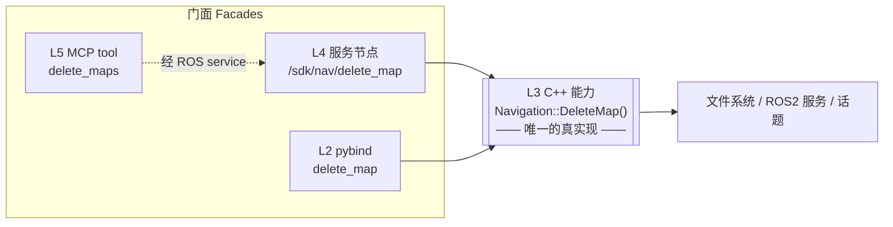
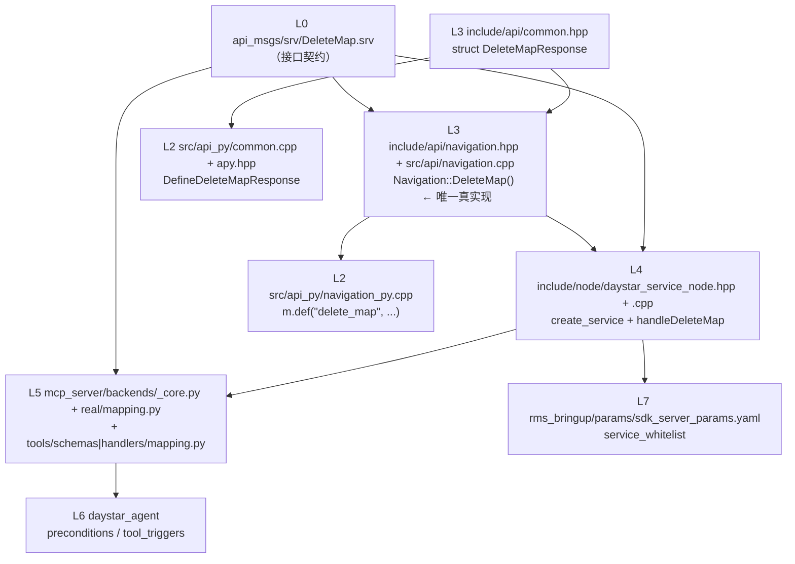
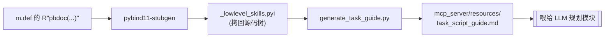
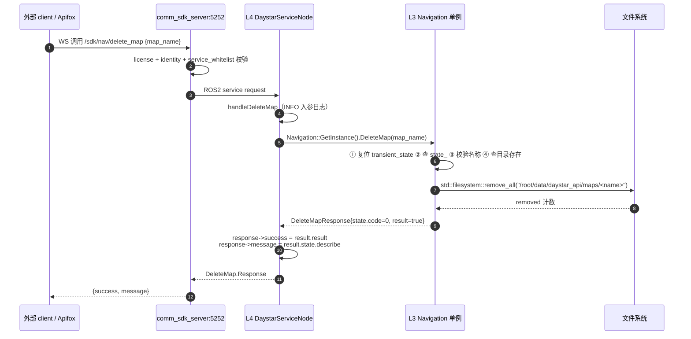
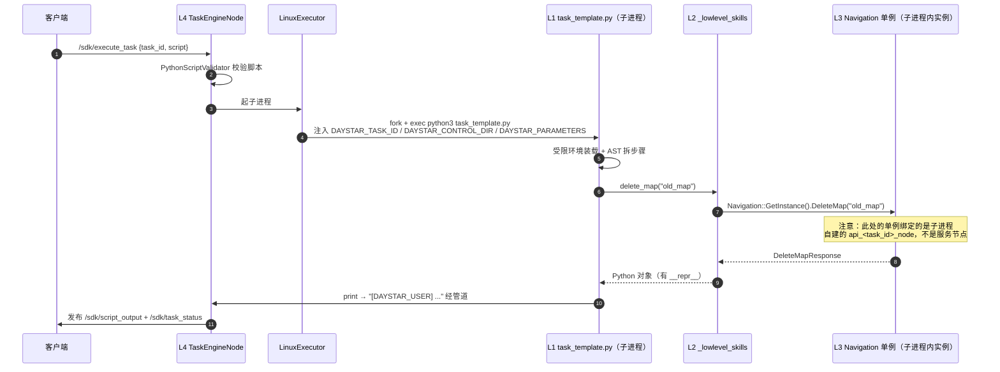
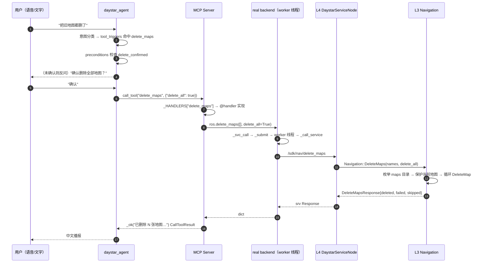
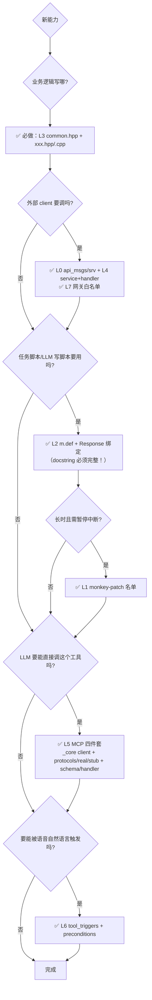

> **本文定位**：[[daystar_api 四层架构详解]]讲的是"框架横向有哪几层"；本文讲的是
> **"一个功能纵向穿过这些层时，每一层具体写了什么代码、为什么这么写"**。
> 选 `delete_map`（删除一张已保存的地图）作为样本，因为它：
> - 链路**最完整**（8 个层次全部覆盖：srv 契约 → C++ 能力 → 服务节点 → pybind → 沙箱 → MCP → Agent → 网关白名单）；
> - 业务逻辑**最简单**（就是删一个目录），不会被业务细节淹没框架本身；
> - 有配套的批量版 `delete_maps`，可以对比出"单条 vs 批量"的设计取舍。

> 路径基准：`/root/ws/overlay_ws/src/sdk_server/`。下文写 `daystar_api/xxx` 即
> `/root/ws/overlay_ws/src/sdk_server/daystar_api/xxx`。

---
## 0. 先建立三个心智模型
### 模型一：不是"瀑布"，是"一个核心 + 多个门面"
最常见的误解是把四层当成"必须逐层穿过的瀑布"。实际结构是：

**`Navigation::DeleteMap()` 是唯一写业务逻辑的地方**，其他层全是"门面"：
- L4 把它包成 ROS2 service，给进程外的人用；
- L2 把它包成 Python 函数，给沙箱脚本用；
- L5 把它包成 MCP tool，给 LLM 用。
所以**改业务逻辑只改 L3**，其他层是纯转发，改动量极小。这也是为什么这套架构能撑住这么多接口。
### 模型二：同一个单例，在两个进程里绑不同的 node
`Navigation` 是单例（`GetInstance()`），但**单例是进程内的**。框架里有两个进程会各自初始化一份：

| 进程          | 谁初始化                                | 绑定的 ROS node                  | 代码位置                                                                  |
| ----------- | ----------------------------------- | ----------------------------- | --------------------------------------------------------------------- |
| **服务节点进程**  | `DaystarServiceNode::onConfigure()` | `shared_from_this()`（即服务节点自己） | [daystar_service_node.cpp](../src/node/daystar_service_node.cpp#L140) |
| **任务脚本子进程** | `DayStarAPI::Initialize()`          | 新建的 `api_<task_id>_node`      | [api.cpp](../src/api/api.cpp#L187)                                    |

```cpp
// daystar_service_node.cpp · onConfigure
auto state = std::make_shared<State>();
std::string task_id = "daystar_service_" + std::to_string(this->now().nanoseconds());
if (!Navigation::GetInstance().InitialNavigation(task_id, shared_from_this(), state)) { ... }
if (!PTZ::GetInstance().InitialPTZ(task_id, shared_from_this(), state)) { ... }
if (!Motion::GetInstance().InitialMotion(task_id, shared_from_this(), state)) { ... }
// … Speech / Manipulation / Agent 同理，全部共享同一个 state
```

```cpp
// api.cpp · DayStarAPI::Initialize（子进程里，pybind 侧）
this->node_ptr_ = rclcpp_lifecycle::LifecycleNode::make_shared(name, ns); // 自己造 node
this->transient_state_ptr_ = std::make_shared<State>();
Navigation::GetInstance().InitialNavigation(task_id_, node_ptr_, transient_state_ptr_);
```

**这个认知很重要**：写 L3 能力时不能假设"我一定跑在服务节点里"，`node_ptr_` 可能是任务节点。所以 L3 里一律用 `node_ptr_->create_client(...)` / `node_ptr_->now()`，不要 `dynamic_cast` 回具体节点类型。

### 模型三：贯穿全栈的血液是 `State`
```cpp
// include/api/common.hpp
enum StateCode {
    invalid = -1, success = 0, fail = 1,
    error_base = 1000, uninitialized = 1001, timeout = 1002, module_status_error = 1003,
    action_request_timeout   = 1010, action_request_rejected  = 1011,
    action_request_interrupted = 1012, action_request_async_sent = 1013,
    action_result_timeout    = 1014, action_canceled          = 1015,
    service_appear_timeout   = 1016, service_request_interrupted = 1017,
    service_request_timeout  = 1018,
};

struct State {
    State() { code = StateCode::success; describe = StateDescribe[StateCode::success]; }
    StateCode   code;      // 0 = 成功
    std::string describe;  // 人类可读，最终会变成 response.message / state.describe
};
```

**全栈约定：`state.code == 0` 成功，非零失败。** 这条约定在每一层都会被翻译一次：

| 层            | 成功判断表达                                                                                |
| ------------ | ------------------------------------------------------------------------------------- |
| L3 C++       | `response.state.code == StateCode::success`                                           |
| L4 ROS srv   | `response->success`（由 `result.result` 赋值），`response->message = result.state.describe` |
| L2 Python    | `resp.state.code == 0` / `resp.result`                                                |
| L5 MCP       | `result["success"]`                                                                   |
| L6 Agent/LLM | `_ok(...)` / `_err(...)` 的中文文案                                                        |
  
## 1. 全景：一个能力要落在哪 8 个地方
以 `delete_map` 为例，实际改动分布：

  



对应的真实文件清单（可直接拿去 grep 对照）：

| #   | 层   | 文件                                                     | 干了什么                                                                       |
| --- | --- | ------------------------------------------------------ | -------------------------------------------------------------------------- |
| 1   | L0  | `api_msgs/srv/DeleteMap.srv`                           | 定义 request/response 字段                                                     |
| 2   | L3  | `daystar_api/include/api/common.hpp`                   | `struct DeleteMapResponse { State state; bool result; }`                   |
| 3   | L3  | `daystar_api/include/api/navigation.hpp`               | 声明 `DeleteMapResponse DeleteMap(const std::string&)`                       |
| 4   | L3  | `daystar_api/src/api/navigation.cpp`                   | **实现**（校验 + 删目录 + 填 State）                                                 |
| 5   | L4  | `daystar_api/include/node/daystar_service_node.hpp`    | `#include` srv、声明 `handleDeleteMap` + service 成员                           |
| 6   | L4  | `daystar_api/src/node/daystar_service_node.cpp`        | `create_service("/sdk/nav/delete_map")` + handler 实现                       |
| 7   | L2  | `daystar_api/src/api_py/navigation_py.cpp`             | `m.def("delete_map", ...)` + docstring                                     |
| 8   | L2  | `daystar_api/src/api_py/common.cpp` + `apy.hpp`        | `DefineDeleteMapResponse` 绑定响应结构体                                          |
| 9   | L5  | `daystar_api/mcp_server/backends/_core.py`             | `self.delete_map_client = create_client(DeleteMap, '/sdk/nav/delete_map')` |
| 10  | L5  | `daystar_api/mcp_server/backends/real/mapping.py`      | `def delete_map(...)` 调 `_svc_call`                                        |
| 11  | L5  | `daystar_api/mcp_server/backends/protocols/mapping.py` | Protocol 声明（类型契约）                                                          |
| 12  | L5  | `daystar_api/mcp_server/backends/stub/mapping.py`      | 无硬件时的假实现（测试用）                                                              |
| 13  | L5  | `daystar_api/mcp_server/tools/schemas/mapping.py`      | `register_schema("delete_maps", ...)`                                      |
| 14  | L5  | `daystar_api/mcp_server/tools/handlers/mapping.py`     | `@handler("delete_maps")`                                                  |
| 15  | L6  | `daystar_agent/config/runtime/preconditions.yaml`      | `delete_maps: [delete_confirmed]`                                          |
| 16  | L7  | `system/rms_bringup/params/sdk_server_params.yaml`     | `service_whitelist` 放行                                                     |

> **注意 #11/#12**：MCP backend 是 `protocols`（接口）/ `real`（真机）/ `stub`（假数据）三件套。
> 加 real 不加 stub 会让 `tests/test_delete_interfaces.py` 那类不依赖硬件的测试挂掉。

## 2. 逐层拆解 `delete_map`
### L0 · 接口契约层：`api_msgs`
**文件**：`api_msgs/srv/DeleteMap.srv`
```
# 删除指定名称的已保存地图（删除地图目录，不可恢复）
# 允许删除当前正在使用的地图：照常执行删除，但 response.message 会附带
# "导航功能将不可用"警告，提示需加载其他地图后导航才能恢复。
# Request
string map_name
---
# Response
bool success
string message
```
#### 关键点 1：`.srv` 不需要手工登记到 CMakeLists
`api_msgs/CMakeLists.txt` 用一个自定义宏自动递归收集：
```cmake
include(complie_ros_interface.cmake)   # 导入一个自定义的 CMake 宏文件，里面定义了 get_ros_interface_file 这个命令
set(ros_interface_list)                # 声明一个空列表，用来存放后面收集到的所有接口文件路径
get_ros_interface_file(${PROJECT_NAME} "msg")     # 执行自定义宏，递归搜索 msg/ 目录下所有 .msg 文件，加入到 ros_interface_list
get_ros_interface_file(${PROJECT_NAME} "srv")     # 递归搜索 srv/ 目录下所有 .srv 文件（包括你新增的 DeleteMap.srv），加入列表
get_ros_interface_file(${PROJECT_NAME} "action")  # 递归搜索 action/ 目录下所有 .action 文件，加入列表
rosidl_generate_interfaces(${PROJECT_NAME} ${ros_interface_list}
        DEPENDENCIES builtin_interfaces sensor_msgs geometry_msgs action_msgs daystar_navigation_msgs)
# ↑ 调用 ROS2 的代码生成工具，把上面收集的所有 .srv/.msg/.action 文件
#   编译成 C++ 头文件（如 api_msgs/srv/delete_map.hpp）和 Python module
#   DEPENDENCIES 指定这些接口依赖的其他消息包（如 geometry_msgs、sensor_msgs）
```

宏本体（`complie_ros_interface.cmake`）就是一个 `file(GLOB_RECURSE ...)`：
```cmake
macro(get_ros_interface_file target)
    cmake_parse_arguments(_ARG "LOG" "" "" ${ARGN})
    file(GLOB_RECURSE _ros_interface_list RELATIVE ${PROJECT_SOURCE_DIR}
         ${_ARG_UNPARSED_ARGUMENTS}/*.${_ARG_UNPARSED_ARGUMENTS})
    if(_ros_interface_list)
        list(APPEND ros_interface_list ${_ros_interface_list})
        ...
    endif()
endmacro()
```

> **实践影响**：新增 `.srv` 文件后**必须重新 cmake configure**（`GLOB` 是 configure 期求值的）。`colcon build` 正常会重新 configure，但如果只是 `ninja` 增量编译会漏掉——遇到"新 srv 找不到"先删 `build/api_msgs`。

#### 关键点 2：response 字段的命名约定
对外 srv 的 response **固定用 `bool success` + `string message`**，因为 L4 handler 和 L5 `_svc_call`的默认解析器都按这两个字段写死：
```python
# mcp_server/backends/_core.py · _svc_call
parser = parse or (lambda r: {"success": r.success, "message": r.message})
```
字段名叫别的（比如 `result` / `msg`）就必须在每个调用点传自定义 `parse=`，得不偿失。

#### 关键点 3：对比批量版 `DeleteMaps.srv` 看语义设计
```
# Request
string[] map_names        # 要删除的地图名称列表（单个即指定删除）；delete_all=true 时忽略
bool delete_all           # 为 true 时忽略 map_names，删除全部已保存地图（范围受 include_current 控制）
bool include_current      # 仅 delete_all=true 时生效：true=当前地图一并删除；false=保留当前地图
bool block true    # true=阻塞直至完成（server 用 kBlockMaxTimeoutSeconds 30 min 硬上限）
int32 timeout 30   # 仅 block=false 时生效（秒），<=0 按默认 30
---
# Response
bool success              # 是否全部删除成功
string[] deleted_names    # 成功删除的地图名称
string[] failed_names     # 删除失败的地图名称
string[] skipped_names    # 被保护跳过的地图
```

这里体现了框架的两个通用设计：
1. **批量接口把"枚举"下沉到 server**：`delete_all=true` 时调用方不需要先 `get_available_maps` 再逐个删，server 自己 `directory_iterator` 枚举。少一次 RTT，也避免 TOCTOU。
2. **`block` + `timeout` 成对出现**：这是全框架的通用异步约定，见 [[daystar_api 框架分层实现拆解#4.3 handler 实现（`src/node/daystar_service_node.cpp`）—— **四行模板**|4.3]]。

### L3 · C++ 能力层：`Navigation::DeleteMap`
这是**唯一有业务逻辑的地方**，也是理解框架的重点。
#### 3.1 响应结构体（`include/api/common.hpp`）
```cpp
struct DeleteMapResponse {
    State state;    // 统一状态（必须是第一个字段，全框架惯例）
    bool  result;   // 业务结果
};
```
响应结构体有两种形态，取决于"这个能力是不是转发一个 ROS 服务"：

| 形态                  | 例子                                                 | 结构                                        |
| ------------------- | -------------------------------------------------- | ----------------------------------------- |
| **A. 自实现**（不转发 ROS） | `DeleteMapResponse`                                | `State state; bool result;`               |
| **B. 转发 ROS 服务/动作** | `GoToDockResponse`、`IntelligentNavigationResponse` | `State state; SrvXxx::Response response;` |

```cpp
// 形态 B 举例
struct GoToDockResponse { State state; SrvRobotCommand::Response response; };
struct IntelligentNavigationResponse {
    State state;
    ActIntelligentNavigation::Result response;
    NavigationFuturePtr future;                 // 仅 block=false 时填充
    bool has_future() const { return future != nullptr; }
};
```

> **这个区分直接决定 L2 要不要动 `ros_custom_interfaces.cpp`**：
> 形态 A 不需要（没有 ROS 类型要暴露给 Python），形态 B 需要。
> `delete_map` 是形态 A，所以你在 `ros_custom_interfaces.cpp` 里 grep 不到它——这不是漏了，是不需要。

#### 3.2 声明（`include/api/navigation.hpp`）
```cpp
class Navigation final : public Base {
public:
    static Navigation& GetInstance();
    Navigation(const Navigation&) = delete;
    Navigation& operator=(const Navigation&) = delete;

    bool InitialNavigation(const std::string &task_id,
                           const rclcpp_lifecycle::LifecycleNode::SharedPtr node_ptr,
                           const std::shared_ptr<State> state);
    // …
    DeleteMapResponse  DeleteMap(const std::string& map_name);
    DeleteMapsResponse DeleteMaps(const std::vector<std::string>& map_names, bool delete_all = false);
    // …
    State state_;   // 模块级持久状态

private:
    Navigation();   // 私有构造 → 强制走 GetInstance()
};
```

#### 3.3 实现（`src/api/navigation.cpp`）—— **五段式模板**
这是全框架 L3 函数的**标准骨架**，几乎每个能力都长这样。逐段注解：
```cpp
DeleteMapResponse Navigation::DeleteMap(const std::string &map_name) {
    DeleteMapResponse response;
    response.result = false;                      // ← ① 默认失败（防止提前 return 时是脏值）

    // ② 重置"瞬时状态"：这是本次调用的错误暂存区
    transient_state_ptr_->code = StateCode::success;

    // ③ 构造调用签名字符串：既用于日志，也用于 State.describe 的前缀
    std::string funs = FORMAT("%s(map_name=%s)", __FUNCTION__, map_name.c_str());
    INFO("%s", funs.c_str());

    try {
        // ④ 检查"模块持久状态"：模块初始化失败过就直接短路，不做任何事
        if (state_.code != StateCode::success) {
            response.state = GetState(funs, state_.code);
            return response;
        }

        // ⑤ 入参校验（安全边界！）
        if (map_name.empty() ||
            map_name.find('/')  != std::string::npos ||
            map_name.find('\\') != std::string::npos ||
            map_name.find("..") != std::string::npos) {
            std::string error_msg = "Invalid map_name '" + map_name + "'";
            ERROR("[%s] %s: %s", logger_name_.c_str(), funs.c_str(), error_msg.c_str());
            response.state = GetState(funs, StateCode::fail);
            response.state.describe = error_msg;
            transient_state_ptr_->code     = response.state.code;
            transient_state_ptr_->describe = response.state.describe;
            return response;
        }

        // ⑥ 前置条件检查
        std::string map_dir = "/root/data/daystar_api/maps/" + map_name;
        if (!std::filesystem::exists(map_dir)) {
            std::string error_msg = "Map '" + map_name + "' not found";
            ERROR("[%s] %s: %s", logger_name_.c_str(), funs.c_str(), error_msg.c_str());
            response.state = GetState(funs, StateCode::fail);
            response.state.describe = error_msg;
            transient_state_ptr_->code     = response.state.code;
            transient_state_ptr_->describe = response.state.describe;
            return response;
        }

        // ⑦ 真正干活
        std::uintmax_t removed = std::filesystem::remove_all(map_dir);
        if (removed > 0) {
            INFO("[%s] Successfully deleted map '%s' (removed %llu entries)",
                 logger_name_.c_str(), map_name.c_str(),
                 static_cast<unsigned long long>(removed));
            response.result = true;
            response.state  = GetState(funs, StateCode::success);
        } else {
            ERROR("[%s] Failed to delete map: %s", logger_name_.c_str(), map_name.c_str());
            response.state = GetState(funs, StateCode::fail);
            response.state.describe = "Failed to delete map directory";
            transient_state_ptr_->code     = response.state.code;
            transient_state_ptr_->describe = response.state.describe;
        }

    // ⑧ 异常兜底：分层 catch，具体异常给具体信息
    } catch (const std::filesystem::filesystem_error &e) {
        ERROR("[%s] Error deleting map directory: %s", logger_name_.c_str(), e.what());
        response.state = GetState(funs, StateCode::fail);
        response.state.describe = std::string("Failed to delete map directory: ") + e.what();
        transient_state_ptr_->code     = response.state.code;
        transient_state_ptr_->describe = response.state.describe;
    } catch (const std::exception &e) {
        ERROR("[%s] [%s]: Failed -> %s", logger_name_.c_str(), __FUNCTION__, e.what());
        response.state = GetState(funs, StateCode::fail);
        response.state.describe = e.what();
        transient_state_ptr_->code     = StateCode::fail;
        transient_state_ptr_->describe = e.what();
    }
    return response;   // ⑨ 单一出口，绝不抛异常给调用方
}
```
**九个要点里，最容易被新人漏掉的是 ①②④⑨**：
- **① 默认失败**：所有 `bool result` / `success` 一律初始化为 `false`。中途 `return` 的路径很多，
  默认成功等于埋雷。
- **② `transient_state_ptr_` 是什么**：一个**所有能力域共享**的 `shared_ptr<State>`。
  服务节点 `onConfigure` 里 `auto state = std::make_shared<State>()` 造一份，传给
  Navigation/PTZ/Speech/Motion/Manipulation/Agent **全部单例**。它的作用是让**内部私有函数
  （如 `RequestGetCurrentPose`）能把失败原因"回传"给外层公开函数**，而不用改函数签名：
  ```cpp
  // 内部函数失败时只写 transient_state_ptr_
  SrvAPIGetCurrentPose::Response response = RequestGetCurrentPose(timeout);
  // 外层据此判定
  ret.state = this->GetState(funs, response.success ? StateCode::success
                                                    : transient_state_ptr_->code);
  ```
  
  所以**每个公开函数入口必须先 `transient_state_ptr_->code = StateCode::success;` 复位**，
  否则会读到上一次调用残留的错误码。
- **④ `state_` vs `transient_state_ptr_`**：

|      | `state_`（模块持久）            | `transient_state_ptr_`（瞬时共享） |
| ---- | ------------------------- | ---------------------------- |
| 生命周期 | 模块初始化时确定，长期不变             | 每次公开调用重置                     |
| 含义   | "这个能力域可用吗"                | "这次调用哪一步失败了"                 |
| 谁写   | `Base::Init` / `SetState` | 内部私有 Request 函数              |
| 谁读   | 每个公开函数开头的短路检查             | 公开函数结尾拼 `State`              |
  
- **⑨ 不抛异常**：L3 是 ABI 边界。往上抛会穿过 pybind（虽然 pybind 能转成 Python 异常）和
  ROS service callback（会直接崩掉 executor）。所以**统一 try/catch 转成 `State`**。
  唯一的例外是死锁防御（见 [4.5](#45-死锁防御在回调里调阻塞-api-会-throw)），那是刻意要打断调用方的。
#### 3.4 `GetState` / `SetState` 是什么
来自基类 `include/api/base.hpp`：
```cpp
State GetState(const std::string& funs, StateCode code) {
    State ret;
    ret.code = code;
    ret.describe = logger_name_ + "." + funs + " >> " + StateDescribe[code];
    if (code != StateCode::success) {
        WARN("The module %s status(%d) is abnormal, the request failed.\n%s",
             logger_name_.c_str(), static_cast<int>(code), ret.describe.c_str());
    }
    return ret;
}
```
它做两件事：**拼一个带上下文的 describe** + **失败时自动打 WARN**。这就是为什么日志里能看到`Navigation.DeleteMap(map_name=old) >> fail` 这种自解释的串——`funs` 里带了全部入参。
> **规范**：`FORMAT` 里必须打全部入参（数组也要全量输出），这是 `CLAUDE.md` 明确要求的， 排障时全靠它。

#### 3.5 批量版的复用模式
`DeleteMaps` 不重复实现删除逻辑，而是循环调用 `DeleteMap`：
```cpp
for (const auto &name : targets) {
    auto r = DeleteMap(name);
    if (r.result) response.deleted.push_back(name);
    else          response.failed.push_back(name);
}
response.result = response.failed.empty();
```
外加一段"枚举 + 保护当前地图"的前处理：
```cpp
if (delete_all) {
    std::string current_map;
    {
        std::lock_guard<std::mutex> lk(current_map_mutex_);
        if (current_map_received_)
            current_map = std::filesystem::path(current_map_cache_.map_name).filename().string();
    }
    const std::string maps_root = "/root/data/daystar_api/maps";
    if (std::filesystem::exists(maps_root)) {
        for (const auto &entry : std::filesystem::directory_iterator(maps_root)) {
            if (!entry.is_directory()) continue;
            std::string name = entry.path().filename().string();
            if (!current_map.empty() && name == current_map) {
                WARN("[%s] DeleteMaps(delete_all): keep current map '%s' (protected, not deleted)",
                     logger_name_.c_str(), name.c_str());
                response.skipped.push_back(name);
                continue;
            }
            targets.push_back(name);
        }
    }
} else {
    targets = map_names;
}
```
注意 `current_map_cache_` 是**订阅 latched `/nav/current_map` 话题的本地缓存**，读的时候加 `mutex`。
这是 L3 的另一个通用模式，见 [4.4](#44-话题缓存--新鲜度校验)。

### L4 · 对外服务节点层：`DaystarServiceNode`
L4 的职责极其单纯：**ROS srv ↔ C++ 结构体的字段搬运**。不允许有业务逻辑。
#### 4.1 头文件三件套（`include/node/daystar_service_node.hpp`）
```cpp
// ① include srv 头
#include <api_msgs/srv/delete_map.hpp>
class DaystarServiceNode : public daystar_utils::ros_integration::LifecycleNode {
private:
    // ② 声明 handler
    void handleDeleteMap(
        const std::shared_ptr<api_msgs::srv::DeleteMap::Request> request,
        std::shared_ptr<api_msgs::srv::DeleteMap::Response> response);

    // ③ 声明 service 成员（保存返回值，否则 service 会被立刻析构！）
    rclcpp::Service<api_msgs::srv::DeleteMap>::SharedPtr delete_map_service_;
};
```
#### 4.2 注册 service（`onConfigure` 里）
```cpp
delete_map_service_ = this->create_service<api_msgs::srv::DeleteMap>(
    "/sdk/nav/delete_map",
    std::bind(&DaystarServiceNode::handleDeleteMap, this,
              std::placeholders::_1, std::placeholders::_2),
    service_qos.get_rmw_qos_profile(),
    service_callback_group_);          // ← 回调组的选择很关键
```
**回调组的三选一**，这是 L4 唯一需要动脑的地方：
```cpp
// onConfigure 里创建的三个组
service_callback_group_ = this->create_callback_group(rclcpp::CallbackGroupType::Reentrant);
feedback_callback_group_ = this->create_callback_group(rclcpp::CallbackGroupType::MutuallyExclusive);
// 第二参数 automatically_add_to_executor_with_node=false：阻止主 executor 通过
// add_node 自动接管这个组。main 里会把它显式 add 到独立 fast executor。
// 这样即使主 executor 的线程池被 navigation / mapping 等慢回调占满，
// fast service 仍由独立 executor 调度，保持响应。
fast_service_callback_group_ = this->create_callback_group(
    rclcpp::CallbackGroupType::Reentrant, /*automatically_add_to_executor_with_node=*/false);
sub_callback_group_ = this->create_callback_group(
    rclcpp::CallbackGroupType::MutuallyExclusive, /*automatically_add_to_executor_with_node=*/false);
```

| 组                              | 用于                                              | 判断标准           |
| ------------------------------ | ----------------------------------------------- | -------------- |
| `service_callback_group_`      | 普通/慢服务（`delete_map`、`navigate_to_*`、`load_map`） | 会阻塞或耗时 > 100ms |
| `fast_service_callback_group_` | 快查询（`get_available_locations`）                  | 纯读缓存，必须秒回      |
| `feedback_callback_group_`     | 周期发布 timer、话题转发                                 | 单线程串行即可        |

> **踩坑提示**：把慢服务放进 `fast_service_callback_group_`，会拖垮整个"快通道"，
> 让所有查询类接口一起超时。反过来把快查询放进 `service_callback_group_`，在导航跑起来时
> 查询会排在慢回调后面。**新增服务时先想清楚它属于哪一类**。
#### 4.3 handler 实现（`src/node/daystar_service_node.cpp`）—— **四行模板**
```cpp
void DaystarServiceNode::handleDeleteMap(
    const std::shared_ptr<api_msgs::srv::DeleteMap::Request> request,
    std::shared_ptr<api_msgs::srv::DeleteMap::Response> response) {
    try {
        INFO("Received DeleteMap request: map_name='%s'", request->map_name.c_str());   // ① 入参日志
        auto result = Navigation::GetInstance().DeleteMap(request->map_name);           // ② 调 L3
        response->success = result.result;              // ③ 搬运：业务结果
        response->message = result.state.describe;      // ③ 搬运：失败原因

        if (response->success) {                                                        // ④ 结果日志
            INFO("DeleteMap '%s' completed successfully", request->map_name.c_str());
        } else {
            WARN("DeleteMap '%s' failed: %s", request->map_name.c_str(), response->message.c_str());
        }
    } catch (const std::exception &e) {                                                 // ⑤ 兜底
        ERROR("[%s] Exception in handleDeleteMap: %s", get_name(), e.what());
        response->success = false;
        response->message = std::string("Delete map error: ") + e.what();
    }
}
```

**注意 `response->message = result.state.describe`**：这就是"L3 的 State 如何变成对外可读错误"的
那一步。`describe` 里带了 `Navigation.DeleteMap(map_name=xxx) >> ` 前缀，客户端拿到的错误自带上下文。
> L4 handler 里**再包一层 try/catch** 不是冗余：L3 理论上不抛，但 pybind/ROS 转换、
> `shared_ptr` 解引用等仍可能抛。ROS service callback 里逸出异常会杀掉 executor 线程。

### L2 · pybind11 绑定层
#### 2.1 模块装配总览
```cpp
// src/api_py/main.cpp
PYBIND11_MODULE(_lowlevel_skills, m) {
    m.doc() = R"pbdoc(Daystar low level skills set python (C++ native bindings).)pbdoc";
    DefineCommonType(m);   // State / 各种 Response 结构体
    DefineBase(m);
    DefineNavigation(m);   // ← delete_map 在这里
    DefinePTZ(m);
    DefineMotion(m);
    DefineManipulation(m);
    DefineUserLogging(m);
    DefineSpeech(m);
    DefineAgent(m);
    DefineDayStarAPI(m);
}
```

文件分工：

| 文件                                               | 职责                                    |
| ------------------------------------------------ | ------------------------------------- |
| `main.cpp`                                       | `PYBIND11_MODULE` 入口，调用各域 `DefineXxx` |
| `apy.hpp`                                        | 所有 `DefineXxx` 的前向声明（新增必须在这里加一行）      |
| `<域>_py.cpp`                                     | 该域的函数绑定（`m.def(...)`）                 |
| `common.cpp`                                     | **Response 结构体**绑定（`py::class_<>`）    |
| `ros_custom_interfaces.cpp`                      | 自定义 ROS srv/msg **类型**绑定（仅形态 B 需要）    |
| `ros_std_msgs.cpp` / `ros_geometry_msgs.cpp` / … | 标准 ROS 消息类型绑定                         |

#### 2.2 函数绑定（`src/api_py/navigation_py.cpp`）
```cpp
m.def("delete_map", [](const std::string& map_name)
{
    return daystar_api::Navigation::GetInstance().DeleteMap(map_name);   // ← 纯转发
}, py::arg("map_name"),
R"pbdoc(
Delete a saved map by name.

删除指定名称的已保存地图（移除整个地图目录，不可恢复）。地图存于/root/data/daystar_api/maps/<map_name>/。请勿删除当前正在使用的地图。
Args:
    map_name(str): 要删除的地图名称（禁止含 / \\ 或 .. 等路径分隔/上跳）
Returns:
    DeleteMapResponse: 删除结果
        - state: 状态（state.code==0 成功）
        - result: bool，是否成功删除

Examples: ::
    # 删除单张地图
    result = delete_map("office_floor1")
    if result.result:
        print("地图已删除")
    # 批量删除多张地图
    for name in ["old_map_1", "old_map_2"]:
        delete_map(name)
Note:
    - 地图不存在或名称非法时 result=False，state.describe 含原因
)pbdoc");
```

#### 2.3 ⚠️ docstring 不是注释，是**给 LLM 的接口契约**
这是本框架最反直觉、也最容易被当成"可以后补"的一点。构建链路是：


CMake 里的实现（`compile_and_install.cmake`）：

```cmake
add_custom_command(
        OUTPUT "${CMAKE_CURRENT_BINARY_DIR}/${_api_name}.pyi"
        COMMAND ${CMAKE_COMMAND} -E env PYTHONPATH=${CMAKE_CURRENT_BINARY_DIR}
        ${PYBIND11_STUBGEN_EXECUTABLE}
        --enum-class-locations "StateCode:${_api_name}"   # 让枚举默认值渲染成合法 Python 表达式
        -o "${CMAKE_CURRENT_BINARY_DIR}" "${_api_name}"
        DEPENDS ${_api_name})

add_custom_target(generate_stubs_${_api_name} ALL
        DEPENDS "${CMAKE_CURRENT_BINARY_DIR}/${_api_name}.pyi"
        COMMAND ${CMAKE_COMMAND} -E copy_if_different
                "${CMAKE_CURRENT_BINARY_DIR}/${_api_name}.pyi"
                "${PROJECT_SOURCE_DIR}/${_api_name}.pyi")   # ← 拷回源码树，会产生 git diff
```

`CMakeLists.txt` 里还锁了时序：
```cmake
# 关键时序：指南读取的是 stubgen 拷回源码树的 _lowlevel_skills.pyi，必须等 stub 生成完
if(TARGET generate_stubs__lowlevel_skills)
        add_dependencies(generate_task_script_guide generate_stubs__lowlevel_skills)
endif()
```

**结论：docstring 写得敷衍 = 这个能力对 LLM 不可见 = 功能缺陷。** `CLAUDE.md` 里规定的必备结构：
```
一句话功能说明。
Args:
    param_name(type): 含义、范围（枚举值逐一列出）
Returns:
    ResponseType: 字段说明
        - field: 类型及含义
Examples: ::
    # 真实可运行示例
    result = some_func(arg=value)
    if result.response.result:
        print("成功")
Note:
    - topic 来源 / 数据时效（缓存 5 秒）/ 前置条件
```
#### 2.4 响应结构体绑定（`src/api_py/common.cpp`）
```cpp
void DefineDeleteMapResponse(py::object m) {
    py::class_<daystar_api::DeleteMapResponse>(
                m, "DeleteMapResponse", py::dynamic_attr())
            .def(py::init<>())                                     // ① 必须有默认构造
            .def_readonly("state", &daystar_api::DeleteMapResponse::state,
                          R"pbdoc(State of the response)pbdoc")    // ② 每个字段带 docstring
            .def_readonly("result", &daystar_api::DeleteMapResponse::result,
                          R"pbdoc(Result of the response)pbdoc")
            .def("__repr__", [](const daystar_api::DeleteMapResponse &resp) {   // ③ 必须有 __repr__
                const py::bool_ t = resp.result;
                return ToPyString(t);
            });
}
```
多字段的版本（`DeleteMapsResponse`）用 `py::dict` 拼 repr：
```cpp
.def("__repr__", [](const daystar_api::DeleteMapsResponse &resp) {
    py::dict d;
    d["result"]  = resp.result;
    d["deleted"] = resp.deleted;
    d["failed"]  = resp.failed;
    d["skipped"] = resp.skipped;
    return ToPyString(d);
});
```
`__repr__` 之所以是硬性要求：任务脚本里 `print(result)` 是最常见的调试手段，
没有 `__repr__` 打出来就是 `<_lowlevel_skills.DeleteMapResponse object at 0x7f...>`，
这段输出会经 `[DAYSTAR_USER]` 前缀发到 `/sdk/script_output`，最后被 LLM 读到——等于给模型喂垃圾。
还要在 `apy.hpp` 声明 + 在 `DefineCommonType` 里注册：
```cpp
// apy.hpp
void DefineDeleteMapResponse(py::object);
// common.cpp · DefineCommonType(m) 内
DefineDeleteMapResponse(m);
DefineDeleteMapsResponse(m);
```
#### 2.5 Python 侧怎么用
```python
# daystar_api/__init__.py
from . import lowlevel_skills, highlevel_skills, logger
__all__ = ['lowlevel_skills', 'highlevel_skills', 'logger']
```
任务脚本里：
```python
from daystar_api.lowlevel_skills import delete_map
resp = delete_map("office_floor1")
if resp.result:
    print("地图已删除")
else:
    print(f"删除失败: {resp.state.describe}")
```

### L1 · Python 沙箱层
`delete_map` **在 L1 不需要任何改动**——这本身就是一个重要知识点：**L1 只对"长时可中断操作"特殊处理**。
#### 1.1 L1 什么时候要动

| 能力特征              | 要不要动 L1              | 例子                                    |
| ----------------- | -------------------- | ------------------------------------- |
| 瞬时完成（< 1s，不可中断）   | ❌ 不动                 | `delete_map` / `get_current_pose`     |
| 长时阻塞、需要"暂停时能立刻取消" | ✅ 加进 monkey-patch 名单 | `navigation_to_pose` / `stop_mapping` |
| 持续输出速度指令          | ✅ 特殊 wrapper         | `send_cmd_vel(dt>0)`                  |

`_monkey_patch_lowlevel` 把 `navigation_to_*` 换成协作式封装：暂停时主动 cancel 正在飞的 goal，恢复后按需重启该步。`send_cmd_vel(dt>0)` 的 wrapper 更特别——用 `dt=0` 的单帧 C++ 调用做 10Hz 循环，每 tick 检查 stop/pause，**退出时必发零速**防止马达 latching。

#### 1.2 沙箱对新能力的隐性约束
即使不改 L1，新能力也必须符合沙箱规则：
```python
ALLOWED_MODULES = frozenset({
    "time","json","math","random","datetime","collections","itertools",
    "functools","re","uuid","decimal","fractions","statistics","copy","enum",
    "daystar_api",          # ← 机器人能力入口
})
DANGEROUS_BUILTINS = frozenset({
    "eval","exec","compile","open","__import__","globals","locals","vars",
    "getattr","setattr","delattr","type","input","breakpoint", ...
})
```
**约束推论**：任务脚本里拿不到 `open()`，所以**任何"读写文件"的能力必须由 C++ 侧提供**，不能让脚本自己去操作。`delete_map` 删目录放在 L3 而不是让脚本 `shutil.rmtree`，根本原因就在这里（也顺带解释了 L3 里那段路径校验为什么必须有——它是唯一的安全边界）。
#### 1.3 输出通道
```python
USER_PRINT_PREFIX_STDOUT = "[DAYSTAR_USER] "
USER_PRINT_PREFIX_STDERR = "[DAYSTAR_USER_ERROR] "
```
子进程 stdout 被 `LinuxExecutor` 通过管道捕获，按前缀分流后发布到 `/sdk/script_output`。

### L5 · MCP 工具层
MCP 层的作用是**把 `/sdk/*` ROS 服务翻译成 LLM 能理解和调用的工具**。它有清晰的三层结构：
```
mcp_server/
  backends/
    _core.py                # 基础设施：worker 线程 + _svc_call/_action_call + 所有 client 创建
    protocols/<域>.py       # Protocol 类型契约（IDE/mypy 用）
    real/<域>.py            # 真机实现 mixin（调真 ROS 服务）
    stub/<域>.py            # 假实现（无硬件测试）
  tools/
    _registry.py            # register_schema / @handler / link()
    _schema.py              # _obj() 辅助 + 共享常量
    _helpers.py             # _ok/_err/_run/_batch_delete
    schemas/<域>.py         # 工具的 schema 声明（给 LLM 看的描述）
    handlers/<域>.py        # 工具的执行逻辑
```

#### 5.1 创建 client（`backends/_core.py`）
```python
from api_msgs.srv import (..., DeleteMap, DeleteMaps, ...)
self.delete_map_client  = self.node.create_client(DeleteMap,  '/sdk/nav/delete_map')
self.delete_maps_client = self.node.create_client(DeleteMaps, '/sdk/nav/delete_maps')
```
#### 5.2 单线程 worker 模型（`_core.py` 的核心设计）
**所有 ROS2 操作都在唯一一条工作线程里执行**，这是为了避开 rclpy 的重入问题：
```python
self._worker = threading.Thread(target=self._worker_loop, daemon=True, name="ros2-worker")
self._worker.start()

def _worker_loop(self):
    """单一工作线程：处理任务队列 + spin_once 轮询"""
    while not self._stop_flag.is_set():
        while True:                              # 排干任务队列
            try:
                func, result_q = self._task_queue.get_nowait()
                try:    result_q.put(('ok', func()))
                except Exception as e: result_q.put(('err', e))
            except queue.Empty:
                break
        rclpy.spin_once(self.node, timeout_sec=0.02)   # 处理 topic 回调和 service 响应
  
def _submit(self, func, timeout=15.0):
    """将任务提交到工作线程并阻塞等待结果（可从任意线程调用）"""
    result_q = queue.Queue()
    self._task_queue.put((func, result_q))
    status, value = result_q.get(timeout=timeout)
    if status == 'err': raise value
    return value

def _call_service(self, client, request, timeout=10.0):
    """在工作线程内同步等待 service 响应（必须从工作线程调用）
    用 spin_once 轮询替代 spin_until_future_complete，避免重入"""
    future = client.call_async(request)
    deadline = time.monotonic() + timeout
    while not future.done():
        if time.monotonic() > deadline: return None
        rclpy.spin_once(self.node, timeout_sec=0.05)
    return future.result()
```

在此之上是通用样板 `_svc_call`：
```python
def _svc_call(self, client, request, *, parse=None, timeout=10.0,
              name="service", default_on_fail=None):
    """通用 service 调用：封装 "_submit + _call_service + 解析" 的样板。
    parse(response) → dict；未提供时默认取 {success, message}。
    超时/异常时返回 default_on_fail。"""
    parser = parse or (lambda r: {"success": r.success, "message": r.message})
    fail_template = dict(default_on_fail) if default_on_fail else {}
    fail_template.setdefault("success", False)

    def _do():
        r = self._call_service(client, request, timeout=timeout)
        if r is None:
            return {**fail_template, "message": "Service call timeout"}
        return parser(r)
    try:
        return self._submit(_do, timeout=timeout + 5.0)
    except Exception as e:
        return {**fail_template, "message": f"{name} failed: {e}"}
```
> **关键约束**：`_submit` 的 timeout 比 `_call_service` 多 5s，保证"内层先超时并给出有意义的 message"，而不是外层先超时抛出 `TimeoutError`。新增调用时**不要**把两个 timeout 设成一样。

#### 5.3 backend 方法（`backends/real/mapping.py`）
```python
def delete_map(self, map_name: str, timeout: float = 10.0) -> Dict[str, Any]:
    """删除指定名称的已保存地图（删除地图目录，不可恢复）。"""
    req = DeleteMap.Request()
    req.map_name = map_name
    return self._svc_call(
        self.delete_map_client, req, name="delete_map", timeout=float(timeout),
    )

def delete_maps(self, map_names: list, delete_all: bool = False,
                timeout: float = 60.0) -> Dict[str, Any]:
    """批量删除地图；delete_all=True 时删除全部（服务端枚举地图目录）。"""
    req = DeleteMaps.Request()
    req.map_names  = list(map_names or [])
    req.delete_all = bool(delete_all)
    return self._svc_call(
        self.delete_maps_client, req, name="delete_maps", timeout=float(timeout),
        parse=_parse_batch_delete,                        # ← 多字段需要自定义 parse
        default_on_fail={"deleted_names": [], "failed_names": list(map_names or [])},
    )
```

自定义 parse：
```python
def _parse_batch_delete(r):
    return {"success": r.success,
            "deleted_names": list(r.deleted_names),
            "failed_names":  list(r.failed_names),
            "skipped_names": list(getattr(r, "skipped_names", []) or []),
            "message": r.message}
```
> 注意 `getattr(r, "skipped_names", []) or []`：**对新增字段做容错**，这样老版本 `api_msgs` 也能跑（避免 msg/py 版本 skew 直接 AttributeError）。

对应还要加 `protocols/mapping.py`（类型契约）和 `stub/mapping.py`（假数据）：
```python
# protocols/mapping.py
def delete_map(self, map_name: str, timeout: float = 10.0) -> Dict[str, Any]: ...
# stub/mapping.py
def delete_map(self, map_name, timeout=10.0):
    return {"success": True, "message": f"mock delete_map '{map_name}'"}
```
#### 5.4 schema / handler 分离注册（`tools/`）
框架用 **name 做唯一键**把 schema 和 handler 解耦，import 期做双向 1:1 校验：
```python
# tools/schemas/mapping.py —— 只声明"这个工具长什么样"（给 LLM 读）
register_schema(
    name="delete_maps",
    description=(
        "批量删除已保存的地图。map_names 传单个名称即删除指定地图，传多个即批量删除；"
        "delete_all=true 时删除全部已保存地图（无需提供名称）；此时当前正在使用的地图默认保留不删，"
        "保留项在 skipped_names 返回。删除会移除整个地图目录，不可恢复。"
    ),
    action_phrase="批量删除地图",              # 给用户听的中文播报
    input_schema=_obj({
        "map_names": {
            "type": "array", "minItems": 1, "maxItems": 100,
            "items": {**MAP_NAME_PARAM},
            "description": "要删除的地图名称列表（单个即指定删除；delete_all=true 时可省略）",
        },
        "delete_all": {
            "type": "boolean", "default": False,
            "description": "为 true 时删除全部已保存地图（忽略 map_names）",
        },
    }),
    destructive=True,      # ← MCP ToolAnnotations，宿主据此提示用户确认
    idempotent=True,
)
```

```python
# tools/handlers/mapping.py —— 只写"怎么执行"
@handler("delete_maps")
async def _delete_maps(ros: "MappingOps", args: dict) -> CallToolResult:
    return await _batch_delete(ros.delete_maps, args.get("map_names", []),
                               noun="地图", delete_all=bool(args.get("delete_all", False)))
```
`link()` 在包 import 末尾执行，**孤儿立即 raise**：
```python
def link() -> None:
    """双向 1:1 校验 + 填回。任何不匹配立即 raise（导入期 fail-fast）。"""
    missing = [n for n in _SCHEMAS if n not in _PENDING_HANDLERS]
    if missing:  raise RuntimeError(f"孤儿 schema（无 handler）: {missing}")
    orphan  = [n for n in _PENDING_HANDLERS if n not in _SCHEMAS]
    if orphan:   raise RuntimeError(f"孤儿 handler（无 schema）: {orphan}")
    for n, spec in _SCHEMAS.items():
        spec.handler = _PENDING_HANDLERS[n]
        _REGISTRY.append(spec); _HANDLERS[n] = spec.handler; _SPEC_BY_NAME[n] = spec
        for alias in spec.aliases:
            _HANDLERS[alias] = spec.handler
```
> **好处**：`register_schema` 的 name 和 `@handler` 的 name 打错一个字母，**MCP server 启动就崩**，不会等到 LLM 调用时才发现"工具不存在"。这是刻意的 fail-fast 设计。
#### 5.5 `ToolSpec` 的元数据字段（决定 LLM/Agent 行为）
```python
@dataclass
class ToolSpec:
    name: str
    description: str            # 给 LLM 读的语义描述
    input_schema: Dict          # JSON Schema
    annotations: ToolAnnotations  # readOnly / destructive / idempotent / openWorld
    aliases: tuple = ()
    action_phrase: str = ""     # 给用户听的中文短语，支持 {param} 插值
    enum_labels: Dict = ...     # enum 值 → 中文显示（如 nav_mode → "导航模式"）
    audience: tuple = ()        # "daystar_agent" / "external"，空=不限
    preconditions: tuple = ()   # 执行前置条件 key
    query_kind: str = ""        # "config" = 只读配置查询，分类器可无参点名
```
### L6 · Agent 层
对 `delete_maps` 这种破坏性操作，Agent 侧声明了**前置条件**：
```yaml
# daystar_agent/config/runtime/preconditions.yaml
  delete_maps:      [delete_confirmed]
```
含义：LLM 规划出 `delete_maps` 这一步时，`daystar_agent/preconditions/state_checks.py`会检查 `delete_confirmed` 是否满足（即用户是否显式确认过删除），不满足就拦下来反问用户。
```python
# state_checks.py 注释
# 仅对在 tool_preconditions 显式声明的删除工具（delete_maps/images/locations/...）
```
另外 `config/semantic/tool_triggers.yaml` 里配了触发词，帮意图分类器把"把地图都删了" 这类自然语言路由到 `delete_maps`。

> **L6 判断标准**：只有需要被**语音/LLM 自然语言触发**的能力才要动 Agent 层。
> 纯 SDK 集成接口（外部 client 直调）不需要。

### L7 · 网关白名单
外部 client 走 WebSocket 网关（`comm_sdk_server`，端口 **5252**）访问 `/sdk/*` 服务，网关有服务白名单：
```yaml
# system/rms_bringup/params/sdk_server_params.yaml
    topic_whitelist: ['.*cmd_vel.*', '.*ptzf_cmd_vel.*', '.*system.*', '.*sensor.*',
                      '.*/api/.*', '.*/cam/.*', '.*/sdk/.*']
```
`service_whitelist` 同理。**新增 `/sdk/xxx/yyy` 服务后如果外部调不通，先查这里**，这是最高频的"代码没问题但接口不通"原因。（网关的完整调试要点见仓库记忆 `sdk_websocket_debug.md`：子协议头 `comm.websocket.v1`、license flag、`Identification-Code: daystarbot_sdk` 三要素缺一握手失败。）

## 3. 三条调用通道的完整时序
### 通道 A：外部 client 直调服务（最短，`delete_map` 的主路径）


### 通道 B：任务脚本（经沙箱子进程）


### 通道 C：LLM / Agent（经 MCP）


## 4. 框架的 6 个核心机制
### 4.1 单例 + 自持 executor + 回调组
L3 每个能力域都是单例，且**自己管理 executor 和回调组**（`Navigation::InitialNavigation`）：
```cpp
executor_ = std::make_shared<rclcpp::executors::MultiThreadedExecutor>();
send_goal_cb_group_              = node_ptr_->create_callback_group(MutuallyExclusive, false);
get_location_cb_group_           = node_ptr_->create_callback_group(MutuallyExclusive, false);
set_localization_cb_group_       = node_ptr_->create_callback_group(MutuallyExclusive, false);
default_cb_group_                = node_ptr->create_callback_group(MutuallyExclusive, false);
get_localization_state_cb_group_ = node_ptr->create_callback_group(MutuallyExclusive, false);
executor_->add_callback_group(send_goal_cb_group_,  node_ptr->get_node_base_interface());
executor_->add_callback_group(get_location_cb_group_, node_ptr->get_node_base_interface());
// … 全部 add
executor_thread_ = std::make_unique<daystar_utils::ros_integration::NodeThread>(executor_);
```
注意第二个参数 `automatically_add_to_executor_with_node = false`：**阻止外层 executor
通过 `add_node` 自动接管这些组**，从而保证 L3 的 client 回调只由 L3 自己的 executor 调度。
这样即使 L4 的主 executor 被占满，L3 的服务调用仍能正常收到响应。
### 4.2 client 的两种去向
```cpp
// ① 连底层原生栈（/nav/*、/cam/* 等，别人家的服务）
navigation_client_  = rclcpp_action::create_client<ActIntelligentNavigation>(
        node_ptr_, "/nav/intelligent_navigate_to_pose", send_goal_cb_group_);
save_map_client_    = node_ptr_->create_client<SrvSaveMap>("/nav/slam/save_map", ...);
reload_map_client_  = node_ptr->create_client<SrvReloadMap>("/nav/load_map", ...);
// ② 连自家 L4 服务节点（/sdk/*，自己暴露的）
get_current_pose_client_ = node_ptr_->create_client<SrvAPIGetCurrentPose>(
        "/sdk/nav/get_current_pose", ..., get_location_cb_group_);
```
> ② 看起来像"自己调自己"，实际是因为任务脚本子进程里的 `Navigation` 单例
> **没有服务节点的位姿缓存**，只能通过 `/sdk/nav/get_current_pose` 向服务节点进程要。
> **新增能力时先想清楚"数据在谁手里"**，别无脑照抄 ①。
### 4.3 `block` / `timeout` 的全局约定
```cpp
// include/api/navigation.hpp
// block=true 时的最大等待时间（秒），防止无限阻塞
constexpr int kBlockMaxTimeoutSeconds = 30 * 60;
```
Python 侧对齐这个常量：
```python
# mcp_server/backends/_core.py
# 与 C++ 侧 daystar_api/include/api/navigation.hpp 的 kBlockMaxTimeoutSeconds 对齐：
# block=true 时 server 最长等待时间（30 分钟）。
# Python svc_timeout 必须 >= 此值，否则 RPC 在 server 完成前先超时。
_BLOCK_MAX_TIMEOUT_SECONDS = 30 * 60
```
语义表：

| `block` | server 行为                            | client 该设多大 timeout                |
| ------- | ------------------------------------ | ---------------------------------- |
| `true`  | 同步等到完成，硬上限 30 min，**忽略请求里的 timeout** | `_BLOCK_MAX_TIMEOUT_SECONDS + 5.0` |
| `false` | 以请求的 `timeout` 为上限，超时即返回失败           | `timeout + 5.0`                    |

```python
svc_timeout = (_BLOCK_MAX_TIMEOUT_SECONDS + 5.0) if block else (float(timeout) + 5.0)
```

> **这条约定踩过坑**：`set_localization` 曾经在 Python 侧写死 30s，导致 server 还在跑就被client 判超时报错。加新的长耗时接口时务必按表设置。

### 4.4 话题缓存 + 新鲜度校验
对于"查询类"能力，L3 不每次都发请求，而是**订阅话题 + 本地缓存 + 超时判定**。
`Motion::GetDockState()` 是标准样板：
```cpp
// 订阅
dock_state_sub_ = node_ptr_->create_subscription<std_msgs::msg::UInt32>(
    "/nav/dock_state", ..., std::bind(&Motion::DockStateCallback, this, _1));
// 回调写缓存 + 时间戳
void Motion::DockStateCallback(const std_msgs::msg::UInt32::SharedPtr msg) {
    WriteLock lock(dock_state_mutex_);
    current_dock_state_.store(msg->data, std::memory_order_relaxed);
    last_dock_state_update_time_ = node_ptr_->now();
}

// 读取前先等数据就绪（Base 提供的通用等待）
if (!WaitForDataReady([this]() { return IsDockStateDataValid(3.0); }, "dock_state", 3.0)) {
    response.dock_state = DockState::UNKNOWN_DOCK;   // 超时返回 UNKNOWN，不返回脏数据
    ...
}
```

`Base::WaitForDataReady` 的实现（`include/api/base.hpp`）：
```cpp
bool WaitForDataReady(std::function<bool()> data_validator,
                      const std::string& data_name,
                      double wait_timeout_seconds) const {
    auto start_time = node_ptr_->now();
    auto timeout_duration = rclcpp::Duration::from_seconds(wait_timeout_seconds);
    if (data_validator()) return true;                     // 已就绪直接返回
    while (rclcpp::ok()) {
        auto current_time = node_ptr_->now();
        if ((current_time - start_time) >= timeout_duration) {
            WARN("[%s] Timeout waiting for %s data (%.2f seconds)", ...);
            return false;
        }
        if (data_validator()) { ... return true; }
        std::this_thread::sleep_for(std::chrono::milliseconds(50));   // 避免忙等
    }
    return false;
}
```
另外还有**"快照器"变体**：给高频热路径（如周期发布 `RobotStatus`）用的无日志、不阻塞版本：
```cpp
// navigation.hpp
// 轻量无日志快照器（供 robot_status 热路径，读缓存 + 5s TTL，不阻塞、不打印 WARN/INFO）
LocalizationMode  SnapshotLocalizationMode() const;
LocalizationState SnapshotLocalizationState() const;
LidarState        SnapshotLidarState() const;
```
> **设计要点**：**查询接口有两个版本**——面向用户的 `GetXxx()`（会等、会打日志、会返回 State）
> 和面向热路径的 `SnapshotXxx()`（纯读缓存）。周期 timer 里绝不能调前者，否则 2Hz 的
> `robot_status` 发布会被 3 秒的 `WaitForDataReady` 拖死。

### 4.5 死锁防御：在回调里调阻塞 API 会 throw
`navigation.cpp` 开头有一段专门的防御代码，很值得学习其思路：
```cpp
// ------------------------------------------------------------------------
// 死锁防御：检测"在 nav callback 内部又调阻塞型 nav API"
//
// navigation_client_ 绑在 send_goal_cb_group_（MutuallyExclusive），同组
// 同时只能跑一个回调；如果用户在 complete/failed/progress 回调里再调一次
// block=true 的 nav，会等 send_goal_cb_group_ 派发新 goal 的 result_callback，
// 但该组已被当前回调占着 → 永远死锁。
// ------------------------------------------------------------------------

namespace {
    thread_local bool g_in_nav_callback = false;
    struct NavCallbackEntryGuard {           // RAII：进回调置位，出回调复位
        bool prev;
        NavCallbackEntryGuard() : prev(g_in_nav_callback) { g_in_nav_callback = true; }
        ~NavCallbackEntryGuard() { g_in_nav_callback = prev; }
        NavCallbackEntryGuard(const NavCallbackEntryGuard&) = delete;
        NavCallbackEntryGuard& operator=(const NavCallbackEntryGuard&) = delete;
    };

    inline void CheckNotInNavCallback(const char* api_name) {
        if (g_in_nav_callback) {
            throw std::runtime_error(std::string("daystar_api: ") + api_name +
                " cannot be called from within a navigation callback ..."
                " Use block=False, call from the main thread serially,"
                " or spawn an independent thread inside the callback to start a new navigation.");
        }
    }
}
```
**这是全框架唯一刻意抛异常的地方**：因为死锁不可恢复，必须在开发期就打断调用方；
异常经 pybind11 自动转成 Python `RuntimeError`，用户脚本里能看到完整的原因和三种解法。
> **可迁移的经验**：任何"MutuallyExclusive 回调组 + 阻塞等待同组事件"的组合都会死锁。
> 你新写能力时如果也用 `MutuallyExclusive` 组 + block 语义，照抄这个 `thread_local + RAII` 模式。
### 4.6 生命周期节点与初始化顺序
L4 两个节点都是 `LifecycleNode`，由 `launch/daystar_api.launch.py` 拉起并自动
`configure → activate`（带 `respawn`）。
```
declareROSParameters()   ← 声明所有参数（*_rate、data_timeout_threshold …）
        ↓
onConfigure()            ← ① 初始化全部 L3 单例 ② 创建回调组 ③ 创建 service/pub/sub/timer
        ↓
onActivate()             ← LifecyclePublisher 激活
```
**顺序不能反**：单例初始化必须在 `create_service` 之前，否则服务上线了但 L3 还没 client，第一个请求就会失败。
还有一个细节，周期发布前必须查激活状态：
```cpp
// 未激活时不发布，避免 configure→activate 窗口内向未激活的
// LifecyclePublisher publish 产生告警 + 丢帧
if (!umi_joint_state_publisher_->is_activated()) {
    return;
}
```

## 5. 每层的"模板骨架"（照抄即可）
假设你要加一个能力 `Foo::DoBar(const std::string& arg)`。
### 5.1 L0 · `api_msgs/srv/DoBar.srv`
```
# 一句话说明这个接口干什么、有什么副作用
# Request
string arg
bool block true      # 需要长耗时才加
int32 timeout 30     # 需要长耗时才加
---
# Response
bool success
string message
```
### 5.2 L3 · `include/api/common.hpp`
```cpp
// 形态 A：自实现
struct DoBarResponse { State state; bool result; };
// 形态 B：转发 ROS 服务
// struct DoBarResponse { State state; SrvDoBar::Response response; };
```
### 5.3 L3 · `include/api/foo.hpp`
```cpp
/**
 * @brief 一句话说明
 * @param arg 含义、范围
 * @param timeout 超时时间(秒)
 * @return DoBarResponse 响应结构
 */
DoBarResponse DoBar(const std::string& arg, int timeout = 5);
```
### 5.4 L3 · `src/api/foo.cpp`（五段式）
```cpp
DoBarResponse Foo::DoBar(const std::string& arg, int timeout) {
    DoBarResponse response;
    response.result = false;                                    // ① 默认失败
    transient_state_ptr_->code = StateCode::success;            // ② 复位瞬时状态

    std::string funs = FORMAT("%s(arg=%s, timeout=%d)", __FUNCTION__, arg.c_str(), timeout);
    INFO("%s", funs.c_str());                                   // ③ 入参日志（全量）

    try {
        if (state_.code != StateCode::success) {                // ④ 模块状态短路
            response.state = GetState(funs, state_.code);
            return response;
        }
        // ⑤ 入参校验
        if (arg.empty()) {
            response.state = GetState(funs, StateCode::fail);
            response.state.describe = "arg must not be empty";
            transient_state_ptr_->code     = response.state.code;
            transient_state_ptr_->describe = response.state.describe;
            return response;
        }
        // ⑥ 干活
        // …
        response.result = true;
        response.state  = GetState(funs, StateCode::success);
    } catch (const std::exception& e) {                          // ⑦ 兜底
        ERROR("[%s] [%s]: Failed -> %s", logger_name_.c_str(), __FUNCTION__, e.what());
        response.state = GetState(funs, StateCode::fail);
        response.state.describe = e.what();
        transient_state_ptr_->code     = StateCode::fail;
        transient_state_ptr_->describe = e.what();
    }
    return response;                                             // ⑧ 单一出口，不抛
}
```
### 5.5 L4 · `include/node/daystar_service_node.hpp`
```cpp
#include <api_msgs/srv/do_bar.hpp>          // ①
void handleDoBar(                            // ②
    const std::shared_ptr<api_msgs::srv::DoBar::Request> request,
    std::shared_ptr<api_msgs::srv::DoBar::Response> response);
rclcpp::Service<api_msgs::srv::DoBar>::SharedPtr do_bar_service_;   // ③
```
### 5.6 L4 · `src/node/daystar_service_node.cpp`
```cpp
// onConfigure 内
do_bar_service_ = this->create_service<api_msgs::srv::DoBar>(
    "/sdk/foo/do_bar",
    std::bind(&DaystarServiceNode::handleDoBar, this, std::placeholders::_1, std::placeholders::_2),
    service_qos.get_rmw_qos_profile(),
    service_callback_group_);         // 快查询用 fast_service_callback_group_
// handler
void DaystarServiceNode::handleDoBar(
    const std::shared_ptr<api_msgs::srv::DoBar::Request> request,
    std::shared_ptr<api_msgs::srv::DoBar::Response> response) {
    try {
        INFO("Received DoBar request: arg='%s'", request->arg.c_str());
        auto result = Foo::GetInstance().DoBar(request->arg);
        response->success = result.result;
        response->message = result.state.describe;
        if (response->success) INFO("DoBar '%s' completed successfully", request->arg.c_str());
        else                   WARN("DoBar '%s' failed: %s", request->arg.c_str(), response->message.c_str());
    } catch (const std::exception &e) {
        ERROR("[%s] Exception in handleDoBar: %s", get_name(), e.what());
        response->success = false;
        response->message = std::string("DoBar error: ") + e.what();
    }
}
```
### 5.7 L2 · `src/api_py/foo_py.cpp` + `common.cpp` + `apy.hpp`
```cpp
// foo_py.cpp
m.def("do_bar", [](const std::string& arg, int timeout) {
    return daystar_api::Foo::GetInstance().DoBar(arg, timeout);
}, py::arg("arg"), py::arg("timeout") = 5,
R"pbdoc(
One-line summary.
中文说明。
Args:
    arg(str): 含义、范围
    timeout(int): 超时时间（秒），默认 5
Returns:
    DoBarResponse: 结果
        - state: 状态（state.code==0 成功）
        - result: bool，是否成功
Examples: ::
    r = do_bar("hello")
    if r.result:
        print("成功")
Note:
    - 前置条件 / 数据来源 / 时效说明
)pbdoc");

// common.cpp
void DefineDoBarResponse(py::object m) {
    py::class_<daystar_api::DoBarResponse>(m, "DoBarResponse", py::dynamic_attr())
        .def(py::init<>())
        .def_readonly("state",  &daystar_api::DoBarResponse::state,  R"pbdoc(State of the response)pbdoc")
        .def_readonly("result", &daystar_api::DoBarResponse::result, R"pbdoc(Result of the response)pbdoc")
        .def("__repr__", [](const daystar_api::DoBarResponse& resp) {
            py::dict d; d["result"] = resp.result; return ToPyString(d);
        });
}
// 并在 DefineCommonType(m) 里调用 DefineDoBarResponse(m);
// 并在 apy.hpp 加 void DefineDoBarResponse(py::object);
```

### 5.8 L5 · MCP 四件套
```python
# backends/_core.py
from api_msgs.srv import DoBar
self.do_bar_client = self.node.create_client(DoBar, '/sdk/foo/do_bar')
# backends/protocols/foo.py
def do_bar(self, arg: str, timeout: float = 10.0) -> Dict[str, Any]: ...
# backends/real/foo.py
def do_bar(self, arg: str, timeout: float = 10.0) -> Dict[str, Any]:
    req = DoBar.Request(); req.arg = arg
    return self._svc_call(self.do_bar_client, req, name="do_bar", timeout=float(timeout))
# backends/stub/foo.py
def do_bar(self, arg, timeout=10.0):
    return {"success": True, "message": f"mock do_bar '{arg}'"}
# tools/schemas/foo.py
register_schema(name="do_bar", description="…给 LLM 读的语义描述…",
                action_phrase="执行 {arg}",
                input_schema=_obj({"arg": {"type": "string", "description": "…"}},
                                  required=["arg"]),
                idempotent=True)
# tools/handlers/foo.py
@handler("do_bar")
async def _do_bar(ros: "FooOps", args: dict) -> CallToolResult:
    result = await _run(lambda: ros.do_bar(args.get("arg", "")))
    if result["success"]:
        return _ok(f"已执行 {args.get('arg')}。", data=result)
    return _err(f"执行失败：{result['message']}", data=result)
```
### 5.9 构建
```bash
cd /root/ws/overlay_ws            # 必须在 colcon 工作区根，不要在子目录
overlay_build_release --packages-select api_msgs daystar_api
```
构建会自动连带完成：C++ 编译 → `pybind11-stubgen` 生成 `_lowlevel_skills.pyi`（并拷回源码树）→ `generate_task_guide.py` 重生 `task_script_guide.md`。**改了 `.srv` 必须先编 `api_msgs`**。

## 6. 新增能力决策树 + Checklist
### 6.1 决策树：我这个能力要动哪几层？



### 6.2 完整 Checklist
- [ ] **L0** `api_msgs/srv/Xxx.srv`：response 用 `bool success` + `string message`；长耗时加 `block`/`timeout`
- [ ] **L3-a** `include/api/common.hpp`：`struct XxxResponse { State state; ... }`，`State` 放第一个字段
- [ ] **L3-b** `include/api/<域>.hpp`：函数声明 + Doxygen 注释
- [ ] **L3-c** `src/api/<域>.cpp`：五段式实现，默认失败 / 复位 transient / 短路 state_ / 全量日志 / 不抛异常
- [ ] **L4-a** `include/node/daystar_service_node.hpp`：include srv、声明 handler、声明 service 成员
- [ ] **L4-b** `src/node/daystar_service_node.cpp`：`create_service` 选对回调组 + handler 四行搬运
- [ ] **L2-a** `src/api_py/<域>_py.cpp`：`m.def` + **完整 docstring**（Args/Returns/Examples/Note）
- [ ] **L2-b** `src/api_py/common.cpp`：`DefineXxxResponse`（`py::init<>` + 字段 docstring + `__repr__`）
- [ ] **L2-c** `src/api_py/apy.hpp`：加 `void DefineXxxResponse(py::object);`
- [ ] **L2-d** `src/api_py/common.cpp` 的 `DefineCommonType(m)` 里调用它
- [ ] **L2-e**（仅形态 B）`src/api_py/ros_custom_interfaces.cpp`：绑 ROS srv 类型 + 在 `DefineCustomInterfaces()` 注册
- [ ] **L1**（仅长时可中断）`daystar_api/task_template.py` monkey-patch 名单
- [ ] **L5-a** `mcp_server/backends/_core.py`：`create_client`
- [ ] **L5-b** `mcp_server/backends/protocols/<域>.py`：Protocol 声明
- [ ] **L5-c** `mcp_server/backends/real/<域>.py`：`_svc_call` 调用（timeout 对齐 block 语义）
- [ ] **L5-d** `mcp_server/backends/stub/<域>.py`：假实现（别漏，否则无硬件测试挂）
- [ ] **L5-e** `mcp_server/tools/schemas/<域>.py`：`register_schema`（destructive/read_only/idempotent 标对）
- [ ] **L5-f** `mcp_server/tools/handlers/<域>.py`：`@handler("同名")`
- [ ] **L6**（仅语音场景）`daystar_agent/config/semantic/tool_triggers.yaml` + `config/runtime/preconditions.yaml`
- [ ] **L7** `system/rms_bringup/params/sdk_server_params.yaml`：`service_whitelist` 放行
- [ ] **文档/测试** `docs/sdk_exposed_interfaces.md`、`docs/sphinx/changelog.rst`、`tests/test_xxx.py`
- [ ] **构建** `cd /root/ws/overlay_ws && overlay_build_release --packages-select api_msgs daystar_api`

## 7. 延伸阅读
- [四层架构详解.md](四层架构详解.md) —— 横向架构概览（本文是它的纵向补充）
- [../CLAUDE.md](../CLAUDE.md) —— 开发规范（docstring 强制要求、日志规范、MCP 注册机制、构建命令）
- [../README.md](../README.md) —— 快速任务定位表
- [sdk_exposed_interfaces.md](sdk_exposed_interfaces.md) —— 所有 `/sdk/*` 服务的对外接口文档
- [global_functions_api.md](global_functions_api.md) —— 任务脚本可用的全局函数清单

**建议的代码阅读顺序**（照着这个顺序读一遍，框架就通了）：
1. `include/api/common.hpp` 的 `StateCode` / `State` / 各 Response（10 分钟）
2. `include/api/base.hpp` 全文（`GetState` / `SetState` / `WaitForDataReady`，很短）
3. `src/api/navigation.cpp` 的 `DeleteMap`（五段式模板）+ `InitialNavigation`（单例初始化）
4. `src/node/daystar_service_node.cpp` 的 `onConfigure` 开头 + `handleDeleteMap`
5. `src/api_py/navigation_py.cpp` 的 `delete_map` + `src/api_py/common.cpp` 的 `DefineDeleteMapResponse`
6. `mcp_server/backends/_core.py` 的 `_worker_loop` / `_submit` / `_svc_call`
7. `mcp_server/tools/_registry.py` 的 `register_schema` / `handler` / `link`