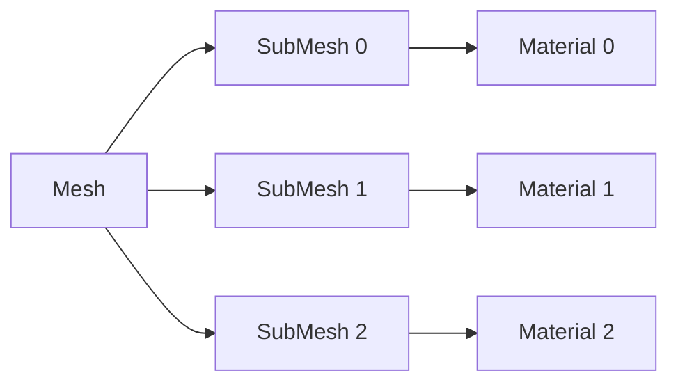
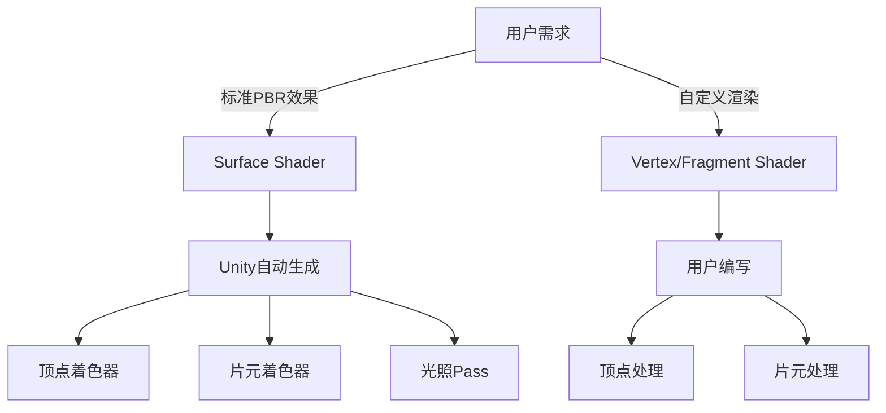

## 为什么要做视锥剔除
在很多的开放性世界的游戏中，场景中往往会有大量的植被与建筑，然而由于视角有限，在屏幕上并不会显示出所有地图上的物体，只能显示出视锥体内的物体。如下图，场景中有很多的小树，但是最终显示在屏幕上的只有视锥体内的小树。
![[Pasted image 20250608101714.png|500]]
如果我们不做任何的操作，那么场景中**所有的**小树对应数据（顶点，三角面）都会通过CPU提交DrawCall传递到GPU中，并且参与到顶点着色器的计算中，如果有几何着色器同样也会参与到其中的计算，然后才会做剔除的操作。也就是说，**一大堆我们其实并看不见的物体依旧在Rendering Pipeline中耗费着大量的计算，造成了不必要的消耗**。
> [!note]+ 为什么不用unity的culling，而要自己实现？
> 因为unity的culling只能剔除unity用mesh render一个个画出来的物体。  基于GPU instancing的绘制方案，unity无法再进行常规的视锥剔除。gpu instance把相同的合成了一个物体，一次画出，unity当然不能剔除这个整体的局部物体。自己写剔除计算哪些局部需要加到这个整体里。（实际上不画的数据也在，只是index偏移到后面去了，后面的都不画）

并且由于GPU没有单个物体的概念，全部都是顶点和面，因此剔除的效率并不高。比如我有一个人物模型，有上万个顶点和面，那么CPU要剔除它时就需要将所有的顶点和面都计算一遍，来看留下哪些和剔除哪些顶点和面。但是如果我们能够使用一个**包围盒**把这个模型包起来，那么只需要计算包围盒的几个顶点即可判断出是否剔除这个模型。

针对上面这些问题，我们可以使用视锥剔除来进行优化。当然了，除此之外还有遮挡剔除（例如Hiz）等方案可以进行更进一步的优化。

简单的视锥剔除后的效果如下：![[c998e51e-c505-11eb-ac77-eaa902b6d667.mp4]]
![[2.mp4]]
## 视锥剔除原理

前面我们说了，所有看不见的物体，也就是视锥体外的物体都会被传入到GPU中做计算。那么如果我们能够在CPU阶段就抛弃这些视锥体外的物体，不就可以大大降低传入到GPU中的数据了。

那么问题的核心就是怎么判断物体是否在视锥体内或者外。前面也说了一个物体可能非常的复杂有成千上万的顶点和面，因此我们往往会给每个物体定义一个包围盒或者包围球，这样问题就简化为**如何判断包围盒或者包围球和视锥体的内外关系**。

那么我们来看看怎么判断我们的包围盒是否在视锥体内，二维下的示意图如下：
![[Pasted image 20250608135614.png|500]]
很明显我们应该将ABD三个物体的数据提交给GPU，而把C剔除掉。那么这个判断逻辑怎么来的呢？首先我们可以通过判断包围盒的每个**顶点与视锥体的关系**来判断整个包围盒与视锥体的关系。其中我们可以**把视锥体看作是六个面的集合，如果一个点都在六个面的背面，那么这个点就在视锥体内**。但是如果包围盒有任何一个顶点在视锥体内，我们就当做AABB属于在视锥体内的话，那么对于物体D（比如一面墙）的AABB明显不适用，它的所有顶点都不在视锥体内，但是我们依旧需要渲染它。此时我们需要逆向思维，即**若包围盒的所有顶点都在视锥体的某个面外，那么我们认为这个物体是要被剔除的**。例如C的所有顶点都在右边那个面外，需要剔除，D的所有顶点并没有全部在某个面外因此保留。

理解了原理之后我们接下来要做的就是怎么用代码实现它，在以往这部分的逻辑会在CPU进行，并且还会事先使用例如**八叉树**的形式来对场景进行划分，比如我某个节点对应的包围盒在视锥体外，那么该节点下的所有子节点必然也都在视锥体外，从而节省了大量的计算。对于在CPU上进行的剔除操作（视锥剔除，遮挡剔除等）我们称之为**CPU Culling**。

但是在当今的GPGPU当中，我们可以使用[[Compute Shader|Compute Shader]]来完成==物体级别的剔除==，这种剔除方式我们称之为**GPU Culling**。本文要介绍的就是其中一种使用Compute Shader来实现视锥剔除的方法，简单来说就是利用cs，在GPU端判断物体的包围盒和视锥体的关系。、

## Graphics.DrawMeshInstancedIndirect

Unity的[GPU instancing](https://link.zhihu.com/?target=https%3A//docs.unity3d.com/Manual/GPUInstancing.html)技术可以帮助我们使用少量的draw call绘制大量相同材质的物体，例如场景中的植被，因此我们才能够绘制很多小树从而保持着不错的帧率。

而我们要用cs来进行culling判断的话，必然要将这成千上万个物体的包围盒信息传入到cs中，然后再由cs把不被剔除的物体传回到CPU，最终绘制出来。其中大量数据在CPU与GPU的传递就会造成很大的性能问题，特别在手机端传输带宽受限的情况下肯定是无法承受的。

而DrawMeshInstancedIndirect方法可以为我们很好的解决这样的问题，官方有一段说明如下：

> This is useful if you want to populate all of the instance data from the GPU, and the CPU does not know the number of instances to draw (for example, when performing GPU culling).

也就是说使用该方法，我们可以把在显存里面的数据直接Draw到渲染管线中，而不是传统的从CPU发送数据。也就是说可以把cs处理后的结果直接放到渲染管线当中，而不用再传递到CPU端。
### 绘制同一网格多个实例的脚本：
```csharp
using UnityEngine;
using System.Collections;

public class ExampleClass : MonoBehaviour {
    public int instanceCount = 100000; //初始实例数量（10万）,`int`，每个实例占16字节计算缓冲区内存
    public Mesh instanceMesh;  //需要实例化的原始网格资源
    public Material instanceMaterial;  //- 实例化专用材质，Shader必须支持计算缓冲区数据解析
    public int subMeshIndex = 0;  //- 指定使用网格的子网格索引（默认第一个）

    private int cachedInstanceCount = -1;  // 缓存的上次实例数量
    private int cachedSubMeshIndex = -1;  // 缓存的上次子网格索引
    private ComputeBuffer positionBuffer;
    private ComputeBuffer argsBuffer;
    //渲染参数
    private uint[] args = new uint[5] { 0, 0, 0, 0, 0 };

    void Start() {
        argsBuffer = new ComputeBuffer(1, args.Length * sizeof(uint), ComputeBufferType.IndirectArguments);
        UpdateBuffers();
    }

    void Update() {
        //- 仅在实例数量/子网格变化时重建缓冲区（避免每帧更新）
        // Update starting position buffer
        if (cachedInstanceCount != instanceCount || cachedSubMeshIndex != subMeshIndex)
            UpdateBuffers();

        // 左右方向键控制实例数量增减
        if (Input.GetAxisRaw("Horizontal") != 0.0f)
            instanceCount = (int)Mathf.Clamp(instanceCount + Input.GetAxis("Horizontal") * 40000, 1.0f, 5000000.0f);

        // Render
        Graphics.DrawMeshInstancedIndirect(instanceMesh, subMeshIndex, instanceMaterial, new Bounds(Vector3.zero, new Vector3(100.0f, 100.0f, 100.0f)), argsBuffer);
    }

    void OnGUI() {
        GUI.Label(new Rect(265, 25, 200, 30), "Instance Count: " + instanceCount.ToString());
        instanceCount = (int)GUI.HorizontalSlider(new Rect(25, 20, 200, 30), (float)instanceCount, 1.0f, 5000000.0f);
    }
	//这段代码是实例化渲染系统的核心，负责创建和更新计算缓冲区，包含位置数据和渲染参数。
    void UpdateBuffers() {
        // Ensure submesh index is in range
        if (instanceMesh != null)
            subMeshIndex = Mathf.Clamp(subMeshIndex, 0, instanceMesh.subMeshCount - 1);

        // 在创建新缓冲区前释放旧资源，避免内存泄漏
        if (positionBuffer != null)
            positionBuffer.Release();
        positionBuffer = new ComputeBuffer(instanceCount, 16);
        Vector4[] positions = new Vector4[instanceCount];
        for (int i = 0; i < instanceCount; i++) {
            float angle = Random.Range(0.0f, Mathf.PI * 2.0f);
            float distance = Random.Range(20.0f, 100.0f);
            float height = Random.Range(-2.0f, 2.0f);
            float size = Random.Range(0.05f, 0.25f);
            positions[i] = new Vector4(Mathf.Sin(angle) * distance, height, Mathf.Cos(angle) * distance, size);
        }
        positionBuffer.SetData(positions);
        instanceMaterial.SetBuffer("positionBuffer", positionBuffer);

        // Indirect args
        if (instanceMesh != null) {
            args[0] = (uint)instanceMesh.GetIndexCount(subMeshIndex); //子网格的三角形索引总数
            args[1] = (uint)instanceCount;
            args[2] = (uint)instanceMesh.GetIndexStart(subMeshIndex); //子网格索引在索引缓冲区中的起始位置
            args[3] = (uint)instanceMesh.GetBaseVertex(subMeshIndex); //子网格顶点在顶点缓冲区中的偏移
        }
        else
        {
            args[0] = args[1] = args[2] = args[3] = 0;
        }
        argsBuffer.SetData(args);

        cachedInstanceCount = instanceCount;
        cachedSubMeshIndex = subMeshIndex;
    }

    void OnDisable() {
        if (positionBuffer != null)
            positionBuffer.Release();
        positionBuffer = null;

        if (argsBuffer != null)
            argsBuffer.Release();
        argsBuffer = null;
    }
}

```
#### 子网格（subMesh）深度解析

在Unity网格系统中，​**​子网格(subMesh)​**​ 是一个核心概念，指单个网格对象中包含的多个独立几何部分，每个部分可以拥有自己的材质和渲染属性。



1. ​**​子网格本质​**​
    - 网格(Mesh)的​**​子分区​**​
    - 每个子网格：
        - 拥有独立的​**​顶点索引缓冲区​**​
        - 可绑定不同材质
        - 代表模型的不同视觉部分
2. ​**​`subMeshCount`属性​**​
    `int subMeshCount = mesh.subMeshCount;`
    - ​**​值含义​**​：
        - `1`：单材质模型（最常见）
        - `>1`：多材质复杂模型
        - `0`：无效网格（理论值）
    - ​**​典型模型示例​**​：

| 模型类型 | 子网格数 | 用途        |
| ---- | ---- | --------- |
| 简单方块 | 1    | 单一材质      |
| 游戏角色 | 3-6  | 身体、头发、武器  |
| 环境建筑 | 5-20 | 墙壁、窗户、屋顶等 |
3. **子网格索引系统​**​
	- ​**​索引范围​**​：`0 → subMeshCount-1`
	- ​**​使用示例​**​：
    `// 获取第二个子网格的索引数` 
    `int indices = mesh.GetIndexCount(1);`
4. ​**​`GetIndexCount(subMeshIndex)`​**​
    `args[0] = (uint)instanceMesh.GetIndexCount(subMeshIndex);`
    - 返回：​**​子网格的三角形索引总数​**​
    - 计算方法：`三角形数 × 3`
5. ​**​`GetIndexStart(subMeshIndex)`​**​
    `args[2] = (uint)instanceMesh.GetIndexStart(subMeshIndex);`
    - 返回：​**​子网格在索引缓冲区中的起始位置​**​
    - 缓冲区结构：
        `[子网格0索引][子网格1索引]...[子网格N索引] 
        `^          ^ 
        `|索引0起始 |索引1起始`
6. ​**​`GetBaseVertex(subMeshIndex)`​**​
    `args[3] = (uint)instanceMesh.GetBaseVertex(subMeshIndex);`
    - 返回：​**​子网格在顶点缓冲区中的基础偏移量​**
### 实例的标准表面材质

|特性|标准表面着色器(Surface Shader)|普通着色器(Vertex/Fragment Shader)|
|---|---|---|
|​**​设计目标​**​|简化光照计算|完全自由控制渲染流程|
|​**​抽象级别​**​|高级声明式接口|底层图形API直接映射|
|​**​语法结构​**​|基于Unity特殊语法|基于标准HLSL/Cg语言|
|​**​应用场景​**​|标准材质效果|自定义/风格化渲染|



​**​标准表面着色器：​**​
- ​**​声明式编程模型​**​：
    `#pragma surface surf Standard  // 声明表面函数和光照模型`
- ​**​自动Pass生成​**​：Unity在编译时自动创建多个Pass：
    - 前向渲染Base Pass
    - 附加光源Pass
    - 阴影投射Pass
    - 元数据Pass

​**​普通着色器：​**​
- ​**​命令式编程模型​**​：
    `#pragma vertex vert  // 明确定义顶点函数 #pragma fragment frag // 明确定义片元函数`
- ​**​手动Pass管理​**​：开发者必须手动编写所有Pass：
    ```Pass {     Name "FORWARD"     Tags {"LightMode" = "ForwardBase"}     // 手动编写光照计算... }```

```
Shader "Instanced/InstancedSurfaceShader" {
    Properties {
        _MainTex ("Albedo (RGB)", 2D) = "white" {}     // 基础纹理
        _Glossiness ("Smoothness", Range(0,1)) = 0.5   // 光滑度
        _Metallic ("Metallic", Range(0,1)) = 0.0       // 金属度
    }
    SubShader {
        Tags { "RenderType"="Opaque" }
        LOD 200

        CGPROGRAM
        // Physically based Standard lighting model
        #pragma surface surf Standard addshadow fullforwardshadows    //声明使用标准光照模型的表面着色器 | 生成阴影投射Pass  | 支持所有前向渲染阴影
        #pragma multi_compile_instancing               //启用实例化编译支持
        #pragma instancing_options procedural:setup      //自定义实例化数据处理

        sampler2D _MainTex;

        struct Input {
            float2 uv_MainTex;
        };

    #ifdef UNITY_PROCEDURAL_INSTANCING_ENABLED
        StructuredBuffer<float4> positionBuffer;
    #endif

        void rotate2D(inout float2 v, float r)
        {
            float s, c;
            sincos(r, s, c);
            v = float2(v.x * c - v.y * s, v.x * s + v.y * c);
        }

        void setup()
        {
        #ifdef UNITY_PROCEDURAL_INSTANCING_ENABLED
            float4 data = positionBuffer[unity_InstanceID];

            float rotation = data.w * data.w * _Time.y * 0.5f;
            rotate2D(data.xz, rotation);

            unity_ObjectToWorld._11_21_31_41 = float4(data.w, 0, 0, 0);
            unity_ObjectToWorld._12_22_32_42 = float4(0, data.w, 0, 0);
            unity_ObjectToWorld._13_23_33_43 = float4(0, 0, data.w, 0);
            unity_ObjectToWorld._14_24_34_44 = float4(data.xyz, 1);
            unity_WorldToObject = unity_ObjectToWorld;
            unity_WorldToObject._14_24_34 *= -1;
            unity_WorldToObject._11_22_33 = 1.0f / unity_WorldToObject._11_22_33;
        #endif
        }

        half _Glossiness;
        half _Metallic;

        void surf (Input IN, inout SurfaceOutputStandard o) {
            fixed4 c = tex2D (_MainTex, IN.uv_MainTex);
            o.Albedo = c.rgb;
            o.Metallic = _Metallic;
            o.Smoothness = _Glossiness;
            o.Alpha = c.a;
        }
        ENDCG
    }
    FallBack "Diffuse"
}

```

### custom shader
```
          Shader "Instanced/InstancedShader" {
    Properties {
        _MainTex ("Albedo (RGB)", 2D) = "white" {}
    }
    SubShader {

        Pass {

            Tags {"LightMode"="ForwardBase"}

            CGPROGRAM

            #pragma vertex vert
            #pragma fragment frag
            #pragma multi_compile_fwdbase nolightmap nodirlightmap nodynlightmap novertexlight
            #pragma target 4.5

            #include "UnityCG.cginc"
            #include "UnityLightingCommon.cginc"
            #include "AutoLight.cginc"

            sampler2D _MainTex;

        #if SHADER_TARGET >= 45
            StructuredBuffer<float4> positionBuffer;
        #endif

            struct v2f
            {
                float4 pos : SV_POSITION;
                float2 uv_MainTex : TEXCOORD0;
                float3 ambient : TEXCOORD1;
                float3 diffuse : TEXCOORD2;
                float3 color : TEXCOORD3;
                SHADOW_COORDS(4)
            };

            void rotate2D(inout float2 v, float r)
            {
                float s, c;
                sincos(r, s, c);
                v = float2(v.x * c - v.y * s, v.x * s + v.y * c);
            }

            v2f vert (appdata_full v, uint instanceID : SV_InstanceID)
            {
            #if SHADER_TARGET >= 45
                float4 data = positionBuffer[instanceID];
            #else
                float4 data = 0;
            #endif

                float rotation = data.w * data.w * _Time.x * 0.5f;
                rotate2D(data.xz, rotation);

                float3 localPosition = v.vertex.xyz * data.w;
                float3 worldPosition = data.xyz + localPosition;
                float3 worldNormal = v.normal;


                float3 ndotl = saturate(dot(worldNormal, _WorldSpaceLightPos0.xyz));
                float3 ambient = ShadeSH9(float4(worldNormal, 1.0f));
                float3 diffuse = (ndotl * _LightColor0.rgb);
                float3 color = v.color;

                v2f o;
                o.pos = mul(UNITY_MATRIX_VP, float4(worldPosition, 1.0f));
                o.uv_MainTex = v.texcoord;
                o.ambient = ambient;
                o.diffuse = diffuse;
                o.color = color;
                TRANSFER_SHADOW(o)
                return o;
            }

            fixed4 frag (v2f i) : SV_Target
            {
                fixed shadow = SHADOW_ATTENUATION(i);
                fixed4 albedo = tex2D(_MainTex, i.uv_MainTex);
                float3 lighting = i.diffuse * shadow + i.ambient;
                fixed4 output = fixed4(albedo.rgb * i.color * lighting, albedo.w);
                UNITY_APPLY_FOG(i.fogCoord, output);
                return output;
            }

            ENDCG
        }
    }
}

```

## 视锥体六个面的定义

视锥剔除的核心就是如何判断包围盒与视锥体的关系，前面我们说了判断的方法为：若包围盒的所有顶点都在视锥体的某个面外，那么我们认为这个物体是要被剔除的。那么我们首先要定义出视锥体的六个面。

我们知道**平面方程**为：

> Ax+By+Cz+D=0

其中xyz代表平面上的一点，ABC为平面法线，D的值后面介绍。这样我们即可以使用一个四维向量 Vector4=(A,B,C,D)来表示一个平面。

例如假设有个平面平行于xz平面且正面向上，那么其法线即为(0,1,0)，因此A=0，B=1，C=0。若该平面过点(0,5,0)，那么x=0，y=5，z=0，可解得D=-5。因此过点(0,5,0)法线为(0,1,0)的平面方程为0x+1y+0z-5=0，用向量表示即为(0,1,0,-5)。

我们可以发现其中D=-(Ax+By+Cz)，而Ax+By+Cz的值正是(A,B,C)与(x,y,z)的点乘结果，因此**D的值即为平面法线和平面内任意一点的点乘结果取负**。

这样我们可以得到第一个函数：

```csharp
//一个点和一个法向量确定一个平面
public static Vector4 GetPlane(Vector3 normal, Vector3 point)
{
    return new Vector4(normal.x, normal.y, normal.z, -Vector3.Dot(normal, point));
}
```

视锥体的六个面我们简单的用左右上下远近来称呼，其中远近两个面的法线我们可以通过Camera.transform.forward来获得，其他四个面的法线怎么求呢？因为透视相机的左右上下四个面肯定都过相机本身，因此Camera.transform.position就是四个面上的一点，而三点可以确定一个平面，我们只需要再求出远平面（或近平面）的四个端点，这样对于上下左右四个面中的任何一个面的法线我们都可以利用远平面的某两个点和相机本身（一共三个点）通过向量的**叉乘**来获取。
三点确定一个平面的方法如下：

```csharp
//三点确定一个平面
public static Vector4 GetPlane(Vector3 a, Vector3 b, Vector3 c)
{
    Vector3 normal = Vector3.Normalize(Vector3.Cross(b - a, c - a));
    return GetPlane(normal, a);
}
```

视锥体远平面的计算方式如下：

```csharp
//获取视锥体远平面的四个点
public static Vector3[] GetCameraFarClipPlanePoint(Camera camera)
{
    Vector3[] points = new Vector3[4];
    Transform transform = camera.transform;
    float distance = camera.farClipPlane;
    float halfFovRad = Mathf.Deg2Rad * camera.fieldOfView * 0.5f;
    float upLen = distance * Mathf.Tan(halfFovRad);
    float rightLen = upLen * camera.aspect;
    Vector3 farCenterPoint = transform.position + distance * transform.forward;
    Vector3 up = upLen * transform.up;
    Vector3 right = rightLen * transform.right;
    points[0] = farCenterPoint - up - right;//left-bottom
    points[1] = farCenterPoint - up + right;//right-bottom
    points[2] = farCenterPoint + up - right;//left-up
    points[3] = farCenterPoint + up + right;//right-up
    return points;
}
```

比较简单，就不过多说了，camera.aspect = width/height ，视锥体的yz横切面如下图：
![[Pasted image 20250608164202.png|500]] 
有了上述这些点的坐标，我们就可以得到视锥体的所有面了，代码如下：

```csharp
//获取视锥体的六个平面
public static Vector4[] GetFrustumPlane(Camera camera)
{
    Vector4[] planes = new Vector4[6];
    Transform transform = camera.transform;
    Vector3 cameraPosition = transform.position;
    Vector3[] points = GetCameraFarClipPlanePoint(camera);
    //顺时针
    planes[0] = GetPlane(cameraPosition, points[0], points[2]);//left
    planes[1] = GetPlane(cameraPosition, points[3], points[1]);//right
    planes[2] = GetPlane(cameraPosition, points[1], points[0]);//bottom
    planes[3] = GetPlane(cameraPosition, points[2], points[3]);//up
    planes[4] = GetPlane(-transform.forward, transform.position + transform.forward * camera.nearClipPlane);//near
    planes[5] = GetPlane(transform.forward, transform.position + transform.forward * camera.farClipPlane);//far
    return planes;
}
```

需要注意的就是顶点的顺序，**在Unity中顺时针代表正面**。
## 点与面的关系

面有了，那么如果判断一个点是在这个面的正面还是背面呢？我们先来看一个二维的示意图，如下：
![[Pasted image 20250608164557.png|468]]
我们假设图中平面的法线为(nx,ny,nz)，由于O(ox,oy,oz)在平面上，那么就可以求出平面方程中D的值为：-(nx*ox+ny*oy+nz*oz)。如果我们把A(ax,ay,az)带入这个平面方程，可得：nx*ax+ny*ay+nz*az-(nx*ox+ny*oy+nz*oz)，提取一下可得nx*(ax-ox)+ny*(ay-oy)+nz*(az-oz)，不就是法向量n与向量OA的点乘，因为点乘的另一层函数是两个向量的模乘以夹角的余弦值，因为若点在平面的正面其与法线的夹角必然在0-90°之间，因此对应的余弦值肯定在0-1之间，因此法向量n与向量OA的点乘的结果必然大于0。

同理可得出结论，假设一个平面为(a,b,c,d)，给定任意一个点(x,y,z)，若：

> ax+by+cz+d>0 则点在平面外  
> ax+by+cz+d=0 则点在平面上  
> ax+by+cz+d<0 则点在平面内

用代码来表示的话即为：

```glsl
bool IsOutsideThePlane(float4 plane, float3 pointPosition)
{
    if(dot(plane.xyz, pointPosition) + plane.w > 0)
        return true;
    return false;
}
```

注：这一部分判断到时候要在cs里做，所以不再是c#代码了。

## CPU与GPU传递的数据

前面我们说了我们要从CPU把所有物体的包围盒信息传递到cs中去做视锥剔除判断，但是由于我们的物体虽然都是同一个Mesh，但是其大小位置旋转可能都不相同，也就是说每个包围盒的顶点的世界坐标都要在CPU先通过一系列的运算才能得到。我们可不可以把这些运算也丢到cs中呢？当然可以。

大部分情况下，我们相同的物体肯定是相同的包围盒，也就是说在**Object Space**中，这些物体的包围盒信息都是相同的，我们可以如下图两个点来描述一个包围盒，其中包围盒的中心就是物体的中心。
![[Pasted image 20250608164639.png|284]]
那么包围盒八点顶点的坐标即为：

> float3(boundMin));  
> float3(boundMax));  
> float3(boundMax.x, boundMax.y, boundMin.z));  
> float3(boundMax.x, boundMin.y, boundMax.z));  
> float3(boundMax.x, boundMin.y, boundMin.z));  
> float3(boundMin.x, boundMax.y, boundMax.z));  
> float3(boundMin.x, boundMax.y, boundMin.z));  
> float3(boundMin.x, boundMin.y, boundMax.z));

至于boundMin以及boundMax的取值多少合适呢？我们可以借助Unity的**BoxCollider**组件来量一下，如下图：
![[Pasted image 20250608164701.png|500]]
例如我要绘制这个树，那么它的boundMin应该为(-1.5, 0, -1.5)，而boundMax为(1.5, 7, 1.5)。

接下来怎么把它们转换到**World Space**呢？我们只需要使用每个物体从自身坐标转到世界坐标的变换矩阵（localToWorldMatrix）与它们相乘即可，这个矩阵可以通过下面方法来得到：

```csharp
Matrix4x4 localToWorldMatrix = Matrix4x4.TRS(position, quaternion, scale)
```

这样我们就可以在cs中计算出每个物体对应的包围盒八个顶点的世界坐标了，并且这样计算出来的包围盒属于[OBB](https://zhida.zhihu.com/search?content_id=171863503&content_type=Article&match_order=1&q=OBB&zhida_source=entity)而非AABB。

然后我们就可以利用c#的**ComputeBuffer**将所有物体的localToWorldMatrix传递到cs的**StructuredBuffer**中。

注：在cs中不能使用Buffer\<float4x4>来接收变换矩阵，会有如下报错：

> elements of typed buffers and textures must fit in four 32-bit quantities at kernel

当然除了变换矩阵之外，我们还需要传入视锥体六个面的信息用于做剔除判断，以及物体总数的信息，防止越界。

好了，有了这些信息后，我们就可以在cs里判断哪些物体是在视椎体之外的。这里还存在着最后一个问题，就是怎么得到保留下来的这些数据，这里我们可以使用[AppendStructuredBuffer](https://link.zhihu.com/?target=https%3A//docs.microsoft.com/en-us/windows/win32/direct3dhlsl/sm5-object-appendstructuredbuffer)来处理。作为cs里面的**输出Buffer**，我们可以使用其**Append**方法，往里面添加我们要输出的数据。

完整的cs代码如下：

```glsl
#pragma kernel ViewPortCulling

uint instanceCount;
StructuredBuffer<float4x4> input;
float4 planes[6];
AppendStructuredBuffer<float4x4> cullresult;

bool IsOutsideThePlane(float4 plane, float3 pointPosition)
{
    if(dot(plane.xyz, pointPosition) + plane.w > 0)
        return true;
    return false;
}

[numthreads(640,1,1)]
void ViewPortCulling (uint3 id : SV_DispatchThreadID)
{
    if(id.x >= instanceCount)
        return;
    float4x4 info = input[id.x];
	
    float3 boundMin = float3(-1.5, 0, -1.5);
    float3 boundMax = float3(1.5, 7, 1.5);
    float4 boundVerts[8];//AABB8个顶点坐标
    boundVerts[0] = mul(info, float4(boundMin, 1));
    boundVerts[1] = mul(info, float4(boundMax, 1));
    boundVerts[2] = mul(info, float4(boundMax.x, boundMax.y, boundMin.z, 1));
    boundVerts[3] = mul(info, float4(boundMax.x, boundMin.y, boundMax.z, 1));
    boundVerts[6] = mul(info, float4(boundMax.x, boundMin.y, boundMin.z, 1));
    boundVerts[4] = mul(info, float4(boundMin.x, boundMax.y, boundMax.z, 1));
    boundVerts[5] = mul(info, float4(boundMin.x, boundMax.y, boundMin.z, 1));
    boundVerts[7] = mul(info, float4(boundMin.x, boundMin.y, boundMax.z, 1));

    //如果8个顶点都在某个面外，则肯定在视锥体外面
    for (int i = 0; i < 6; i++)
    {
	for(int j = 0; j < 8; j++)
	{
	    float3 boundPosition = boundVerts[j].xyz;

	    if(!IsOutsideThePlane(planes[i], boundPosition))
		break;
	    if(j == 7)
		return;
	}
    }
    cullresult.Append(info);
}
```

  

然后我们在c#端给cs传入需要的数据即可。这里需要注意的是cs中的AppendStructuredBuffer对应到c#中的ComputeShader时，其ComputeBufferType为[ComputeBufferType.Append](https://link.zhihu.com/?target=https%3A//docs.unity3d.com/ScriptReference/ComputeBufferType.Append.html)，并且每次更新数据时需要使用[SetCounterValue](https://link.zhihu.com/?target=https%3A//docs.unity3d.com/ScriptReference/ComputeBuffer.SetCounterValue.html)方法来初始化，最后也是将其传入到渲染用到Shader当中。

修改后的C#代码如下：

```csharp
public class ExampleClass : MonoBehaviour {

    ......
    public ComputeShader compute;
    ComputeBuffer localToWorldMatrixBuffer;
    ComputeBuffer cullResult;
    List<Matrix4x4> localToWorldMatrixs = new List<Matrix4x4>();
    int kernel;
    Camera mainCamera;

    void Start()
    {
        kernel = compute.FindKernel("ViewPortCulling");
        mainCamera = Camera.main;
        cullResult = new ComputeBuffer(instanceCount, sizeof(float) * 16, ComputeBufferType.Append);
        ......
    }

    void Update() {
        ......
        Vector4[] planes = CullTool.GetFrustumPlane(mainCamera);

        compute.SetBuffer(kernel, "input", localToWorldMatrixBuffer);
        cullResult.SetCounterValue(0);
        compute.SetBuffer(kernel, "cullresult", cullResult);
        compute.SetInt("instanceCount", instanceCount);
        compute.SetVectorArray("planes", planes);
        compute.Dispatch(kernel, 1 + (instanceCount / 640), 1, 1);
        instanceMaterial.SetBuffer("positionBuffer", cullResult);

        Graphics.DrawMeshInstancedIndirect(instanceMesh, subMeshIndex, instanceMaterial,
            new Bounds(Vector3.zero, new Vector3(100.0f, 100.0f, 100.0f)), argsBuffer);
    }
    
    void UpdateBuffers() {
        ......
        if(localToWorldMatrixBuffer != null)
            localToWorldMatrixBuffer.Release();

        localToWorldMatrixBuffer = new ComputeBuffer(instanceCount, 16 * sizeof(float));
        localToWorldMatrixs.Clear();
        for(int i = 0; i < instanceCount; i++) {
            ......
            localToWorldMatrixs.Add(Matrix4x4.TRS(position, Quaternion.identity, new Vector3(size, size, size)));
        }
        localToWorldMatrixBuffer.SetData(localToWorldMatrixs);
        ......
    }

    void OnDisable() {
        localToWorldMatrixBuffer?.Release();
        localToWorldMatrixBuffer = null;

        cullResult?.Release();
        cullResult = null;
        ......
    }
}
```

  

最后我们只需要修改下官方例子中Shader的代码即可，因为简化，没有使用旋转的物体，因此localToWorldMatrix矩阵中的 **._14_24_34** 代表的即是物体世界坐标下的位置信息，**._11**代表的就是缩放的信息。

修改后的shader代码如下：

```text
Shader "Instanced/InstancedShader" {
    Properties {
        _MainTex ("Albedo (RGB)", 2D) = "white" {}
    }
    SubShader {

        Pass {
            ......
        #if SHADER_TARGET >= 45
	    StructuredBuffer<float4x4> positionBuffer;
        #endif
            ......
            v2f vert (appdata_full v, uint instanceID : SV_InstanceID)
            {
            #if SHADER_TARGET >= 45
                float4x4 data = positionBuffer[instanceID];
            #else
                float4x4 data = 0;
            #endif
                float3 localPosition = v.vertex.xyz * data._11;
                float3 worldPosition = data._14_24_34 + localPosition;
                float3 worldNormal = v.normal;
                ......
            }
            ......
            ENDCG
        }
    }
}
```

  

这样我们就实现了一个简单的View Frustum Culling，有什么写的不好地方欢迎大佬们指点迷津~

## BUG修复

上面的Demo中在剔除时会发现视椎体外面还是会有部分**残留**，这里感谢 

[@榛果和阿柴](https://www.zhihu.com/people/69f4f715b692efaf87f72e50562fa22d)

 帮忙解决了这个问题。

问题的原因在于调用DrawMeshInstancedIndirect时，argsBuffer里面代表渲染数量的值依旧是剔除前的 instanceCount 值。比如说我们要渲染10000棵树，剔除后只剩888棵能看见，那么DrawMeshInstancedIndirect里的数量就应该是888，而不是10000。

那么怎么获取剔除后的数量呢？cullResult.count 是不对的，它的值永远是它初始化时的大小。这里我们可以使用 [CopyCount](https://link.zhihu.com/?target=https%3A//docs.unity3d.com/ScriptReference/ComputeBuffer.CopyCount.html)方法来获取：

```csharp
ComputeBuffer.CopyCount(ComputeBuffer src, ComputeBuffer dst, int dstOffsetBytes) 
```

它可以将某个append或consume类型的ComputeBuffer的实际长度写入到另一个ComputeBuffer里，其中dstOffsetBytes为偏移的位置。因此我们可以把cullResult里的实际数量写到argsBuffer中，而由于argsBuffer中的第二个参数才是存的数量，所以给它偏移一个unit的字节大小。

修改后的代码如下：

```csharp
void Update() {
    ...

    //获取实际要渲染的数量
    ComputeBuffer.CopyCount(cullResult, argsBuffer, sizeof(uint));

    Graphics.DrawMeshInstancedIndirect(instanceMesh, subMeshIndex, instanceMaterial, new Bounds(Vector3.zero, new Vector3(100.0f, 100.0f, 100.0f)), argsBuffer);
}

void UpdateBuffers() {
    ......
    argsBuffer.SetData(args);
}
```

这样在旋转Camera的时候就不会出现残留了，如下：
![[v2-6bf9d47224a6327793e304b06feef6d3_b.webp|500]]

修改后还可以发现帧率得到了明显的提升，对比如下：


剔除前


剔除后