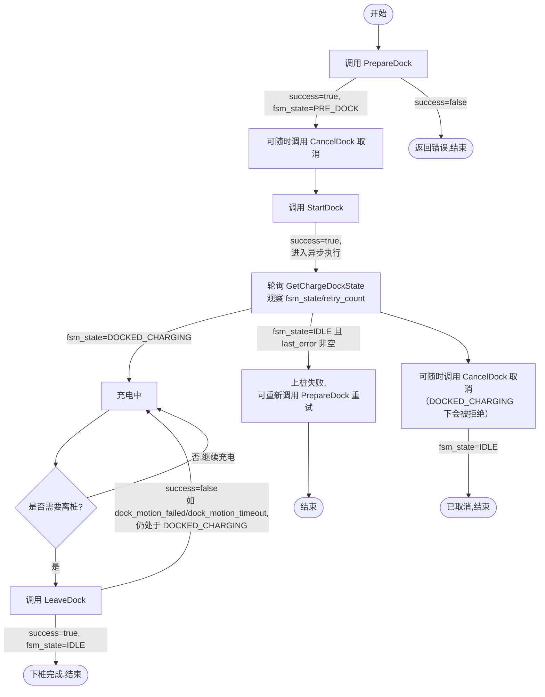
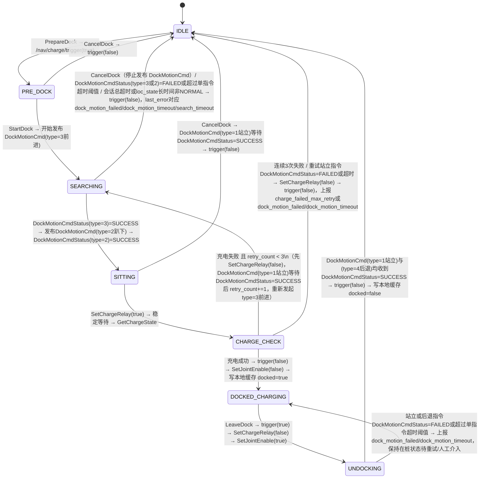

## **Background**
上桩充电是机器人无人化运行必须的功能，否则无法实现任务（巡逻、巡检、运输等）闭环。但是目前上桩充电链路较长，遇到问题排查困难，客户现场（南方电网、南水北调、骡不累等）上报的问题经常无法快速定位解决。所以决定将上桩充电功能移到SYSB上层实现，各模块尽量解耦（MCS、RPS、NAV等），方便快速定位问题，保证上桩功能的稳定。
## Proposal Design
## 0. 背景需求与接口命名
### 0.1 接口目录（依赖接口统一命名，按 ROS2 接口风格）
按模块分组；「导航定位」的 3 个接口是对方团队已确认的真实接口（截图核对，非占位）；「unimotion·MCS/RPS」经 `unimotion` 节点包装后以 ROS2 接口形式暴露，SDK 侧一律当作普通 ROS2 client/发布者调用，不关心内部包装细节。

| 模块            | 接口名                                                       | ROS2 类型                                         | runtime 名称                          | 关键字段                                                                                                                                                                      | 用途                                                                                                                                   |
| ------------- | --------------------------------------------------------- | ----------------------------------------------- | ----------------------------------- | ------------------------------------------------------------------------------------------------------------------------------------------------------------------------- | ------------------------------------------------------------------------------------------------------------------------------------ |
| 导航定位（**已确认**） | `ChargeLocalizationTrigger`                               | `std_srvs/srv/SetBool`                          | `/nav/charge/trigger`               | `data:true` 触发回充定位计算；`data:false` 结束计算                                                                                                                                    | 开关"以桩为原点持续计算相对位姿"                                                                                                                    |
| 导航定位（**已确认**） | `ChargePose`（topic）                                       | `geometry_msgs/msg/PoseStamped`                 | `/nav/charge/pose`                  | 相对位姿；随雷达频率浮动，正常约 10Hz；传感器异常时停止发布                                                                                                                                          | 桩的相对位姿，供 AutoCharge 计算对接/后退目标误差                                                                                                      |
| 导航定位（**已确认**） | `ChargeLocState`（topic）                                   | `daystar_navigation_msgs/msg/LocalizationState` | `/nav/charge/loc_state`             | `loc_state`: `NORMAL=0`/`LACKDATA=1`/`LOST=2`，10Hz                                                                                                                        | 定位状态；**非 `NORMAL` 时机器人必须停止运动、原地待命**（对方团队明确的安全约束）                                                                                     |
| unimotion·MCS | `DockMotionCmd`（topic，AutoCharge 发布 → unimotion 订阅）       | 自定义 msg（新建，待命名包）                                | `/unimotion/dock_motion_cmd`        | `command_type`(uint8：`1`=站立/`2`=趴下/`3`=前进/`4`=后退)、`target_pose`（透传自 `/nav/charge/pose`）、`stamp`                                                                           | AutoCharge 按需持续发布"动作类型+目标位姿"，unimotion 订阅后按类型调用对应 MCS 原语并做内部"补帧"；**AutoCharge 只要停止发布即等效让机器人停止运动**（MCS 特性：收不到新指令会自动停下），不需要额外的 STOP 类型 |
| unimotion·MCS | `DockMotionCmdStatus`（topic，unimotion 发布 → AutoCharge 订阅） | 自定义 msg（新建，与 `DockMotionCmd` 同包）                | `/unimotion/dock_motion_cmd_status` | `command_type`(echo 当前正在执行的指令类型，用于与 AutoCharge 侧发布的 `DockMotionCmd` 做匹配)、`status`(uint8：`0`=执行中`EXECUTING`/`1`=执行成功`SUCCESS`/`2`=执行失败`FAILED`)、`message`（可选，失败原因）、`stamp` | unimotion 对当前正在执行的 `DockMotionCmd` 的执行结果反馈；AutoCharge 订阅后据此判断该指令"执行中/成功/失败"，是判定动作是否完成的**唯一**依据                                       |
| unimotion·MCS | `SetJointEnable`                                          | `std_srvs/srv/SetBool`                          | `/unimotion/set_joint_enable`       | `data: bool`                                                                                                                                                              | 对关节下使能/使能：进入 `DOCKED_CHARGING` 时 `false` 下使能停止伺服；`LeaveDock` 开始时需先 `true` 重新上使能，否则无法执行站立                                             |
| unimotion·RPS | `SetChargeRelay`                                          | `std_srvs/srv/SetBool`                          | `/unimotion/rps/set_charge_relay`   | `data: bool`                                                                                                                                                              | 开/关充电继电器                                                                                                                             |
| unimotion·RPS | `GetChargeState`                                          | srv                                             | `/unimotion/rps/get_charge_state`   | → `is_charging: bool`                                                                                                                                                     | 查询当前是否正在充电                                                                                                                           |

  
> 站立/趴下/前进/后退动作是否完成：**统一改为**订阅 `DockMotionCmdStatus`，按当前发布的 `command_type` 匹配对应终态；`status=SUCCESS` 才视为该指令完成并推进状态机，`status=FAILED` 或超过单指令超时阈值仍未收到终态，都判定该指令失败，**直接终止当前调用并返回对应错误码**（`dock_motion_failed`/`dock_motion_timeout`），不在指令内部自动重试（原先"复用 `Motion::GetRobotState()` 轮询确认"与"AutoCharge 自己算 pose 误差判断到位"两种间接确认方式均已被取代；`Motion::GetRobotState()` 仍是既有能力，但不再作为本功能判定动作完成的依据）。
  
### 0.2 流程（用接口名简化描述）

1. client 调用 **PrepareDock**（SDK 对外接口）→ 调 `/nav/charge/trigger(true)` 并订阅 `/nav/charge/pose`、`/nav/charge/loc_state` → 状态机置 `PRE_DOCK`。

2. client 调用 **StartDock** → 状态机置 `SEARCHING`：AutoCharge 在位姿回调里持续校验 `loc_state==NORMAL` 且数据新鲜，据此持续发布 `DockMotionCmd(command_type=3前进, target_pose=...)` 并订阅 `DockMotionCmdStatus`；`status=EXECUTING` 期间持续下发最新 `target_pose`；收到 `command_type=3` 的 `status=SUCCESS`（对接到位）→ 进入第3步；`status=FAILED` 或超过单指令超时阈值未收到终态 → **直接终止会话**，`trigger(false)`，回 `IDLE`，`last_error=dock_motion_failed`/`dock_motion_timeout`；若持续超过会话总超时或 `loc_state` 长时间非 `NORMAL` → 同样终止会话，`trigger(false)`，回 `IDLE`，`last_error=search_timeout`。

3. 收到 `command_type=3` 的 `SUCCESS` 后，发布 `DockMotionCmd(command_type=2趴下, ...)` 并等待同一 `DockMotionCmdStatus` 话题上 `command_type=2` 的终态：`SUCCESS` → 状态机置 `SITTING`；`FAILED`/超时 → 直接终止会话，`trigger(false)`，回 `IDLE`，`last_error=dock_motion_failed`/`dock_motion_timeout`。

4. 进入 `CHARGE_CHECK`：调用 `SetChargeRelay(true)` → 稳定等待 → 调用 `GetChargeState` 判断 `is_charging`；充电失败则 `SetChargeRelay(false)` → 发布 `DockMotionCmd(command_type=1站立)` 并等待 `DockMotionCmdStatus` 的 `SUCCESS`（`FAILED`/超时 → 直接终止会话并返回 `dock_motion_failed`/`dock_motion_timeout`，不计入充电重试次数）→ `retry_count += 1`（`<3`）→ 回第2步重新对接；连续3次充电判定失败：`SetChargeRelay(false)` → 站立确认（同上）→ `trigger(false)` → 回 `IDLE`，`last_error=charge_failed_max_retry`。**（过程中任意时刻收到 `CancelDock`，都要回到 `IDLE`，语义见 1.1 节。）**

5. 充电成功 → `trigger(false)` → `SetJointEnable(false)`（对关节下使能）→ 把 `docked=true` 写入本地缓存文件（原子写，见 0.7 节）→ 状态机置 `DOCKED_CHARGING`。

6. client 调用 **LeaveDock**（不再单独做 `CheckLeaveDockReady` 前置检查）→ `trigger(true)` 并订阅 `/nav/charge/pose`/`loc_state` 校验数据有效 → `SetChargeRelay(false)` → `SetJointEnable(true)`（重新上使能，否则无法站立）→ 发布 `DockMotionCmd(command_type=1站立)` 并等待 `DockMotionCmdStatus` 的 `SUCCESS`（`FAILED`/超时 → 直接终止，返回 `dock_motion_failed`/`dock_motion_timeout`，状态机保持 `DOCKED_CHARGING`）→ 发布 `DockMotionCmd(command_type=4后退)` 并等待 `DockMotionCmdStatus` 的 `SUCCESS`（同样，`FAILED`/超时直接终止并返回对应错误码）→ `trigger(false)` → 把 `docked=false` 写入本地缓存文件 → 回 `IDLE`。

7. 节点启动（`on_activate`）时读取本地缓存文件的 `docked` 标志初始化状态机：`true` → `DOCKED_CHARGING`，否则 → `IDLE`（可选：用 `GetChargeState().is_charging` 做一次一致性校验，见 0.7 节）。

8. 说明：`/nav/charge/*` 由导航定位模块直接提供 ROS2 接口（已确认）；`DockMotionCmd`/`DockMotionCmdStatus`/`SetJointEnable`/`SetChargeRelay`/`GetChargeState` 由 `unimotion` 节点包装 MCS/RPS 后以 ROS2 接口形式暴露；动作是否完成统一由 `DockMotionCmdStatus` 判定，不再依赖 `Motion::GetRobotState()` 或 AutoCharge 自算 pose 误差。

  

### 0.3 对外暴露接口（SDK 侧，5 个 ROS2 service，供外部 client 直接调用）
本模块对外暴露以下 5 个 ROS2 接口（对应第4节阶段2的 `/sdk/charge/*`），**统一返回**：`success`(bool，调用是否成功)、`fsm_state`(当前状态机状态)、`error_code`、`error_message`（后两者来自 `State`）。

| 接口名                  | ROS2 类型 | 建议 service 名称              | 请求字段 | 用途                                                             |
| -------------------- | ------- | -------------------------- | ---- | -------------------------------------------------------------- |
| `PrepareDock`        | srv     | `/sdk/charge/prepare_dock` | 无    | 预备上桩：打开 sensor、订阅位姿，状态机置 `PRE_DOCK`                            |
| `StartDock`          | srv     | `/sdk/charge/start_dock`   | 无    | 开始上桩：驱动 `SEARCHING → SITTING → CHARGE_CHECK → DOCKED_CHARGING` |
| `LeaveDock`          | srv     | `/sdk/charge/leave_dock`   | 无    | 退桩：驱动 `DOCKED_CHARGING → UNDOCKING → IDLE`                     |
| `CancelDock`         | srv     | `/sdk/charge/cancel_dock`  | 无    | 取消当前上桩流程，语义见 1.1 节                                             |
| `GetChargeDockState` | srv     | `/sdk/charge/get_state`    | 无    | 查询当前状态机状态、重试次数、充电状态等（详细字段见第3节 `GetChargeDockStateResponse`）    |

> 统一响应结构见第3节 Response 结构体；`success`/`fsm_state` 字段已加入 `PrepareDockResponse`/`StartDockResponse`/`CancelDockResponse`/`LeaveChargeDockResponse`（原先仅有 `State state`），与 `GetChargeDockStateResponse` 保持一致。
### 0.4 开发者调用流程图（外部 client 视角）

外部 client 只需要感知 0.3 节的 5 个 `/sdk/charge/*` 接口，不关心内部状态机与 unimotion/感知的交互细节：

### 0.5 上桩全流程详细时序图（含各接口调用顺序）
覆盖 `PrepareDock → StartDock（含充电失败重试）→ LeaveDock` 完整链路，标注每一步调用的模块与接口：

```mermaid
%%{init: {'theme': 'base', 'themeVariables': {
  'background': '#ffffff',
  'textColor': '#0b1f3a',
  'actorBkg': '#1f3b73',
  'actorBorder': '#0b1f3a',
  'actorTextColor': '#ffffff',
  'actorLineColor': '#1f3b73',
  'signalColor': '#1f3b73',
  'signalTextColor': '#0b1f3a',
  'labelBoxBkgColor': '#1f3b73',
  'labelBoxBorderColor': '#0b1f3a',
  'labelTextColor': '#ffffff',
  'loopTextColor': '#000000',
  'noteBkgColor': '#333333',
  'noteBorderColor': '#000000',
  'noteTextColor': '#ffffff',
  'activationBorderColor': '#1f3b73',
  'activationBkgColor': '#dbe6ff',
  'sequenceNumberColor': '#ffffff'
}}}%%

sequenceDiagram
    autonumber
    actor Client as 外部 Client
    participant SDK as SDK L4 服务节点<br/>(/sdk/charge/*)
    participant FSM as AutoCharge L3 状态机
    participant Nav as 导航定位<br/>(/nav/charge/*)
    participant MCS as unimotion·MCS
    participant RPS as unimotion·RPS

    rect rgb(240,248,255)
    Note over Client,Nav: "**阶段一：预备上桩 PrepareDock（IDLE → PRE_DOCK）**"
    Client->>SDK: PrepareDock()
    SDK->>FSM: PrepareDock()
    FSM->>Nav: /nav/charge/trigger(true)
    Nav-->>FSM: success
    FSM->>Nav: subscribe /nav/charge/pose, /nav/charge/loc_state
    FSM-->>SDK: fsm_state=PRE_DOCK, success=true
    SDK-->>Client: PrepareDockResponse
    end

    rect rgb(255,250,240)
    Note over Client,RPS: "**阶段二：开始上桩 StartDock（PRE_DOCK → SEARCHING → SITTING → CHARGE_CHECK → DOCKED_CHARGING）**"
    Client->>SDK: StartDock()
    SDK->>FSM: StartDock()
    Note over SDK,FSM: "**该调用会持续阻塞（可能含多次重试），直到状态机进入下方任一终态后才统一向上返回**"
    loop 持续订阅（随雷达实际频率，正常约10Hz）
        Nav-->>FSM: pose(x,y,yaw) + loc_state
    end

    FSM->>FSM: 校验 loc_state==NORMAL 且数据新鲜
    loop 前进对接
        FSM->>MCS: DockMotionCmd(command_type=3前进, target_pose)
        MCS-->>FSM: DockMotionCmdStatus(command_type=3, status=EXECUTING/SUCCESS/FAILED)
    end

    alt "**command_type=3 收到 SUCCESS**"
        loop 坐下
            FSM->>MCS: DockMotionCmd(command_type=2趴下, target_pose)
            MCS-->>FSM: DockMotionCmdStatus(command_type=2, status=EXECUTING/SUCCESS/FAILED)
        end
        alt "**command_type=2 收到 SUCCESS**"
            FSM->>FSM: fsm_state = SITTING
            FSM->>RPS: SetChargeRelay(true)
            Note right of FSM: "**稳定等待 1.5~2s（可去抖轮询）**"
            FSM->>RPS: GetChargeState()
            RPS-->>FSM: is_charging
            alt "**is_charging = true**"
                FSM->>Nav: /nav/charge/trigger(false)
                FSM->>MCS: SetJointEnable(false)
                FSM->>FSM: 写本地缓存文件 docked=true（原子写）
                FSM->>FSM: fsm_state = DOCKED_CHARGING
                FSM-->>SDK: fsm_state=DOCKED_CHARGING, success=true
                SDK-->>Client: StartDockResponse
            else "**is_charging = false 且 retry_count < 3**"
                FSM->>RPS: SetChargeRelay(false)
                loop 站立
                    FSM->>MCS: DockMotionCmd(command_type=1站立, target_pose)
                    MCS-->>FSM: DockMotionCmdStatus(command_type=1, status=EXECUTING/SUCCESS/FAILED)
                end

                alt "**command_type=1 收到 SUCCESS**"
                    FSM->>FSM: retry_count += 1, fsm_state = SEARCHING（回上面"前进对接"循环重新发起）
                else "**FAILED 或超过单指令超时阈值**"
                    FSM->>Nav: /nav/charge/trigger(false)
                    FSM->>FSM: fsm_state = IDLE, last_error = dock_motion_failed / dock_motion_timeout
                    FSM-->>SDK: fsm_state=IDLE, success=false
                    SDK-->>Client: StartDockResponse
                end

            else "**连续3次失败**"
                FSM->>RPS: SetChargeRelay(false)
                loop 站立
                    FSM->>MCS: DockMotionCmd(command_type=1站立, target_pose)
                    MCS-->>FSM: DockMotionCmdStatus(command_type=1, status=EXECUTING/SUCCESS/FAILED)
                end

                FSM->>Nav: /nav/charge/trigger(false)
                FSM->>FSM: fsm_state = IDLE, last_error = charge_failed_max_retry（若此处站立也 FAILED/超时，改用 dock_motion_failed/dock_motion_timeout）
                FSM-->>SDK: fsm_state=IDLE, success=false
                SDK-->>Client: StartDockResponse
            end

        else "**command_type=2 收到 FAILED 或超过单指令超时阈值**"
            FSM->>Nav: /nav/charge/trigger(false)
            FSM->>FSM: fsm_state = IDLE, last_error = dock_motion_failed / dock_motion_timeout
            FSM-->>SDK: fsm_state=IDLE, success=false
            SDK-->>Client: StartDockResponse
        end

    else "**command_type=3 收到 FAILED 或超过单指令超时阈值**"
        FSM->>Nav: /nav/charge/trigger(false)
        FSM->>FSM: fsm_state = IDLE, last_error = dock_motion_failed / dock_motion_timeout
        FSM-->>SDK: fsm_state=IDLE, success=false
        SDK-->>Client: StartDockResponse
    else "**会话总超时 / loc_state 长时间非 NORMAL**"
        FSM->>FSM: 停止发布 DockMotionCmd
        FSM->>Nav: /nav/charge/trigger(false)
        FSM->>FSM: fsm_state = IDLE, last_error = search_timeout
        FSM-->>SDK: fsm_state=IDLE, success=false
        SDK-->>Client: StartDockResponse
    end

    Client->>SDK: GetChargeDockState()（可选，查询 retry_count 等详情）
    SDK->>FSM: GetChargeDockState()
    FSM-->>SDK: fsm_state, retry_count, is_charging, last_error
    SDK-->>Client: GetChargeDockStateResponse
    end

    rect rgb(245,255,245)
    Note over Client,RPS: "**阶段三：退桩 LeaveDock（DOCKED_CHARGING → UNDOCKING → IDLE，不再单独做 CheckLeaveDockReady）**"
    Client->>SDK: LeaveDock()
    SDK->>FSM: LeaveDock()
    FSM->>Nav: /nav/charge/trigger(true)
    Nav-->>FSM: pose + loc_state（校验数据有效）
    FSM->>RPS: SetChargeRelay(false)
    FSM->>MCS: SetJointEnable(true)（重新上使能）
    loop 站立
        FSM->>MCS: DockMotionCmd(command_type=1站立, target_pose)
        MCS-->>FSM: DockMotionCmdStatus(command_type=1, status=EXECUTING/SUCCESS/FAILED)
    end

    alt "**command_type=1 收到 SUCCESS**"
        loop 后退
            FSM->>MCS: DockMotionCmd(command_type=4后退, target_pose)
            MCS-->>FSM: DockMotionCmdStatus(command_type=4, status=EXECUTING/SUCCESS/FAILED)
        end

        alt "**command_type=4 收到 SUCCESS**"
            FSM->>Nav: /nav/charge/trigger(false)
            FSM->>FSM: 写本地缓存文件 docked=false（原子写）
            FSM->>FSM: fsm_state = IDLE
            FSM-->>SDK: success=true, fsm_state=IDLE
        else "**FAILED 或超过单指令超时阈值**"
            FSM-->>SDK: success=false, fsm_state=DOCKED_CHARGING, error_code=dock_motion_failed/dock_motion_timeout
        end

    else "**FAILED 或超过单指令超时阈值**"
        FSM-->>SDK: success=false, fsm_state=DOCKED_CHARGING, error_code=dock_motion_failed/dock_motion_timeout
    end

    SDK-->>Client: LeaveChargeDockResponse
    end
```

  

> 说明：`StartDock` 在本图中按**同步等待**语义绘制——SDK 只在状态机到达 `DOCKED_CHARGING` 或 `IDLE`（`last_error` 可能为 `dock_motion_failed`/`dock_motion_timeout`/`search_timeout`/`charge_failed_max_retry` 之一）两类终态之一后才统一返回响应；期间的重试（`CHARGE_CHECK → SEARCHING` 回退）均在同一次调用内部完成，不会提前返回；任何一次 `DockMotionCmd` 收到 `FAILED` 或超过单指令超时阈值，都会直接终止当前调用并携带对应错误码返回，不再有"回 `PRE_DOCK` 等待重新 `StartDock`"这类柔性重试路径。

### 0.6 接口依赖表
按 0.1 节的后端接口整理其归属模块、被哪些 SDK 对外接口（0.3 节）依赖、以及具体调用时机：

| 接口名 | 所属模块 | 被哪些 SDK 对外接口依赖 | 调用时机 / 状态机阶段 |
|---|---|---|---|
| `/nav/charge/trigger` | 导航定位 | `PrepareDock`、`StartDock`（内部维持开启）、`CancelDock`、`LeaveDock` | `PrepareDock` 时开启；成功/失败终止/取消时关闭；`LeaveDock` 校验退桩前重新开启，结束后关闭 |
| `/nav/charge/pose`（topic） | 导航定位 | `StartDock`、`LeaveDock` | 全程订阅：`SEARCHING` 用于计算对接目标误差；`LeaveDock` 的后退阶段用于判断安全距离 |
| `/nav/charge/loc_state`（topic） | 导航定位 | `StartDock`、`LeaveDock` | 全程订阅：非 `NORMAL` 时立即停止发布 `DockMotionCmd`，机器人原地待命 |
| `DockMotionCmd`（topic，AutoCharge 发布） | unimotion·MCS | `StartDock`、`CancelDock`、`LeaveDock` | `SEARCHING` 发布 `type=3`(前进)；对接后发布 `type=2`(趴下)；充电失败重试/取消/`LeaveDock` 发布 `type=1`(站立)；`LeaveDock` 最后发布 `type=4`(后退)；停止发布即停止运动 |
| `DockMotionCmdStatus`（topic，unimotion 发布） | unimotion·MCS | `StartDock`、`CancelDock`、`LeaveDock` | 每次发布 `DockMotionCmd` 后订阅，按 `command_type` 匹配对应终态；`SUCCESS` 才推进状态机，`FAILED`/超过单指令超时阈值直接终止当前调用并返回 `dock_motion_failed`/`dock_motion_timeout` |
| `SetJointEnable` | unimotion·MCS | `StartDock`、`LeaveDock` | 充电成功进入 `DOCKED_CHARGING` 时下使能(`false`)；`LeaveDock` 开始前重新上使能(`true`) |
| `SetChargeRelay` | unimotion·RPS | `StartDock`、`CancelDock`、`LeaveDock` | `SITTING→CHARGE_CHECK` 时开启；充电失败重试/连续失败终止/取消(`CHARGE_CHECK`下)/`LeaveDock` 时关闭 |
| `GetChargeState` | unimotion·RPS | `StartDock` | `CHARGE_CHECK` 阶段，`SetChargeRelay(true)` 稳定等待后查询 |
| 本地缓存文件（AutoCharge 自维护，非 ROS2 接口） | AutoCharge 自身 | `StartDock`（写 `docked=true`）、`LeaveDock`（写 `docked=false`）、节点 `on_activate`（读） | 替代原 `SetDockedState`/`GetDockedState`，详见 0.7 节 |
  
> 提示：`SetChargeRelay`/`/nav/charge/trigger`/`SetJointEnable` 均复用 `std_srvs/srv/SetBool`，依赖表中的"调用时机"列即为区分同一接口在不同状态下 `true`/`false` 取值的关键依据。
> `Motion::GetRobotState()` 不再出现在本表中——动作完成判定已统一改为 `DockMotionCmdStatus`，该既有接口与本功能不再有依赖关系。

  
### 0.7 在桩状态本地缓存（替代原 RPS `SetDockedState`/`GetDockedState`）
不再依赖 unimotion·RPS 的 `SetDockedState`/`GetDockedState`，改由 AutoCharge 自己在本地维护一个缓存文件记录"是否在桩充电"，用于节点重启（含异常掉电）后的开机恢复：
- 路径建议：`/root/data/daystar_api/auto_charge/docked_state.json`（沿用仓库里 `/root/data/daystar_api/` 的既有数据目录约定）。
- 内容建议：`{"docked": bool, "updated_at": "<ISO8601时间戳>"}`。
- 写入时机：进入 `DOCKED_CHARGING`（`docked=true`）、`LeaveDock` 成功回 `IDLE`（`docked=false`）。
- 写入方式**必须原子**：先写临时文件 → `fsync` → `rename` 覆盖目标文件（必要时对目录也 `fsync`），避免异常掉电导致文件半写损坏或更新丢失——这正是原来交给 RPS 硬件记录这份状态的原因，挪到本地文件后要靠写入方式本身保证可靠性。
- 读取时机：节点 `on_activate` 时读取一次；建议同时调用一次 `GetChargeState().is_charging` 做一致性校验（例如文件写 `docked=true` 但继电器读到未充电，说明状态可能已过期/不一致，具体如何处理见第2节待确认项）。

## 1. 状态机设计（含修正）

  

状态枚举 `ChargeDockState`：`IDLE=0, PRE_DOCK=1, SEARCHING=2, SITTING=3, CHARGE_CHECK=4, DOCKED_CHARGING=5, UNDOCKING=6, UNKNOWN=99`（重试不再单独占用状态值，统一复用 `SEARCHING`）。
  
### 1.1 取消（CancelDock）语义表

| 当前状态                        | Cancel 行为                                                                                                                                                                                                                                         |
| --------------------------- | ------------------------------------------------------------------------------------------------------------------------------------------------------------------------------------------------------------------------------------------------- |
| `PRE_DOCK`                  | `trigger(false)` → `IDLE`                                                                                                                                                                                                                         |
| `SEARCHING`                 | 停止发布 `DockMotionCmd`（机器人自然停止）→ `trigger(false)` → `IDLE`                                                                                                                                                                                          |
| `SITTING`（已趴下，继电器未开，关节仍使能）  | 发布 `DockMotionCmd(type=1站立)` → 等待 `DockMotionCmdStatus` 的 `SUCCESS` 确认 → `trigger(false)` → `IDLE`；若收到 `FAILED` 或超过单指令超时阈值，直接上报 `dock_motion_failed`/`dock_motion_timeout`，状态机保留在 `SITTING`（避免在站立结果不明时误报已回到安全的 `IDLE`），需上层重新发起 `CancelDock` 或人工介入 |
| `CHARGE_CHECK`（继电器已开，关节仍使能） | `SetChargeRelay(false)` → 同上"站立确认"（含同样的失败/超时处理） → `trigger(false)` → `IDLE`                                                                                                                                                                       |
| `DOCKED_CHARGING`           | **拒绝**，返回错误 `invalid_state_transition`，提示改用 `LeaveDock`                                                                                                                                                                                           |
| `UNDOCKING`                 | 等当前动作完成后到 `IDLE`（退桩过程不可打断，避免继电器状态悬空）                                                                                                                                                                                                              |

> `SITTING`/`CHARGE_CHECK` 下取消时的"站立确认"复用与正常退桩相同的 `DockMotionCmd(type=1)` + `DockMotionCmdStatus` 判定，不再需要单独与 unimotion 对接一个专门的"取消坐下"接口——原来 1.1 节留的"待确认"项已因拆分为通用原语而自然解决。

### 1.2 重试与安全顺序（关键修正点）
- 每次判定充电失败（`GetChargeState.is_charging=false`）：**先 `SetChargeRelay(false)` → 发布 `DockMotionCmd(type=1站立)` 并等待 `DockMotionCmdStatus` 的 `SUCCESS` → 重新发起 `type=3前进` 对接**（等价于回到 `SEARCHING`）；若 `retry_count < 3` 则 `retry_count += 1` 继续；`FAILED`/超过单指令超时阈值 → 直接终止会话并返回 `dock_motion_failed`/`dock_motion_timeout`，**不计入重试次数**；达到3次充电失败则直接终止会话（见下条）。
- 连续3次充电判定失败：`SetChargeRelay(false)` → `DockMotionCmd(type=1站立)` 等待 `SUCCESS` 后 → `trigger(false)` → 状态回 `IDLE`，`last_error = "charge_failed_max_retry"`。
- **单指令执行超时兜底**：每次发布 `DockMotionCmd` 后启动一个针对该指令的超时计时器（阈值待阶段0确认，见第2节）；若在超时窗口内未收到该 `command_type` 对应的 `SUCCESS`/`FAILED` 终态，视为 `dock_motion_timeout`，与收到显式 `FAILED` 一样直接终止当前调用并返回错误码，不在指令内部自动重试。
- `SetChargeRelay(true)` 后到 `GetChargeState` 之间加**稳定等待**（如 1.5–2s，可配置），并在小窗口内允许 1~2 次去抖轮询，避免 BMS 反应延迟导致误判。
- 整个 `StartDock` 会话设**总超时**（如 5 分钟）兜底，超时按取消流程收尾并上报 `session_timeout`。
- `/nav/charge/trigger` 在 `PRE_DOCK` 起持续打开，**贯穿整个重试过程**，仅在最终成功 / 最终失败 / 取消时关闭。
- `SEARCHING` 阶段的失败统一直接终止会话回到 `IDLE`，不再保留"退回 `PRE_DOCK` 等待重新 `StartDock`"的柔性重试路径：`DockMotionCmdStatus` 返回 `FAILED` 或超过单指令超时阈值 → `last_error=dock_motion_failed`/`dock_motion_timeout`；会话总超时或 `loc_state` 长时间非 `NORMAL`（机器人无法继续推进）→ `last_error=search_timeout`；两者均与用户主动 `CancelDock` 走相同收尾路径（`trigger(false)` → `IDLE`）。

### 1.3 状态守卫
- `PrepareDock`：仅在 `IDLE` 可调用；否则返回 `invalid_state_transition`（幂等：已处于 `PRE_DOCK` 时直接返回成功）。
- `StartDock`：仅在 `PRE_DOCK` 可调用（会话内因 `dock_motion_failed`/`dock_motion_timeout`/`search_timeout` 终止后会回到 `IDLE`，需重新调用 `PrepareDock` 回到 `PRE_DOCK` 才能再次 `StartDock`）。
- `LeaveDock`：仅在 `DOCKED_CHARGING` 可调用。
- `CancelDock`：`DOCKED_CHARGING`/`IDLE` 下拒绝或幂等返回，见上表。