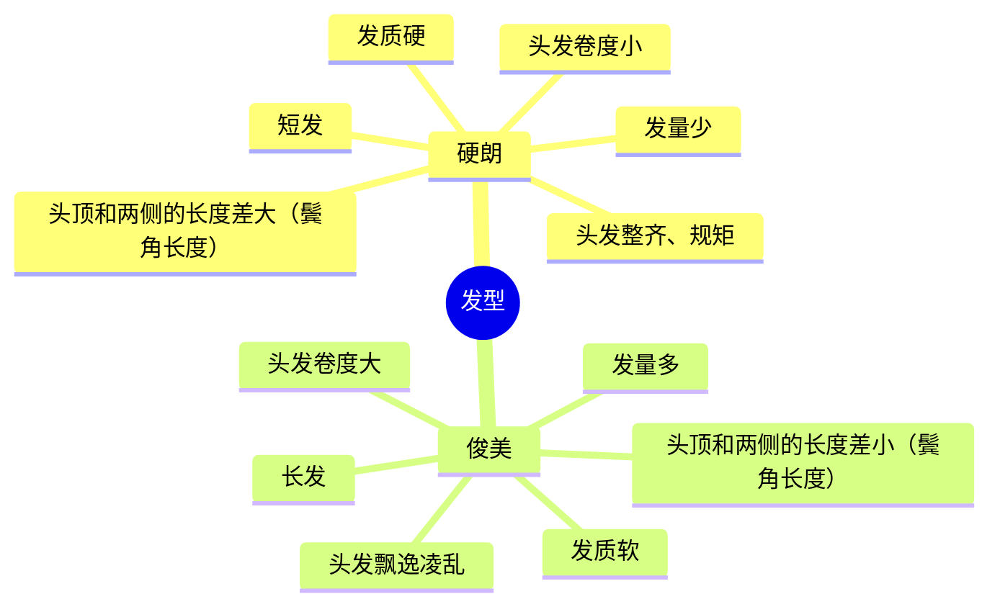

说实话，之所以写这篇笔记是为了早点脱单，之前我信奉的观念是“自己足够优秀，然后去吸引别人”，但是残酷的现实告诉我“你没那么优秀”，所以我决定去切换路线了，我决定去主动追求。与此同时，我看到了知乎上的[一篇文章](https://www.zhihu.com/question/23605963) 让我有一种惊为天人的感觉，我决定按照这篇文章先试试。

核心思想：只要保证不断接触妹子，就能保证不断有约会，只要保证不断有约会，就能保证不断有数据来源，只要保证不断有数据来源，就能保证持续迭代自己的方法，只要保证能持续迭代方法，就能保证最后的成功!

ps：为了防止我自己陷入纯理论的学习困境，要提醒自己采取对应的措施去实践，不管是正确的还是错误的，先实践了再说。

## 身材
脸部分析：
M字秃：硬朗+2
按照5眼3庭来划分，中庭最短，下庭最长，上庭居中
眉毛长度标准，眉毛终点在鼻翼和眼角的延长线上
眼距约等于鼻翼长度，是标准长度
双眼皮：俊美+1
眼神暂时不记分
鼻子比上下庭都要短，俊美+2
鼻翼比一只眼睛的宽度大，硬朗+1
下庭长，硬朗+1
人中比下巴短，俊美+1
嘴巴宽度比瞳距小，俊美+1
唇峰明显，硬朗+1
络腮胡，硬朗+2
腮帮比颧骨小，俊美+1
脸部偏长，硬朗+2
痘坑和色斑明显，硬朗+2
硬朗11分，俊美6分，风格总体偏硬朗

发型：

## 穿着打扮

这里的方法有：
1. 对着镜子，不停的拍自己的穿搭照片
2. 照抄明星的风格