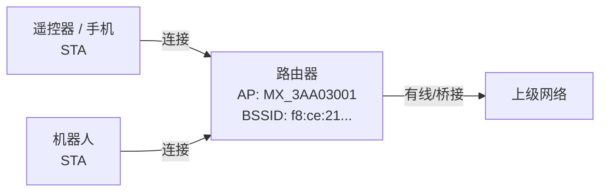
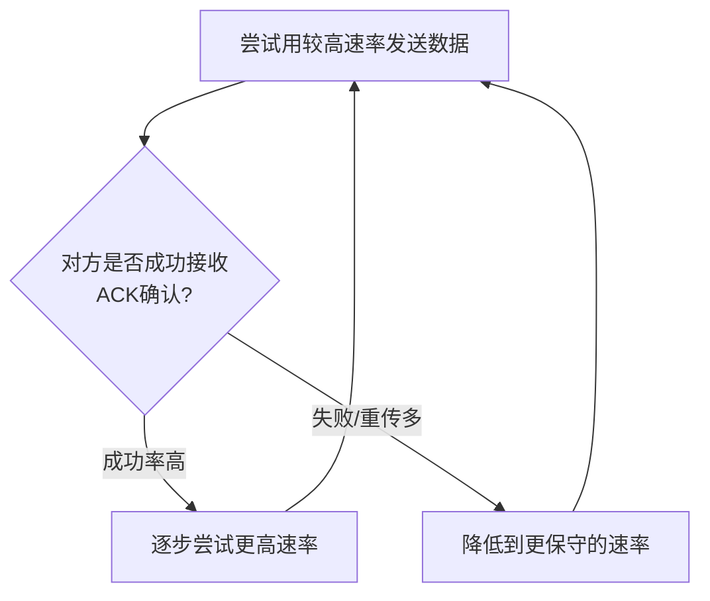
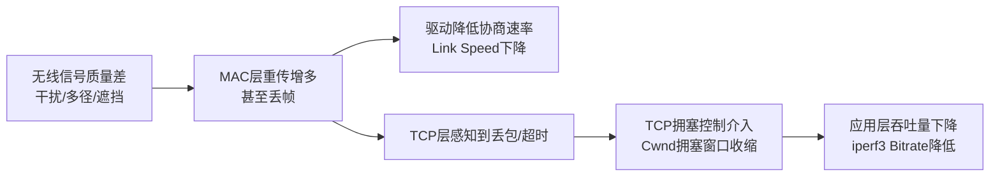
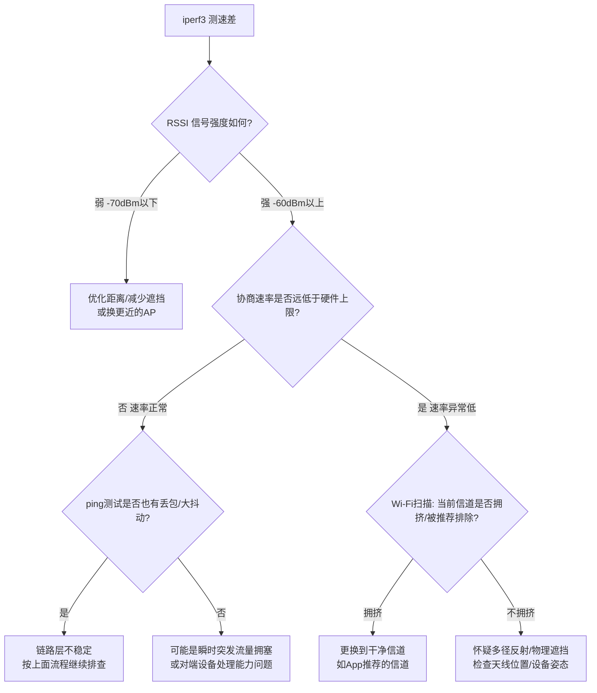

## 1. 基本角色和名词
无线局域网（WLAN / Wi-Fi）里最核心的两个角色：

| 角色    | 英文                | 说明                                      |
| ----- | ----------------- | --------------------------------------- |
| 接入点   | AP (Access Point) | 通常就是路由器/无线网关，负责创建 Wi-Fi 信号，让终端设备接入并转发数据 |
| 站点/终端 | STA (Station)     | 连接到 AP 的设备，比如手机、遥控器、笔记本电脑               |

几个常见标识符：
- **SSID**：Wi-Fi 网络的名字，比如 `MX_3AA03001`，人类可读，用来在设备列表里选择要连的网络。
- **BSSID**：AP 无线网卡的 MAC 地址，比如 `f8:ce:21:96:30:1e`，是这个 AP 在无线层面的唯一身份证。**同一个 SSID 可能对应多个 AP（多个 BSSID）**，比如企业级 Wi-Fi 覆盖、Mesh 组网时，多台设备共用一个 SSID 但各自有不同 BSSID。

  
## 2. 频段（Frequency Band）
Wi-Fi 使用的无线电频率被划分为几个"频段"，就像广播电台占用不同的频率区间：

| 频段               | 常见范围               | 特点                                                 |
| ---------------- | ------------------ | -------------------------------------------------- |
| 2.4GHz           | 2.400 ~ 2.4835 GHz | 覆盖范围广、穿墙能力强，但**信道少、频段窄、容易拥挤**（微波炉、蓝牙、门禁遥控器等都用这个频段） |
| 5GHz             | 5.15 ~ 5.85 GHz    | 信道多、带宽大、速率上限高，但**穿墙能力弱**，衰减更快                      |
| 6GHz（Wi-Fi 6E/7） | 5.925 ~ 7.125 GHz  | 更多可用信道、更干净（新频段，用的设备少），但需要新硬件支持，覆盖范围更小              |

**类比**：频段就像"车道分组"（比如市区道路和高速公路），信道就是这个分组里的具体车道。

## 3. 信道（Channel）
### 3.1 信道是什么
每个频段被进一步划分成多个"信道"，每个信道占用一段固定的频率宽度。设备发送数据时实际占用的是某个具体信道（或信道组合）。
- **2.4GHz**：常见信道 1~13（国内），每个信道宽 20MHz，但**相邻信道会重叠**（比如信道1和信道2的频率范围有重叠），所以实际上互不干扰的信道只有 **1、6、11**（间隔至少5个信道号）。这也是为什么截图里 2.4GHz 信道1~4 都显示"10个接入点"——大家都挤在重叠的频率范围里。
- **5GHz**：信道从 36 开始（36, 40, 44, 48, 52...165），信道间隔更大、数量更多，重叠问题比 2.4GHz 少很多。
### 3.2 信道宽度（Channel Width / Bandwidth）
一个信道可以"单独用"，也可以和相邻信道"捆绑"在一起用，捆绑越多，带宽（理论速率）越高，但抗干扰能力越弱、可用的"干净"信道越少：

| 宽度 | 说明 |
|---|---|
| 20MHz | 最基础单位，一个信道 |
| 40MHz | 捆绑2个相邻20MHz信道 |
| 80MHz | 捆绑4个相邻20MHz信道 |
| 160MHz | 捆绑8个相邻20MHz信道 |
![[Pasted image 20260831164159.png|500]]
**例子**：截图中看到"信道36(50)"，这个 `(50)` 就是指该信道实际占用了 36~50 之间的一段带宽（通常代表 80MHz 位宽，中心频率标注方式因 App 而异）。带宽越大，理论速率越高，但也更容易受相邻信道设备的干扰，且信道数量变少（因为要占用更多相邻信道）。
### 3.3 信道号与实际用途的关系
- **信道号本身不代表速率**，速率取决于：信道宽度 × 调制方式(MCS) × 空间流数(MIMO)。
- **信道号相同 = 直接竞争同一段频率资源**。如果附近有其他 AP 用相同信道，大家要"排队"发送（类似同一个车道大家轮流走），会导致延迟增加、吞吐下降。
- **信道号相邻 = 邻频干扰**，虽然不完全重叠，但频谱边缘会互相"泄露"，同样会造成一定干扰，只是程度比同频轻。

### 3.4 DFS 信道（了解即可）
5GHz 里有一部分信道（通常是 52~144 这一段，称为 UNII-2/UNII-2e）需要做**雷达检测（DFS, Dynamic Frequency Selection）**，因为这段频率历史上被气象雷达、军用雷达使用。如果 AP 检测到疑似雷达信号，会**强制切换信道**，导致连接短暂中断。36~48（UNII-1）和 149~165（UNII-3，部分地区）通常不需要 DFS，更稳定。

## 4. 信号强度（RSSI）
**RSSI (Received Signal Strength Indicator)**：接收端测到的信号强度，单位 dBm，是**负数，越接近0越强**。

| RSSI 范围 | 质量 |
|---|---|
| -30 ~ -50 dBm | 极好（几乎贴身距离） |
| -50 ~ -60 dBm | 良好 |
| -60 ~ -70 dBm | 一般，速率可能开始下降 |
| -70 dBm 以下 | 较差，容易丢包、掉线 |
  
**重要认知**：**RSSI 高（信号强）不代表链路质量一定好**。信号强只说明"能听到"这个 AP 的信号功率大，但如果同一信道有其他设备同时发送数据（干扰），或者信号路径中有反射造成"多径衰落"，照样会导致高丢包率、低速率——这正是我们之前排查中遇到的情况（RSSI -44dBm 很强，但实际速率只有理论值的15%左右）。

## 5. 链路速率协商（Link Speed / PHY Rate）
### 5.1 为什么"理论速率"和"实际速率"差很多
设备连接后会显示两个速率概念：
- **Max Supported Link Speed**：硬件在最理想条件下能达到的**理论峰值**（比如 433Mbps），只在信号完美、无干扰、无遮挡时才可能接近。
- **当前 Link Speed**：设备根据**实时链路质量**动态协商出来的**实际发送速率**，由驱动里的"速率自适应算法"（Rate Control，如 Minstrel）决定。
### 5.2 速率自适应的逻辑（简化理解）

驱动会不断用不同的调制速率（MCS档位）试探发送，如果高速率下失败率（重传/丢包）太高，就会自动降速，用更"稳"但更慢的方式发送，以保证数据能送达。**这就是为什么会出现"信号很强，但协商速率很低"的现象**——不是信号问题，而是高速率下的实际传输失败率太高，驱动主动降级保命。
### 5.3 决定速率上限的因素
1. **Wi-Fi 标准**（802.11 a/b/g/n/ac/ax/be，对应 Wi-Fi 1~7）：越新的标准理论速率上限越高。
2. **信道宽度**（20/40/80/160MHz）：越宽理论速率越高。
3. **空间流数 / MIMO**（1x1, 2x2, 4x4...）：多天线可以并行传输多路数据流，进一步提升速率。
4. **调制编码方式 MCS（Modulation and Coding Scheme）**：信号质量越好，可以用越密集的调制方式（携带更多信息但更容易出错），信号差时退化到简单调制（携带信息少但更抗干扰）。
## 6. 干扰的分类

| 干扰类型 | 说明 | 排查方式 |
|---|---|---|
| **同频干扰** | 附近有其他 AP/设备使用**完全相同**的信道 | Wi-Fi 扫描 App 查看信道占用的 AP 数量 |
| **邻频干扰** | 附近设备使用**相邻**信道，频谱边缘重叠 | 同上，注意看相邻信道号 |
| **非 Wi-Fi 干扰** | 微波炉、蓝牙、无绳电话、视频信号发射器等占用相同频段但不遵循 Wi-Fi 协议 | 较难直接扫描到，通常靠排除法（换个环境/时间测试对比） |
| **多径干扰/反射** | 信号经过金属表面、墙壁反射后，多条路径的信号在接收端叠加、抵消，造成瞬时信号质量下降（RSSI 均值看不出来） | 常见于金属机身设备（如机器人、云台），可尝试更换天线位置或朝向 |
| **物理遮挡** | 设备移动、人体/物体阻挡在收发天线之间 | 观察问题是否和设备姿态/位置相关 |

## 7. 从 Wi-Fi 层到 TCP 层：问题是如何"传导"的
无线链路质量差，最终会体现在应用层测速工具（如 iperf3）的表现上，中间的传导链条是：

### 关键概念：TCP 拥塞窗口（Cwnd）
- **Cwnd** 决定发送方"敢一次性发多少未确认的数据"。
- 网络通畅时，Cwnd 逐渐增大（越来越有信心多发）；一旦检测到丢包/超时，Cwnd 会**立刻大幅缩小**，然后重新缓慢爬升。
- 如果底层无线链路持续不稳定（不断丢包），Cwnd 就会一直卡在很小的值，永远没机会爬起来 —— 表现为 iperf3 里看到的吞吐量持续走低、重传次数（Retr）持续增加。

**一句话总结因果链**：无线信号问题 → MAC层重传/丢帧 → 速率被迫下调 + TCP感知丢包 → Cwnd收缩 → 应用层测速数据难看。

## 8. 常用诊断工具速查表

| 工具/命令                                          | 用途                                         | 备注                                         |
| ---------------------------------------------- | ------------------------------------------ | ------------------------------------------ |
| `adb shell cmd wifi status`                    | 查看当前连接的 RSSI、协商速率、频率、重传/丢包计数               | 需要 shell 权限，部分子命令（如 scan-results）在新系统上会被拒绝 |
| `adb shell dumpsys wifi`                       | 更完整的 Wi-Fi 状态信息，包括扫描缓存                     | 输出很长，需要翻找关键字段                              |
| `ping -i 0.2 -c 100 <目标IP>`                    | 测试连通性、丢包率、RTT 抖动（mdev）                     | 小包测试，能通过不代表大流量没问题                          |
| `iperf3 -c <IP> -p <端口> -i 1 -t 30`            | TCP/UDP 吞吐量压力测试，观察 Bitrate/Retr/Cwnd 随时间变化 | 本笔记配套的 [README.md](README.md) 有详细用法        |
| Wi-Fi 分析 App（如 WiFiAnalyzer）                   | 可视化查看周边信道占用、AP 数量、信道评级推荐                   | 需要定位权限（Android 系统要求），shell 命令拿不到这些数据时可以用   |
| `netsh wlan show networks mode=bssid`（Windows） | 电脑端扫描周边 AP 信道占用                            | 免安装，Windows 自带                             |

## 9. 排查思路总览（决策流程）
